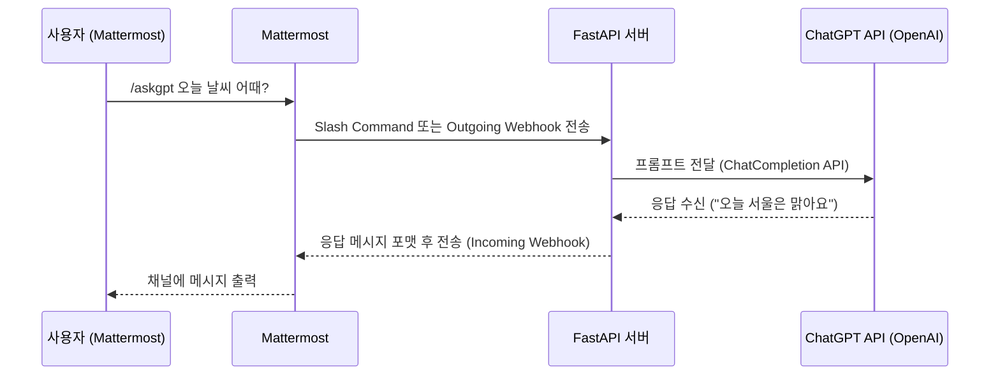

# 1. 개요

Mattermost , Python Bot, ChatGPT 를 활용한 구조를 만들어보자.


## 1) 가능 아키텍처 흐름

```
Mattermost (사용자 입력)
    ↓
[Outgoing Webhook 또는 Slash Command]
    ↓
API Server (예: FastAPI)
    ↓
ChatGPT API (OpenAI API)
    ↓
API Server에서 응답 처리 및 포맷
    ↓
Mattermost에 응답 반환 (Incoming Webhook)
```


## 2) 예시 시나리오


### (1) 예시 시나리오

* 사용자가 Mattermost 채널에서 /askgpt 오늘 날씨 어때? 입력
* FastAPI 서버가 요청을 받아 OpenAI API에 프롬프트 전달
* ChatGPT 응답: "오늘 서울 날씨는 맑고 22도입니다."
* FastAPI 서버가 이 응답을 Mattermost에 다시 전송 → 채널에 출력됨


### (2) 시퀀스다이어그램



* 사용자가 /askgpt와 같은 명령을 입력
* Mattermost가 서버로 요청 전송
* API 서버가 ChatGPT API에 질의
* 응답을 가공하여 다시 Mattermost에 전달


### (3) 구성 요소별 설명

* **Mattermost**
  * Outgoing Webhook 또는 Slash Command를 이용해 사용자의 입력을 외부 서버로 전달 가능
  * 특정 명령(ex. /askgpt)을 사용하여 트리거 가능
* **API Server (Python FastAPI 등)**
  * Mattermost에서 전달된 요청을 수신하고,
  * ChatGPT(OpenAI API)에 프롬프트를 전달
  * 받은 응답을 가공하여 다시 Mattermost로 전송
* **ChatGPT API (OpenAI)**
  * https://api.openai.com/v1/chat/completions 엔드포인트를 사용해 GPT 모델 호출
  * FastAPI 서버에서 비동기 호출로 처리 가능
* **응답 반환**
  * Mattermost는 웹훅 URL로 JSON 형태의 메시지를 수신
  * FastAPI에서 포맷을 맞춰 전달하면 채팅창에 바로 출력됨


# 2. 구현


## 1) 참고 사항

* OpenAI API를 사용하려면 유효한 API Key가 필요
* Mattermost의 Webhook 및 Slash 명령어 설정은 관리자 권한 필요
* FastAPI는 httpx 또는 aiohttp 등을 사용해 비동기로 OpenAI API 호출 가능


**ChatGPT API Key 생성 → Python(FastAPI) 서버 구현 → Mattermost 연결** 순으로 진행한다.


## 2) OpenAI ChatGPT API Key 발급

* https://platform.openai.com/account/api-keys 에 접속
* 로그인 후 **“Create new secret key”** 클릭
* 발급된 Key를 안전하게 저장
  * 예: sk-XXXXXXXXXXXXXXXXXXXXXXXXXXXX


## 3) FastAPI 기반 Python Bot 개발

```
mkdir mattermost-gpt-bot && cd mattermost-gpt-bot
python -m venv venv && source venv/bin/activate
pip install fastapi uvicorn openai python-multipart
```

**main.py**

```python
from fastapi import FastAPI, Form
from fastapi.responses import JSONResponse
import openai
import os

app = FastAPI()

# OpenAI API 키 설정
openai.api_key = os.getenv("OPENAI_API_KEY")

@app.post("/mattermost-gpt")
async def chat_with_gpt(text: str = Form(...), user_name: str = Form(...)):
    try:
        # GPT 프롬프트 구성
        messages = [{"role": "user", "content": text}]
        completion = openai.ChatCompletion.create(
            model="gpt-4",
            messages=messages
        )
        answer = completion.choices[0].message["content"].strip()

        # Mattermost에 전송할 메시지 형식
        return JSONResponse(content={
            "response_type": "in_channel",
            "text": f"**{user_name}**: {text}\n**GPT**: {answer}"
        })

    except Exception as e:
        return JSONResponse(status_code=500, content={"text": f"오류 발생: {str(e)}"})
```


**.env 파일 (예)**

```

OPENAI_API_KEY=sk-xxxxxxxxxxxxxxxxxxxxxxxx

```


## 4) FastAPI 서버 실행

```

uvicorn main:app --host 0.0.0.0 --port 8000

```

이제 /mattermost-gpt 엔드포인트가 외부 요청을 받을 준비가 되었습니다.


## 5) Mattermost에서 Slash Command 등록

​	1.	**System Console → Integrations → Slash Commands → Add**

​	2.	아래와 같이 설정:

​	•	Command: /askgpt

​	•	Request URL: http://<공개주소>/mattermost-gpt

​	•	테스트 목적이면 [ngrok](https://ngrok.com/)으로 포트 노출 가능

​	•	Request Method: POST

​	•	Response Username: gptbot

​	3.	저장하고 채팅창에서 /askgpt 안녕하세요 테스트!


------


**🔄 이후 계획 (선택 사항)**

​	•	응답에 Markdown, 링크, 블록코드 등 포맷 적용

​	•	Mattermost 인증 토큰 검증

​	•	채널 구분별 context 관리 (세션 유지)


------


바로 시작하실 수 있게 필요한 코드를 정리해드렸는데, ngrok 사용법이나 FastAPI 배포를 도와드릴 수도 있어요.

**ngrok을 써서 Mattermost랑 바로 연결해보고 싶으세요?**

