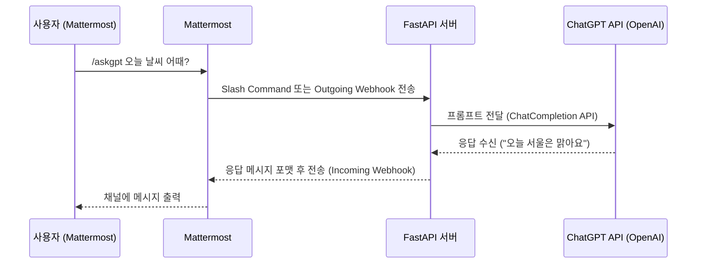

# 1. 개요

Mattermost , Python Bot, ChatGPT 를 활용한 구조를 만들어보자.


## 1) 가능 아키텍처 흐름

```
Mattermost (사용자 입력)
    ↓
[Outgoing Webhook 또는 Slash Command]
    ↓
API Server (예: FastAPI)
    ↓
ChatGPT API (OpenAI API)
    ↓
API Server에서 응답 처리 및 포맷
    ↓
Mattermost에 응답 반환 (Incoming Webhook)
```


## 2) 예시 시나리오


### (1) 예시 시나리오

* 사용자가 Mattermost 채널에서 /askgpt 오늘 날씨 어때? 입력
* FastAPI 서버가 요청을 받아 OpenAI API에 프롬프트 전달
* ChatGPT 응답: "오늘 서울 날씨는 맑고 22도입니다."
* FastAPI 서버가 이 응답을 Mattermost에 다시 전송 → 채널에 출력됨


### (2) 시퀀스다이어그램



* 사용자가 /askgpt와 같은 명령을 입력
* Mattermost가 서버로 요청 전송
* API 서버가 ChatGPT API에 질의
* 응답을 가공하여 다시 Mattermost에 전달


### (3) 구성 요소별 설명

​	1.	**Mattermost**

​	•	Outgoing Webhook 또는 Slash Command를 이용해 사용자의 입력을 외부 서버로 전달 가능

​	•	특정 명령(ex. /askgpt)을 사용하여 트리거 가능

​	2.	**API Server (Python FastAPI 등)**

​	•	Mattermost에서 전달된 요청을 수신하고,

​	•	ChatGPT(OpenAI API)에 프롬프트를 전달

​	•	받은 응답을 가공하여 다시 Mattermost로 전송

​	3.	**ChatGPT API (OpenAI)**

​	•	https://api.openai.com/v1/chat/completions 엔드포인트를 사용해 GPT 모델 호출

​	•	FastAPI 서버에서 비동기 호출로 처리 가능

​	4.	**응답 반환**

​	•	Mattermost는 웹훅 URL로 JSON 형태의 메시지를 수신

​	•	FastAPI에서 포맷을 맞춰 전달하면 채팅창에 바로 출력됨


# 2. 구현


## 1) 참고 사항

* OpenAI API를 사용하려면 유효한 API Key가 필요
* Mattermost의 Webhook 및 Slash 명령어 설정은 관리자 권한 필요
* FastAPI는 httpx 또는 aiohttp 등을 사용해 비동기로 OpenAI API 호출 가능


