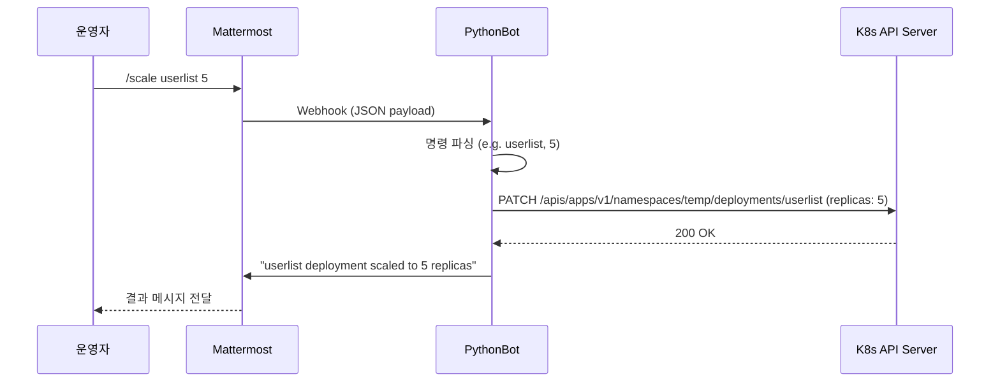

```mermaid
sequenceDiagram
    participant 운영자
    participant Mattermost
    participant PythonBot
    participant K8s API Server

    운영자->>Mattermost: /scale userlist 5
    Mattermost->>PythonBot: Webhook (JSON payload)
    PythonBot->>PythonBot: 명령 파싱 (e.g. userlist, 5)
    PythonBot->>K8s API Server: PATCH /apis/apps/v1/namespaces/temp/deployments/userlist (replicas: 5)
    K8s API Server-->>PythonBot: 200 OK
    PythonBot->>Mattermost: "userlist deployment scaled to 5 replicas"
    Mattermost-->>운영자: 결과 메시지 전달
```

