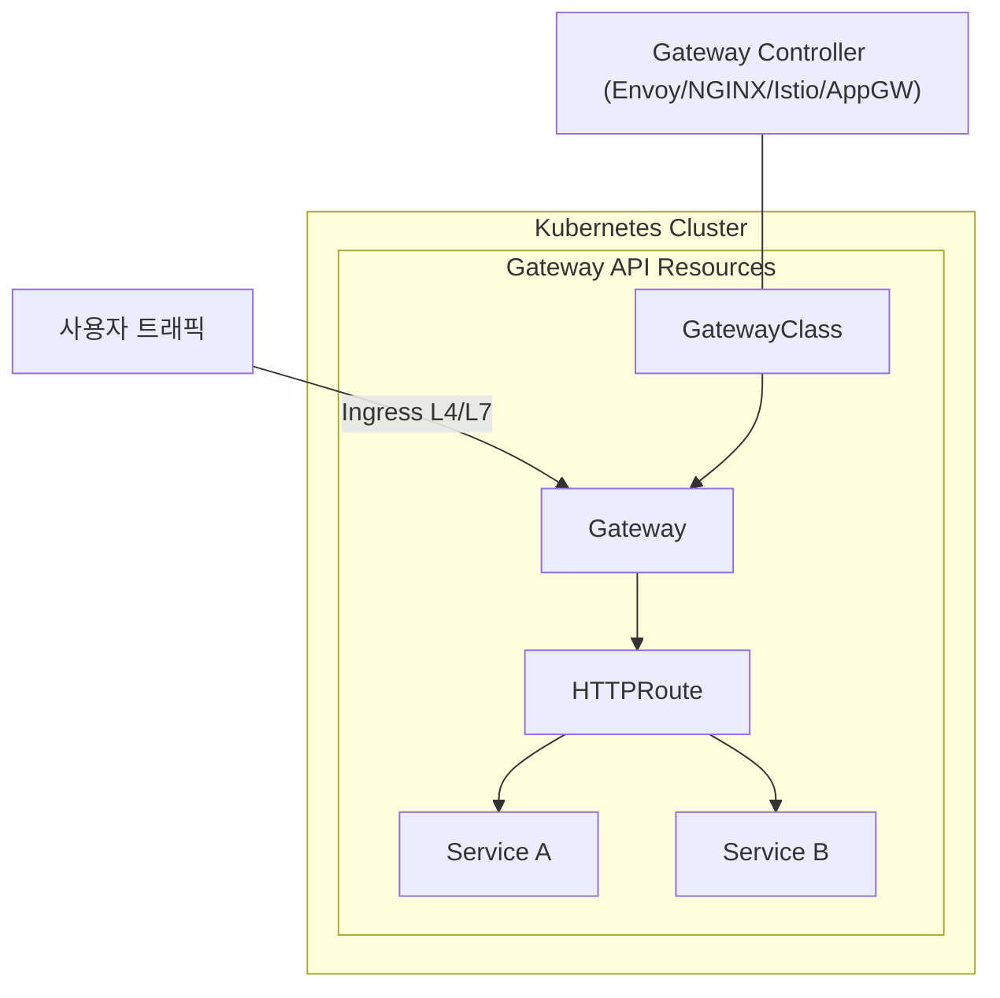
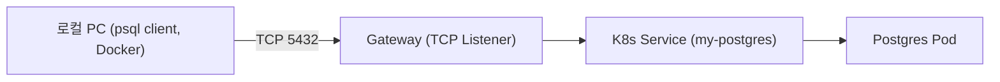

# GatewayAPI


# 1. 개요

Kubernetes **Ingress**와 새롭게 등장한 **Gateway API**는 쿠버네티스 네트워크 진화 과정에서 중요한 변화 포인트이다.

Ingress 는 Kubernetes 초기 L7 트래픽 진입점 표준 API 이며 주로 http/https 라우팅 중심으로 기능이 제한적이였다.

Gateway API 는 Ingress 의 차세대 대체 표준으로 CNCF/쿠버네티스 SIG-Network 에서 개발중이며 L4/L7 모두 지원하며 API가 세분화(tcp/udp/http/grpc route)된다.


## 1) 기존 Ingress 와 Gateway API 비교


| **항목**      | **Ingress**                                 | **Gateway API**                                              |
| ------------- | ------------------------------------------- | ------------------------------------------------------------ |
| 리소스 타입   | Ingress 하나                                | GatewayClass, Gateway, HTTPRoute 등 여러 리소스로 분리       |
| 표현력        | 주로 L7 HTTP(S) 라우팅만 지원               | L4/L7 라우팅 모두 지원 (TCP, UDP, HTTP, gRPC 등)             |
| 확장성        | Controller 구현체마다 주석(Annotation) 남발 | **표준화된 필드** 제공 → 벤더/컨트롤러간 일관성              |
| 멀티테넌시    | 네임스페이스 단위 격리 한계                 | Gateway와 Route 리소스를 나눠 다수 팀/서비스에서 안전하게 공유 가능 |
| CRD 기반 확장 | 제한적                                      | CRD 기반으로 확장성 내장 (커스텀 필드 불필요)                |

### 핵심 포인트

- **Ingress는 단순 HTTP 라우팅 중심** (구식 API)
- **Gateway API는 차세대 네트워크 API** → 멀티테넌시, 다양한 프로토콜 지원, CRD 확장성
- CNCF 및 주요 벤더(NGINX, Istio, Envoy, Azure 등)에서 **Ingress를 대체할 표준**으로 추진 중


## 2) Gateway API 주요 리소스

###  Gateway Controller

- Gateway API 리소스를 **실제로 동작**하게 만드는 컨트롤러(소프트웨어).

- 예시: Envoy Gateway, Istio, NGINX, AKS Application Gateway Controller 등.

- GatewayClass에 controllerName을 지정하면, 해당 컨트롤러가 자신이 관리해야 할 리소스를 “Claim”해서 동작합니다.

  

### GatewayClass

- 클러스터에서 사용할 Gateway 구현체를 정의 (예: Istio, NGINX, Envoy, AKS Application Gateway 등).
- “이 컨트롤러가 Gateway를 처리할 거야” 라는 선언.


### Gateway

- 특정 GatewayClass를 기반으로, 실제 **Load Balancer나 Listener 리소스**를 프로비저닝 (포트, 프로토콜, 인증서 등).
- 실제 트래픽이 들어오는 진입점(Load Balancer, NodePort 등).
- 어떤 GatewayClass를 쓸 건지, 어떤 포트/프로토콜을 받을 건지 정의.


### Route

- 트래픽 라우팅 규칙 정의.
- HTTPRoute, TCPRoute, UDPRoute, GRPCRoute 지원.
- 서비스와 연결되어 트래픽 분배.
- 어떤 Gateway에 붙어서 어떤 Host/Path/Port로 들어온 요청을 어떤 Service로 보낼지 정의.





## 3) 예시 (Gateway API)

```
apiVersion: gateway.networking.k8s.io/v1
kind: GatewayClass
metadata:
  name: nginx
spec:
  controllerName: k8s.io/ingress-nginx
---
apiVersion: gateway.networking.k8s.io/v1
kind: Gateway
metadata:
  name: web-gateway
  namespace: default
spec:
  gatewayClassName: nginx
  listeners:
  - name: http
    protocol: HTTP
    port: 80
---
apiVersion: gateway.networking.k8s.io/v1
kind: HTTPRoute
metadata:
  name: web-route
  namespace: default
spec:
  parentRefs:
  - name: web-gateway
  rules:
  - matches:
    - path:
        type: PathPrefix
        value: /app
    backendRefs:
    - name: my-service
      port: 80
```

➡️ 위 예제는

- nginx GatewayClass를 쓰고,
- web-gateway에서 80포트 HTTP 리스닝,
- /app 요청은 my-service 로 라우팅한다는 의미예요.


## 4) Azure (AKS)에서의 Gateway API


- AKS에서는 **Application Gateway Ingress Controller (AGIC)** 가 기존 Ingress를 지원했음
- 최근에는 **Gateway API 기반 Application Gateway Controller** 로 발전 중
- 즉, **Gateway API를 쓰면 Ingress보다 더 강력한 라우팅/보안 정책**을 Azure 네이티브하게 적용할 수 있음


# 2. AKS에서 Gateway API 설정

AKS에 처음 클러스터를 만들고 바로 **Gateway API**를 설정하는 방법을 알아보자.


## 1) AKS 클러스터 생성

```sh

# 리소스그룹 생성
$  az group list -o table
Name                                                                   Location      Status
---------------------------------------------------------------------  ------------  ---------
rg-az01-poc-cloudautomation-sh-01                                      koreacentral  Succeeded
rg-az01-poc-cloudautomation-jw-01                                      koreacentral  Succeeded
rg-az01-poc-cloudautomation-dh-01                                      koreacentral  Succeeded
rg-az01-poc-cloudautomation-ck-01                                      koreacentral  Succeeded
rg-az01-poc-cloudautomation-ww-01                                      koreacentral  Succeeded
MC-rg-az01-poc-cloudautomation-ww-01                                   koreacentral  Succeeded
MA_defaultazuremonitorworkspace-se_koreacentral_managed                koreacentral  Succeeded
rg-az01-poc-cloudautomation-jy-01                                      koreacentral  Succeeded
MC_rg-az01-poc-cloudautomation-jy-01_aks-az01-dev-jytest_koreacentral  koreacentral  Succeeded


$ az group create \
  -n rg-az01-ca-yj01 \
  -l koreacentral \
  --tags EMAIL='yj.song@kt.com' \
         ServiceName='cloud-automation' \
         Name='songyangjong' \
         CreateDate='2025-09-05'


$  az group list -o table
Name                                                                   Location      Status
---------------------------------------------------------------------  ------------  ---------
...
rg-az01-ca-yj01                                                        koreacentral  Succeeded


  
# AKS 목록
$ az aks list -o table
Name                                        Location      ResourceGroup                      KubernetesVersion    CurrentKubernetesVersion    ProvisioningState    Fqdn
------------------------------------------  ------------  ---------------------------------  -------------------  --------------------------  -------------------  ----------------------------------------------------------------------
aks-az01-poc-cloudautomation-monitoring-01  koreacentral  rg-az01-poc-cloudautomation-ww-01  1.31                 1.31.7                      Succeeded            aks-az01-p-rg-az01-poc-clou-0597e2-2bpqt8hq.hcp.koreacentral.azmk8s.io
aks-az01-dev-jytest                         koreacentral  rg-az01-poc-cloudautomation-jy-01  1.32                 1.32.5                      Succeeded            aks-az01-d-rg-az01-poc-clou-0597e2-5f1r3ne3.hcp.koreacentral.azmk8s.io


# AKS 생성
$ az aks create \
  -g rg-az01-ca-yj01 \
  -n aks-az01-ca-yj-01 \
  --node-count 2 \
  --enable-managed-identity \
  --network-plugin azure \
  --network-plugin-mode overlay \
  --pod-cidr 10.244.0.0/16 \
  --service-cidr 10.0.0.0/16 \
  --dns-service-ip 10.0.0.10 \
  --generate-ssh-keys


```

클러스터 연결:

```sh

$ az aks get-credentials -g rg-az01-ca-yj01 -n aks-az01-ca-yj-01

$ kubectl config get-contexts
CURRENT   NAME                        CLUSTER                     AUTHINFO                                                    NAMESPACE
*         aks-az01-ca-yj-01           aks-az01-ca-yj-01           clusterUser_rg-az01-ca-yj01_aks-az01-ca-yj-01
          aks-az01-cloudbiz-comm-01   aks-az01-cloudbiz-comm-01   clusterUser_rg-cloudbiz-comm-01_aks-az01-cloudbiz-comm-01   temp

```


## 2) Gateway API CRD 설치


Gateway API는 Kubernetes의 확장 리소스이므로 CRD(CustomResourceDefinition)를 설치해야 한다.

```sh

# 1. standard 설치
$ kubectl apply -f https://github.com/kubernetes-sigs/gateway-api/releases/download/v1.1.0/standard-install.yaml

customresourcedefinition.apiextensions.k8s.io/gatewayclasses.gateway.networking.k8s.io created
customresourcedefinition.apiextensions.k8s.io/gateways.gateway.networking.k8s.io created
customresourcedefinition.apiextensions.k8s.io/grpcroutes.gateway.networking.k8s.io created
customresourcedefinition.apiextensions.k8s.io/httproutes.gateway.networking.k8s.io created
customresourcedefinition.apiextensions.k8s.io/referencegrants.gateway.networking.k8s.io created


# 2. experimental
$ kubectl apply -f https://github.com/kubernetes-sigs/gateway-api/releases/download/v1.1.0/experimental-install.yaml

customresourcedefinition.apiextensions.k8s.io/backendlbpolicies.gateway.networking.k8s.io created
customresourcedefinition.apiextensions.k8s.io/backendtlspolicies.gateway.networking.k8s.io created
customresourcedefinition.apiextensions.k8s.io/gatewayclasses.gateway.networking.k8s.io configured
customresourcedefinition.apiextensions.k8s.io/gateways.gateway.networking.k8s.io configured
customresourcedefinition.apiextensions.k8s.io/grpcroutes.gateway.networking.k8s.io configured
customresourcedefinition.apiextensions.k8s.io/httproutes.gateway.networking.k8s.io configured
customresourcedefinition.apiextensions.k8s.io/referencegrants.gateway.networking.k8s.io configured
customresourcedefinition.apiextensions.k8s.io/tcproutes.gateway.networking.k8s.io created
customresourcedefinition.apiextensions.k8s.io/tlsroutes.gateway.networking.k8s.io created
customresourcedefinition.apiextensions.k8s.io/udproutes.gateway.networking.k8s.io created


# 확인
$ kubectl get crd | grep gateway
backendlbpolicies.gateway.networking.k8s.io      2025-09-05T05:33:55Z
backendtlspolicies.gateway.networking.k8s.io     2025-09-05T05:33:55Z
gatewayclasses.gateway.networking.k8s.io         2025-09-05T05:30:25Z
gateways.gateway.networking.k8s.io               2025-09-05T05:30:25Z
grpcroutes.gateway.networking.k8s.io             2025-09-05T05:30:25Z
httproutes.gateway.networking.k8s.io             2025-09-05T05:30:26Z
referencegrants.gateway.networking.k8s.io        2025-09-05T05:30:26Z
tcproutes.gateway.networking.k8s.io              2025-09-05T05:33:56Z
tlsroutes.gateway.networking.k8s.io              2025-09-05T05:33:57Z
udproutes.gateway.networking.k8s.io              2025-09-05T05:33:57Z


```


## 3) Gateway Controller 배포


Gateway API는 **컨트롤러가 필수**예요. (Ingress Controller처럼).

예시: **Envoy Gateway**를 설치한다고 가정.

```sh

$ kubectl apply -f https://github.com/envoyproxy/gateway/releases/download/v0.6.0/install.yaml

# 확인

$ kubectl get pods -n envoy-gateway-system
NAME                             READY   STATUS              RESTARTS   AGE
eg-gateway-helm-certgen-vqcfn    0/1     ContainerCreating   0          2s
envoy-gateway-5bbf64bb74-kr2f7   0/1     ContainerCreating   0          3s


```


## 4) GatewayClass 생성


```sh

$ echo '
apiVersion: gateway.networking.k8s.io/v1
kind: GatewayClass
metadata:
  name: envoy
spec:
  controllerName: gateway.envoyproxy.io/gatewayclass-controller
' | kubectl apply -f -


# 확인
$ kubectl get GatewayClass
NAME    CONTROLLER                                      ACCEPTED   AGE
envoy   gateway.envoyproxy.io/gatewayclass-controller   True       24s


```


## 5) Gateway 리소스 생성

```sh

$ echo '
apiVersion: gateway.networking.k8s.io/v1
kind: Gateway
metadata:
  name: my-gateway
  namespace: default
spec:
  gatewayClassName: envoy
  listeners:
  - name: http
    protocol: HTTP
    port: 80
' | kubectl apply -f -


# 확인
$ kubectl get Gateway
NAME         CLASS   ADDRESS          PROGRAMMED   AGE
my-gateway   envoy   20.249.157.253   True         14s


```


## 6) Route 리소스 생성 (예: HTTPRoute)


```sh


$ echo '
apiVersion: gateway.networking.k8s.io/v1
kind: HTTPRoute
metadata:
  name: my-route
  namespace: default
spec:
  parentRefs:
  - name: my-gateway
  rules:
  - matches:
    - path:
        type: PathPrefix
        value: /
    backendRefs:
    - name: my-service
      port: 80
' | kubectl apply -f -


# 확인
$ kubectl get HTTPRoute
NAME       HOSTNAMES   AGE
my-route               13s


```


## 7) 테스트

```sh

$ kubectl get svc -n envoy-gateway-system
NAME                                TYPE           CLUSTER-IP     EXTERNAL-IP      PORT(S)               AGE
envoy-default-my-gateway-1c7c06f0   LoadBalancer   10.0.83.114    20.249.157.253   80:30622/TCP          104s
envoy-gateway                       ClusterIP      10.0.137.179   <none>           18000/TCP,18001/TCP   4m31s
envoy-gateway-metrics-service       ClusterIP      10.0.6.30      <none>           19001/TCP             4m31s


```

LoadBalancer IP 확인 후 브라우저에서 테스트.


# 3. DB Connect Test

**내 로컬 PC → AKS (또는 K8s) 내부 Postgres → Gateway API (L4) 경유**로 연결을 확인


## 1) PostgreSQL 설치 (Helm)


K8s 안에 PostgreSQL을 설치

```sh
helm repo add bitnami https://charts.bitnami.com/bitnami
helm repo update

# PostgreSQL 설치
helm install my-postgres bitnami/postgresql \
  --set auth.username=testuser \
  --set auth.password=testpass \
  --set auth.database=testdb \
  --set primary.service.ports.postgresql=5432


$ kubectl get svc -l app.kubernetes.io/name=postgresql
NAME                        TYPE        CLUSTER-IP     EXTERNAL-IP   PORT(S)    AGE
my-postgres-postgresql      ClusterIP   10.0.239.231   <none>        5432/TCP   14s
my-postgres-postgresql-hl   ClusterIP   None           <none>        5432/TCP   14s


```


## **2) Gateway API 리소스 생성 (TCPRoute)


### **(1) GatewayClass**


```sh

$ echo '
apiVersion: gateway.networking.k8s.io/v1
kind: GatewayClass
metadata:
  name: envoy
spec:
  controllerName: gateway.envoyproxy.io/gatewayclass-controller
' | kubectl apply -f -


# 확인
$ kubectl get GatewayClass
NAME    CONTROLLER                                      ACCEPTED   AGE
envoy   gateway.envoyproxy.io/gatewayclass-controller   True       19m

  
```


### **(2) Gateway**


```sh

$ echo '
apiVersion: gateway.networking.k8s.io/v1
kind: Gateway
metadata:
  name: postgres-gateway
  namespace: default
spec:
  gatewayClassName: envoy
  listeners:
    - name: postgres
      protocol: TCP
      port: 5432
      allowedRoutes:
        namespaces:
          from: Same
' | kubectl apply -f -


# 확인
$ kubectl get Gateway
NAME               CLASS   ADDRESS          PROGRAMMED   AGE
my-gateway         envoy   20.249.157.253   True         19m
postgres-gateway   envoy   20.249.165.22    False        14s

```


### **(3) TCPRoute**


```sh

$ echo '
apiVersion: gateway.networking.k8s.io/v1alpha2
kind: TCPRoute
metadata:
  name: postgres-route
  namespace: default
spec:
  parentRefs:
    - name: postgres-gateway
      sectionName: postgres
  rules:
    - backendRefs:
        - name: my-postgres-postgresql
          port: 5432
' | kubectl apply -f -


# 확인
$ kubectl get TCPRoute
NAME             AGE
postgres-route   4s

```


## **3. 외부 진입점 확인**


Gateway 리소스에 External IP가 할당됩니다.

확인:

```sh

$ kubectl get gateway postgres-gateway -o wide
NAME               CLASS   ADDRESS         PROGRAMMED   AGE
postgres-gateway   envoy   20.249.165.22   True         62s

```


## **4. 로컬 PC에서 PostgreSQL Client 실행**


### (1) Docker로 실행

```sh
$ docker run -it --rm postgres:16 psql \
  -h 20.249.165.22 -p 5432 -U testuser -d testdb

Password for user testuser:
psql (16.10 (Debian 16.10-1.pgdg13+1), server 17.6)
WARNING: psql major version 16, server major version 17.
         Some psql features might not work.
Type "help" for help.

testdb=>


```


만약 연결이 방화벽 이슈로 안될경우...

```sh

psql: error: connection to server at "20.249.165.22", port 5432 failed: Connection refused
        Is the server running on that host and accepting TCP/IP connections?

```


## **5. 구조 요약 (Mermaid)**




외부에서 Gateway API를 통해 **L4 (TCP) 트래픽**으로 PostgreSQL DB 연결 테스트가 가능


