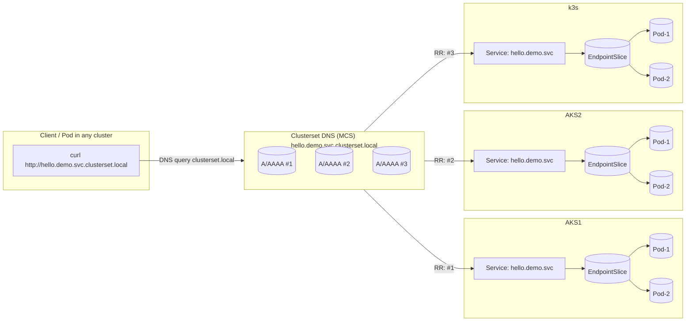
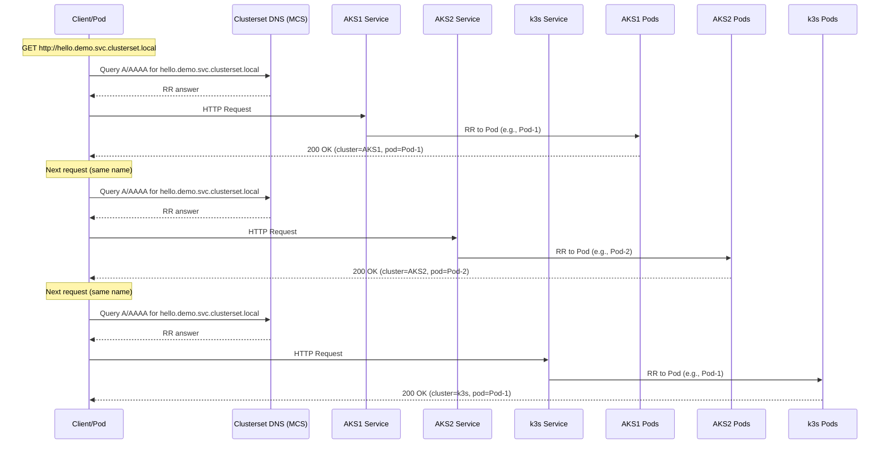

# Karamad PoC 시나리오


# 1. 개요

Karmada의 핵심(정책 기반 배포, 클러스터 선택/가중치, Override, DR, MCS)을 이해하기 위해서 

"AKS1·AKS2·k3s 3개 클러스터를 하나처럼 관리 → 정책으로 분산 배포 → 실제 트래픽까지 확인" PoC 를 수행한다.


# 2. 시나리오 A

> 정책 기반 멀티클러스터 분산 배포 + 트래픽 검증(라운드로빈)


## 목표

- Karmada Control Plane에서 하나의 Deployment/Service를 정의하면

  AKS1·AKS2·k3s에 **가중치 기반으로 분산 배포**된다.

- 각 클러스터에 동일 DNS(hostname)로 Ingress를 열고, **글로벌 L7 로드밸런서(예: Azure Front Door)**로 라운드로빈 트래픽을 흘려 분산을 눈으로 확인.


## 트래픽흐름도

### 토폴로지(구성) 다이어그램 — RR 개념



- hello.demo.svc.clusterset.local 은 **MCS 표준 도메인**으로, ServiceExport/ServiceImport를 통해 생성.
- **DNS 레벨 RR**: 클라이언트가 clusterset.local 이름을 조회하면, 각 클러스터(예: AKS1/AKS2/k3s)에 해당하는 엔드포인트(보통 Service VIP/ClusterIP 또는 headless일 경우 Pod IP)에 대해 **라운드로빈 A/AAAA 레코드**가 응답.
- 각 클러스터 내부로 라우팅된 뒤에는, 그 클러스터의 Service가 **파드 레벨 라운드로빈**(kube-proxy/iptables or IPVS)으로 분산. → **2단 RR**(DNS RR → Service RR)


### 시퀀스 다이어그램 — 여러 요청이 분산되는 흐름



- **DNS RR**가 먼저 각 클러스터의 엔드포인트로 분산(요청 단위/캐시 정책에 따라 결과는 달라질 수 있음).
- 각 클러스터 내부에서 **Service → EndpointSlice → Pod** 순으로 **파드 라운드로빈**.
- 결과적으로 Client 관점에서는 요청들을 반복하면 응답 바디에 찍어둔 cluster=<AKS1|AKS2|k3s>, pod=<name>가 **번갈아** 나타남


## 준비

- 컨트롤 플레인: 별도 mgmt 클러스터(권장) 또는 AKS1에 설치
- 각 클러스터 kubeconfig 준비: aks1, aks2, k3s 컨텍스트
- karmadactl 설치 후 멤버 조인:

```
karmadactl join aks1 --cluster-kubeconfig ~/.kube/config --cluster-context aks1
karmadactl join aks2 --cluster-kubeconfig ~/.kube/config --cluster-context aks2
karmadactl join k3s --cluster-kubeconfig ~/.kube/config --cluster-context k3s
```


## 앱과 서비스 (예: 단순 에코 서버)

- 컨테이너: nginxdemos/hello 또는 hashicorp/http-echo
- 파드가 **자신의 클러스터/파드명**을 응답하도록 Downward API 환경변수 사용


```yaml
apiVersion: apps/v1
kind: Deployment
metadata:
  name: hello
  namespace: demo
spec:
  replicas: 9           # 총 9개를 분산
  selector:
    matchLabels: {app: hello}
  template:
    metadata:
      labels: {app: hello}
    spec:
      containers:
      - name: app
        image: nginxdemos/hello
        ports: [{containerPort: 80}]
        env:
        - name: POD_NAME
          valueFrom: {fieldRef: {fieldPath: metadata.name}}
        - name: NODE_NAME
          valueFrom: {fieldRef: {fieldPath: spec.nodeName}}
        - name: CLUSTER_NAME
          valueFrom: {fieldRef: {fieldPath: metadata.annotations['karmada.io/member-cluster']}}
---
apiVersion: v1
kind: Service
metadata:
  name: hello
  namespace: demo
spec:
  selector: {app: hello}
  ports: [{port: 80, targetPort: 80}]
```


## **분산 배치 정책(가중치/라벨 기반)**

```yaml
apiVersion: policy.karmada.io/v1alpha1
kind: PropagationPolicy
metadata:
  name: hello-prop
  namespace: demo
spec:
  resourceSelectors:
  - apiVersion: apps/v1
    kind: Deployment
    name: hello
  - apiVersion: v1
    kind: Service
    name: hello

  placement:
    clusterAffinity:
      clusterNames: [aks1, aks2, k3s]   # 또는 라벨 기반으로 선택
    replicaScheduling:
      replicaSchedulingType: Divided
      replicaDivisionPreference: Weighted
      weightPreference:
        staticWeightList:
        - targetCluster: {clusterNames: [aks1]}
          weight: 5
        - targetCluster: {clusterNames: [aks2]}
          weight: 3
        - targetCluster: {clusterNames: [k3s]}
          weight: 1
```


### **(선택) 환경별 오버라이드 예시**

- k3s만 다른 이미지 레지스트리 사용, 리소스/노드셀렉터 조정 등:

```
apiVersion: policy.karmada.io/v1alpha1
kind: OverridePolicy
metadata:
  name: hello-override
  namespace: demo
spec:
  resourceSelectors:
  - apiVersion: apps/v1
    kind: Deployment
    name: hello
  overriders:
    plaintext:
    - path: "/spec/template/spec/containers/0/image"
      operator: replace
      value: "nginxdemos/hello:plain"
  targetCluster:
    clusterNames: [k3s]
```


## **노출 및 트래픽 라우팅**

- 각 클러스터에 Ingress Controller(NGINX 등) 설치 후 동일 host 사용(예: hello.example.com)
- AKS1/AKS2는 퍼블릭 IP, k3s는 집/사내망이면 터널(Cloudflare Tunnel/ngrok)로 임시 공개
- **Azure Front Door**(또는 Cloudflare/GSLB)에서 3개 백엔드(각 클러스터 Ingress IP/URL)를 묶고 **라운드로빈** 설정


## **검증**

- 배치 확인:

```
kubectl --context aks1 -n demo get pods -l app=hello
kubectl --context aks2 -n demo get pods -l app=hello
kubectl --context k3s -n demo get pods -l app=hello
```


- 라운드로빈 트래픽:

```sh

# hey test
$ hey -z 20s http://hello.example.com/

# 예상결과
Summary:
  Total:        20.0012 secs         # 총 실행 시간
  Slowest:      0.1203 secs          # 가장 느린 응답 시간
  Fastest:      0.0011 secs          # 가장 빠른 응답 시간
  Average:      0.0105 secs          # 평균 응답 시간
  Requests/sec: 4810.15              # 초당 처리된 요청 수
  Total data:   1.2 MB
  Size/request: 256 bytes

Status code distribution:
  [200]  96203 responses             # HTTP 상태 코드별 응답 수

Error distribution:
  [connect failed]  0
  [timeout]         0


# curl test
$ for i in {1..20}; do curl -s http://hello.example.com/ | grep -E "POD_NAME|NODE_NAME|CLUSTER"; done


```

- 응답에 CLUSTER_NAME/POD_NAME가 번갈아 등장하면 성공

  (실제 라운드로빈은 Front Door가 백엔드(클러스터) 단위로 분산 → 각 클러스터 내부는 Ingress/Service가 다시 파드로 라운드로빈)


## 참고

- **클러스터 간 파드 단위 직접 라운드로빈**은 보통 **글로벌 L7 LB(DNS/GSLB/Front Door)**가 “클러스터 엔드포인트” 사이에서 라운드로빈 하고, 각 클러스터 내부는 Service/Ingress가 “파드”로 라운드로빈 하는 **2단 라우팅** 구조가 현실적임
- Karmada의 **MCS(Multi-Cluster Services)**를 쓰면 “로컬 우선(Locality)” 라우팅이 기본이라 **글로벌 라운드로빈**과는 결이 조금 다름(물론 데모로는 충분히 유용).


# 3. 시나리오 B

>  장애(리전)시 자동 복구/재배치 (HA/DR)


## 목표

- AKS1 장애(스케일다운/노드드레인)를 가정하면, Karmada 스케줄러가 **남은 클러스터로 자동 재배치**
- 정책에서 requiredDuringSchedulingIgnoredDuringExecution/가중치로 우선순위 둠


## 절차 요약

1. 시나리오 A 배포 그대로 사용
2. AKS1에서 장애 유도:

```sh
$ kubectl --context aks1 drain <node> --ignore-daemonsets --delete-emptydir-data
# 또는 클러스터를 Scale 0

```


1. AKS2/k3s에 파드가 **증가**하는지 관찰:

```sh

$ watch kubectl --context aks2 -n demo get pods -l app=hello
$ watch kubectl --context k3s -n demo get pods -l app=hello

```

1. Front Door는 살아있는 백엔드로만 트래픽을 보내 지속 가용


