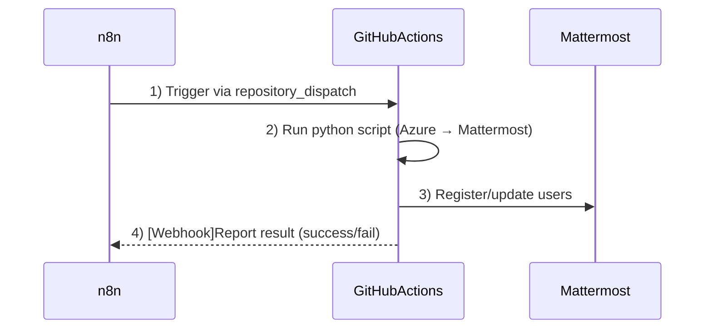
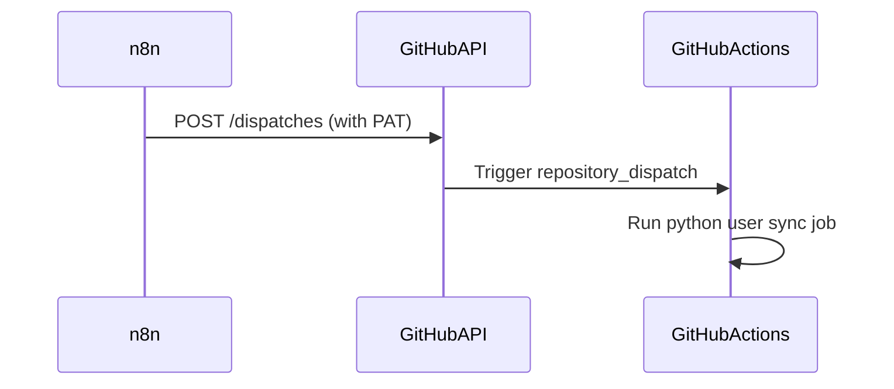

# Mattermost


# 1. 개요

Kubernetes 클러스터에 Helm을 사용하여 Mattermost를 설치한다.


# 2. Helm Install

## 1) Mattermost 공식 Helm Chart 추가

```sh

helm repo add mattermost https://helm.mattermost.com
helm repo update

$ helm search repo mattermost

NAME                                            CHART VERSION   APP VERSION     DESCRIPTION
mattermost/mattermost-calls-offloader           0.2.1           0.9.0           A Helm chart for Kubernetes to deploy Mattermos...
mattermost/mattermost-chaos-engine              0.2.0                           A Helm chart for Kubernetes and Mattermost Appl...
mattermost/mattermost-enterprise-edition        2.6.73          10.7.1          Mattermost Enterprise server with high availiti...
mattermost/mattermost-operator                  1.0.2           1.22.0          A Helm chart for Mattermost Operator
mattermost/mattermost-push-proxy                0.14.0          6.3.0           Mattermost Push Proxy server
mattermost/mattermost-rtcd                      1.4.0           latest          A Helm chart for Kubernetes to deploy Mattermos...
mattermost/mattermost-team-edition              6.6.76          10.7.1          Mattermost Team Edition server.
mattermost/focalboard                           0.5.0           0.6.7           Focalboard Server


$ mkdir -p ~/song/mattermost
$ cd ~/song/mattermost

$ helm show values mattermost/mattermost-team-edition > 11.mattermost-values.yaml


```


------


## 2) 설치 옵션 확인


Mattermost의 Helm chart에 설정 가능한 값 확인:

```
helm show values mattermost/mattermost-team-edition > mattermost-values.yaml
```

이 파일을 편집하여 원하는 설정을 적용할 수 있습니다.


------


## 3) 기본 설치 명령어 (테스트용)

```sh

# NS 생성
$ kubectl create ns mattermost


$ helm -n mattermost install mattermost \
    mattermost/mattermost-team-edition \
    --set service.type=ClusterIP \
    --set persistence.data.enabled=false \
    --set persistence.data.size=10Gi \
    --set ingress.enabled=true \
    --set ingress.className=nginx \
    --set ingress.hosts\[0\]=mm.cbiz.kubepia.net \
    --set ingress.tls\[0\].secretName=mattermost-tls \
    --set ingress.tls\[0\].hosts\[0\]=mm.cbiz.kubepia.net \
    --set mysql.enabled=true \
    --set mysql.mysqlUser=ssongman \
    --set mysql.mysqlRootPassword=New1234! \
    --set mysql.mysqlUser=ssongman \
    --set mysql.mysqlPassword=New1234! \
    --set mysql.mysqlDatabase=mattermost \
    --set mysql.persistence.enabled=false \
    --set mysql.persistence.size=10Gi \
    --dry-run=true


NAME: mattermost
LAST DEPLOYED: Wed Apr 30 19:16:01 2025
NAMESPACE: mattermost
STATUS: deployed
REVISION: 1
NOTES:
You can easily connect to the remote instance from your browser. Forward the webserver port to localhost:8065

- kubectl port-forward --namespace mattermost $(kubectl get pods --namespace mattermost -l "app.kubernetes.io/name=mattermost-team-edition,app.kubernetes.io/instance=mattermost" -o jsonpath='{ .items[0].metadata.name }') 8080:8065

Mattermost will be available at the URL, if you setup the nginx-ingress or other type of ingress:

  https://mm.cbiz.kubepia.net
  


$ helm -n mattermost ls


# 삭제시...
$ helm -n mattermost 


```


## 4) 초기 관리자 계정 생성


Mattermost는 최초 접속 시 웹 UI를 통해 직접 관리자 계정을 생성하도록 유도합니다.

```

User: ssongman
Pass: New1234!


```


------


## 5) Ingress Controller 사용


Ingress NGINX 등을 사용하는 경우 mattermost-values.yaml에 다음을 추가:

```

apiVersion: networking.k8s.io/v1
kind: Ingress
metadata:
  annotations:
    cert-manager.io/cluster-issuer: letsencrypt-prod
    kubernetes.io/tls-acme: "true"
    meta.helm.sh/release-name: mattermost
    meta.helm.sh/release-namespace: mattermost
    nginx.ingress.kubernetes.io/ssl-redirect: "true"


ingress:
  enabled: true
  annotations:
    kubernetes.io/ingress.class: nginx
  hosts:
    - name: mattermost.example.com
      path: /
  tls:
    - secretName: mattermost-tls
      hosts:
        - mattermost.example.com
```


# 3. 모바일 푸시 알림

참고 : https://docs.mattermost.com/deploy/mobile/host-your-own-push-proxy-service.html

## 1) 푸시 알림 서비스 조건

Mattermost에서 모바일 푸시 알림이 작동하려면 다음이 설정되어야 한다.

* 푸시 알림 서비스가 활성화됨
* Push Notification Server가 설정됨
* Self-hosted는 “HPNS” (Mattermost Cloud Push Notification Service) 사용 가능
* Enterprise 라이선스 없이도 기본 푸시 서비스는 사용 가능
* 서버가 인터넷에 접근 가능해야 함
* 모바일 앱이 로그인한 계정의 알림 설정이 활성화되어 있어야 함


## 2) 푸시 알림 설정

* 메뉴 : 환경 > 푸시알림서버

  * 모바일푸시알림 : "TPNS연결을 사용하여 알림을 전송합니다."

  * 푸시 알림서버 : 

    * ```
      https://push-test.mattermost.com
      ```

  * 채널당 최대 알림 : 1000

    * 안정적인 성능을 위해서 최대ㅐ push알림수를 제한한다.
    * 성능 문제로 사용자가 메시지를 입력하기 전, @all, @here, @channel에 도달하기 전까지 채널에 있는 최대 총 사용자 수가 더 이상 알림을 보내지 않는다.


# 4. 사용자추가

admin 이 사용자를 추가하는 방법을 알아본다.  이기능을 이용하면 일괄로 대량의 사용자를 추가 및 갱신할 수 있다. 

System Admin 권한을 가진 Personal Access Token (PAT) 가 필요하다.


## 1) PAT 발급

System Admin 권한을 가진 Personal Access Token (PAT) 발급


### (1) PAT 를 사용하려면 

개인 액세스 토큰을 활성화해야 한다.

* 메뉴 : 시스템 콘솔 > 통합 > 통합관리 > 개인 엑새스 토큰
  * "활성화" 로 변경


### (2) User Access Token 발급

* 메뉴 : Profile > Security > PAT
  * 토큰 생성하기
  * 토큰설명 : forRestAPI
  * 저장

```

토큰 설명: forRestAPI
토큰 ID: nnpwscbffpnzixcbpe58zqgnwe
액세스 토큰 : 5rwhoxq1qibxumxxhymsr1wwxr

```


## 2) 사용자추가


### (1) 사용자 정보 가져오기

```sh


AdminToken=<myadmintoken>
AdminToken=5rwhoxq1qibxumxxhymsr1wwxr


$ curl -X GET https://mm.cbiz.kubepia.net/api/v4/users \
  -H "Authorization: Bearer $AdminToken" \
  -H 'Content-Type: application/json'

[
    {
        "id": "3opp4q694ig5fgan83z11jwgpc",
        "create_at": 1746008747985,
        "update_at": 1746061214320,
        "delete_at": 0,
        "username": "ssongman",
        "auth_data": "",
        "auth_service": "",
        "email": "ssongmantop@gmail.com",
        "nickname": "",
        "first_name": "",
        "last_name": "",
        "position": "",
        "roles": "system_admin system_user",
        "notify_props": {
            "channel": "true",
            "comments": "never",
            "desktop": "mention",
            "desktop_sound": "true",
            "desktop_threads": "all",
            "email": "true",
            "email_threads": "all",
            "first_name": "false",
            "mention_keys": "",
            "push": "mention",
            "push_status": "online",
            "push_threads": "all"
        },
        "locale": "ko",
        "timezone": {
            "automaticTimezone": "Asia/Seoul",
            "manualTimezone": "",
            "useAutomaticTimezone": "true"
        },
        "remote_id": "",
        "disable_welcome_email": false
    },
    {
        "id": "wa4o49uxxfda78kdejewehrfao",
        "create_at": 1746009000003,
        "update_at": 1746009000003,
        "delete_at": 0,
        "username": "system-bot",
        "auth_data": "",
        "auth_service": "",
        "email": "system-bot@localhost",
        "nickname": "",
        "first_name": "System",
        "last_name": "",
        "position": "",
        "roles": "system_user",
        "notify_props": {
            "channel": "true",
            "comments": "never",
            "desktop": "mention",
            "desktop_sound": "true",
            "desktop_threads": "all",
            "email": "true",
            "email_threads": "all",
            "first_name": "false",
            "mention_keys": "",
            "push": "mention",
            "push_status": "online",
            "push_threads": "all"
        },
        "locale": "en",
        "timezone": {
            "automaticTimezone": "",
            "manualTimezone": "",
            "useAutomaticTimezone": "true"
        },
        "is_bot": true,
        "disable_welcome_email": false
    }
]

```


### (2) 사용자 추가

```sh

# admin 추가
$ curl -X POST https://mm.cbiz.kubepia.net/api/v4/users \
  -H "Authorization: Bearer $AdminToken" \
  -H 'Content-Type: application/json' \
  -d '{
    "email": "admin@ktds.co.kr",
    "username": "admin",
    "nickname": "admin",
    "password": "adminpass123!"
  }'

{"id":"zfkbck893fdi9y1nihri349ypa","create_at":1746065066658,"update_at":1746065066658,"delete_at":0,"username":"admin","auth_data":"","auth_service":"","email":"admin@ktds.co.kr","nickname":"","first_name":"","last_name":"","position":"","roles":"system_user","notify_props":{"channel":"true","comments":"never","desktop":"mention","desktop_sound":"true","desktop_threads":"all","email":"true","email_threads":"all","first_name":"false","mention_keys":"","push":"mention","push_status":"online","push_threads":"all"},"last_password_update":1746065066658,"locale":"ko","timezone":{"automaticTimezone":"","manualTimezone":"","useAutomaticTimezone":"true"},"remote_id":"","disable_welcome_email":false}

```


```sh

# 82023066@ktds.co.kr 추가

$ curl -X POST https://mm.cbiz.kubepia.net/api/v4/users \
  -H "Authorization: Bearer $AdminToken" \
  -H 'Content-Type: application/json' \
  -d '{
    "email": "82023066@ktds.co.kr",
    "username": "82023066",
    "nickname": "송양종(Cloud사업2팀)",
    "password": "New1234!"
  }'


{"id":"zfkbck893fdi9y1nihri349ypa","create_at":1746065066658,"update_at":1746065066658,"delete_at":0,"username":"admin","auth_data":"","auth_service":"","email":"admin@ktds.co.kr","nickname":"","first_name":"","last_name":"","position":"","roles":"system_user","notify_props":{"channel":"true","comments":"never","desktop":"mention","desktop_sound":"true","desktop_threads":"all","email":"true","email_threads":"all","first_name":"false","mention_keys":"","push":"mention","push_status":"online","push_threads":"all"},"last_password_update":1746065066658,"locale":"ko","timezone":{"automaticTimezone":"","manualTimezone":"","useAutomaticTimezone":"true"},"remote_id":"","disable_welcome_email":false}

```


```sh


# 82022559@ktds.co.kr


$ curl -X POST https://mm.cbiz.kubepia.net/api/v4/users \
  -H "Authorization: Bearer $AdminToken" \
  -H 'Content-Type: application/json' \
  -d '{
    "email": "82022559@ktds.co.kr",
    "username": "82022559",
    "nickname": "임성식(ICIS Tr 빌링팀)",
    "password": "New1234!"
  }'


```


### (3) 사용자 삭제

```sh

curl --request DELETE \
  --url http://localhost:8065/api/v4/users/{user_id} \
  --header 'Accept: application/json' \
  --header 'Authorization: Bearer 123'


curl --request DELETE \
  --url https://mm.cbiz.kubepia.net/api/v4/users/e1me8cw4apre5gcb7ipjzk16oo \
  -H "Authorization: Bearer $AdminToken" \
  -H 'Accept: application/json'
  
{"status":"OK"}
  
  
```


### (4) 사용자 정보 Patch

생략된 필드는 업데이트 되지 않는다.

```sh

# 샘플
curl --request PUT \
  --url http://localhost:8065/api/v4/users/{user_id}/patch \
  --header 'Accept: application/json' \
  --header 'Authorization: Bearer 123' \
  --header 'Content-Type: application/json' \
  --data '{
  "email": "string",
  "username": "string",
  "first_name": "string",
  "last_name": "string",
  "nickname": "string",
  "locale": "string",
  "position": "string",
  "timezone": {
    "useAutomaticTimezone": true,
    "manualTimezone": "string",
    "automaticTimezone": "string"
  },
  "props": {},
  "notify_props": {
    "email": "string",
    "push": "string",
    "desktop": "string",
    "desktop_sound": "string",
    "mention_keys": "string",
    "channel": "string",
    "first_name": "string"
  }
}'


curl --request PUT \
  --url https://mm.cbiz.kubepia.net/api/v4/users/e1me8cw4apre5gcb7ipjzk16oo/patch \
  -H "Authorization: Bearer $AdminToken" \
  --header 'Content-Type: application/json' \
  --data '{
  "nickname": "송양종(Cloud CoE팀)"
   }'

```


# 5. 대량 사용자 추가


## 1) 대량 사용자를 추가 아키텍처


* Azure Graph API로 사용자 목록 조회
* Python 등으로 REST API를 호출하여 사용자 직접 생성 (POST /api/v4/users)


### 참고 Azure Graph API

Graph API는 Microsoft 365 서비스 전반에 걸친 데이터를 통합적으로 다룰 수 있게 해주는 RESTful API이다.

* **“Graph”**라는 이름은 Microsoft의 리소스들이 **그래프(연결된 노드 구조)**처럼 상호 연관돼 있기 때문이다.
* users, groups, teams, files, devices, apps 등 **모든 리소스가 하나의 통합된 API 엔드포인트**를 통해 노출된다.
* Microsoft의 모든 리소스를 그래프 구조로 묶은 특정 REST API 제품이라서 Graph API 라고 부른다.
* 
* 예시


#### 예시 shell

```sh


GET https://graph.microsoft.com/v1.0/users

# 1. Access token 발급 (Client Credentials Flow)
ACCESS_TOKEN=$(curl -s -X POST -H "Content-Type: application/x-www-form-urlencoded" \
  -d "grant_type=client_credentials" \
  -d "client_id=YOUR_CLIENT_ID" \
  -d "client_secret=YOUR_CLIENT_SECRET" \
  -d "scope=https://graph.microsoft.com/.default" \
  "https://login.microsoftonline.com/YOUR_TENANT_ID/oauth2/v2.0/token" \
  | jq -r '.access_token')

# 2. 사용자 목록 호출
curl -H "Authorization: Bearer $ACCESS_TOKEN" \
     https://graph.microsoft.com/v1.0/users


```


#### az rest

```sh

az login     # 또는 서비스 주체로 az login --service-principal

az rest --method GET --uri "https://graph.microsoft.com/v1.0/users"

```


## 2) Microsoft Graph API

Python에서 Microsoft Graph API를 통해 Azure Entra ID 사용자 목록을 조회한다.


### (1) Azure에 앱 등록

> Client Credentials Flow 용


Azure Portal에서 API 접근을 위한 애플리케이션을 등록한다.


* 메뉴 : Azure Portal > Microsoft Entra ID

  * 왼쪽 메뉴 > 앱 등록 > 새 등록

    * 설정:
      * 이름: mattermost-user-syn
      * 지원되는 계정 유형: **조직 디렉터리 전용**
      * 리디렉션 URI: (필요 없음)
    * 등록

  * Client Secret 생성

    * 앱 등록 완료 후 왼쪽 메뉴에서 인증서 및 비밀
    * 새 클라이언트 비밀 생성 → 설명 및 만료일 설정
      * 설명 : Mattermost User 동기화
      * 만료일 : 6개월
    * 생성 직후 **비밀 값 복사** (이후 재확인 불가)

  * 등록 후, 아래 3가지를 기록한다.

    * Application (client) ID

    * Directory (tenant) ID

    * Client Secret

  * API 권한 추가

    * 앱 등록 > API 권한 > 권한 추가 클릭
    * **Microsoft Graph** 선택
    * **애플리케이션 사용 권한** > User.Read.All 선택
    * 추가 후 → 관리자 동의 클릭하여 조직 승인 처리

```

* Application (client) ID : ed5712b8-bdc8-4908-883d-503c40226372
* Directory (tenant) ID : 4f0a3bfd-1156-4cce-8dc2-a049a13dba23
* Client Secret : 9ug8Q~VO....
* Secret ID : 10b804ba-388d-443a-90e4-193beea7a82c

```


### (2) python pod 준비


```sh

$ kubectl -n temp create deploy python --image=python -- sleep 365d
deployment.apps/python created


# python pod 내로 진입
$ kubectl -n temp exec -it deploy/python -- bash


# 
$ pip install msal requests

$  python
Python 3.13.3

```


### (3) [Python코드]사용자 목록

```sh

$ mkdir -p ~/song
  cd ~/song

$ cat > 11.get_users_from_graph.py

```


코드

```python
import os
import msal
import requests
import re


def normalize_username(upn):    
    """
    # Mattermost username 생성규칙
    길이 : 3자이상, 22자이하
    문자 : 소문자 영문자(a-z), 숫자(0-9), .-_허용
    첫글자 : 반드시 영문자(a-z) 로 시작
    특수문자 : 공백, 한글 , %, $, *, @ 등 사용불가
    """
    base = upn.split("@")[0].lower()
    base = re.sub(r'[^a-z0-9._-]', '', base)
    base = base[:22]
    if base and not base[0].isalpha():
        base = f"u{base}"
    if len(base) < 3:
        base = "user_" + base
    return base
  
  
# 1. 환경변수에서 민감 정보 가져오기
TENANT_ID = os.environ.get("AZURE_TENANT_ID")
CLIENT_ID = os.environ.get("AZURE_CLIENT_ID")
CLIENT_SECRET = os.environ.get("AZURE_CLIENT_SECRET")

if not all([TENANT_ID, CLIENT_ID, CLIENT_SECRET]):
    raise ValueError("환경변수가 누락되었습니다. AZURE_TENANT_ID, AZURE_CLIENT_ID, AZURE_CLIENT_SECRET를 설정하세요.")

# 2. 인증 정보 설정
AUTHORITY = f"https://login.microsoftonline.com/{TENANT_ID}"
SCOPE = ["https://graph.microsoft.com/.default"]
GRAPH_ENDPOINT = "https://graph.microsoft.com/v1.0/users"

# 3. 토큰 요청
app = msal.ConfidentialClientApplication(
    CLIENT_ID,
    authority=AUTHORITY,
    client_credential=CLIENT_SECRET
)

result = app.acquire_token_for_client(scopes=SCOPE)

if "access_token" in result:
    print("액세스 토큰 획득 성공")
    headers = {"Authorization": f"Bearer {result['access_token']}"}
    
    users = []
    url = GRAPH_ENDPOINT

    # 4. 사용자 목록 요청 (페이징 포함)
    while url:
        response = requests.get(url, headers=headers)
        response.raise_for_status()
        data = response.json()
        users.extend(data.get("value", []))
        url = data.get("@odata.nextLink")

    # 5. 출력
    for user in users:
        email = user.get("mail") or user.get("userPrincipalName")  # fallback 처리
        username = email.split("@")[0] if "@" in email else email   # username: email의 @ 앞부분
        username = normalize_username(username)
        nickname = user.get("displayName")
        password = "New1234!"  # 임시 비밀번호
        print(f"{email} - {username} - {nickname}")
else:
    print("토큰 획득 실패:", result.get("error_description"))
```


수행

```sh

# 환경변수
export AZURE_TENANT_ID="4f0a3bfd-1156-4cce-8dc2-a049a13dba23"
export AZURE_CLIENT_ID="ed5712b8-bdc8-4908-883d-503c40226372"
export AZURE_CLIENT_SECRET="9ug8Q~VO....."

# 수행
python 11.get_users_from_graph.py

```


출력 예시

```

액세스 토큰 획득 성공
성상철(ICIS Tr PMO팀) - 82021968@ktds.co.kr
백종환(재무DX개발팀) - 82021969@ktds.co.kr
유광선(플랫폼컨설팅팀) - 82021974@ktds.co.kr
전민철(인증금융플랫폼팀) - 82021977@ktds.co.kr
신혜진(오픈채널서비스팀) - 82021982@ktds.co.kr
최영돈(그룹BD팀) - 82021983@ktds.co.kr
이효리(Rater서비스팀) - 82021985@ktds.co.kr
...

```


### (4) [Python코드]사용자 등록


```sh
$ mkdir -p ~/song
  cd ~/song

$ cat > get_users_from_graph.py

```


```python

import os
import requests

MM_TOKEN = os.environ.get("MM_ADMIN_TOKEN")
MM_BASE_URL = os.environ.get("MM_API_BASE_URL")

if not MM_TOKEN or not MM_BASE_URL:
    raise Exception("환경변수 MM_ADMIN_TOKEN 또는 MM_API_BASE_URL이 누락되었습니다.")

# 샘플 사용자 리스트 (앞에서 받아온 Entra ID 결과 사용)
azure_users = [
    {"email": "user1@domain.com", "username": "user1"},
    {"email": "user2@domain.com", "username": "user2"},
    # ...
]

headers = {
    "Authorization": f"Bearer {MM_TOKEN}",
    "Content-Type": "application/json"
}

def create_mm_user(user):
    payload = {
        "email": user["email"],
        "username": user["username"],
        "password": "TempPassw0rd!"  # 정책에 맞는 임시 비밀번호
    }

    resp = requests.post(f"{MM_BASE_URL}/api/v4/users", headers=headers, json=payload)
    
    if resp.status_code == 201:
        print(f"✅ 사용자 등록 성공: {user['username']}")
    elif resp.status_code == 400 and "email" in resp.text:
        print(f"⚠️ 이미 존재하는 이메일: {user['email']}")
    else:
        print(f"❌ 사용자 등록 실패: {user['username']} / {resp.status_code} - {resp.text}")

# 반복 처리
for user in azure_users:
    create_mm_user(user)
    
```


```sh

export MM_ADMIN_TOKEN="your-mattermost-admin-token"
export MM_API_BASE_URL="https://mm.cbiz.kubepia.net"


```


```sh


# 
$ curl -X POST https://mm.cbiz.kubepia.net/api/v4/users \
  -H "Authorization: Bearer $AdminToken" \
  -H 'Content-Type: application/json' \
  -d '{
    "email": "admin@ktds.co.kr",
    "username": "admin",
    "password": "adminpass123!"
  }'

{"id":"zfkbck893fdi9y1nihri349ypa","create_at":1746065066658,"update_at":1746065066658,"delete_at":0,"username":"admin","auth_data":"","auth_service":"","email":"admin@ktds.co.kr","nickname":"","first_name":"","last_name":"","position":"","roles":"system_user","notify_props":{"channel":"true","comments":"never","desktop":"mention","desktop_sound":"true","desktop_threads":"all","email":"true","email_threads":"all","first_name":"false","mention_keys":"","push":"mention","push_status":"online","push_threads":"all"},"last_password_update":1746065066658,"locale":"ko","timezone":{"automaticTimezone":"","manualTimezone":"","useAutomaticTimezone":"true"},"remote_id":"","disable_welcome_email":false}


```


### (5) [Python코드] 최종코드

### 

```sh
$ mkdir -p ~/song
  cd ~/song

$ cat > 20.azure_user_to_mattermost.py

```


```python
# -*- coding: utf-8 -*-
import os
import msal
import requests
import re

# Load Azure and Mattermost credentials from environment variables
TENANT_ID = os.environ.get("AZURE_TENANT_ID")
CLIENT_ID = os.environ.get("AZURE_CLIENT_ID")
CLIENT_SECRET = os.environ.get("AZURE_CLIENT_SECRET")
MM_TOKEN = os.environ.get("MM_ADMIN_TOKEN")
MM_BASE_URL = os.environ.get("MM_API_BASE_URL")

# Validate required environment variables
if not all([TENANT_ID, CLIENT_ID, CLIENT_SECRET, MM_TOKEN, MM_BASE_URL]):
    raise Exception("❌ Missing required environment variables.")

# Microsoft Graph API settings
AUTHORITY = f"https://login.microsoftonline.com/{TENANT_ID}"
SCOPE = ["https://graph.microsoft.com/.default"]
GRAPH_ENDPOINT = "https://graph.microsoft.com/v1.0/users"

def normalize_username(upn): 
    """
    Normalize a username string to be compliant with Mattermost rules:
    - Must be between 3 and 22 characters
    - Must start with a letter
    - Only lowercase letters, numbers, '.', '-', '_' allowed
    - Disallow spaces, non-ASCII, special symbols
    """
    base = upn.split("@")[0].lower()
    base = re.sub(r'[^a-z0-9._-]', '', base)
    base = base[:22]
    if base and not base[0].isalpha():
        base = f"u{base}"
    if len(base) < 3:
        base = "user_" + base
    return base

# Fetch user list from Azure Entra ID using Microsoft Graph API
def get_azure_users():
    print("🔄 Fetching users from Azure Entra ID...")
    app = msal.ConfidentialClientApplication(
        CLIENT_ID, authority=AUTHORITY,
        client_credential=CLIENT_SECRET
    )
    result = app.acquire_token_for_client(scopes=SCOPE)

    if "access_token" not in result:
        raise Exception(f"❌ Failed to acquire token: {result.get('error_description')}")

    headers = {"Authorization": f"Bearer {result['access_token']}"}
    users = []
    url = GRAPH_ENDPOINT

    while url:
        response = requests.get(url, headers=headers)
        response.raise_for_status()
        data = response.json()
        users.extend(data.get("value", []))
        url = data.get("@odata.nextLink")

    print(f"✅ Loaded {len(users)} users.")
    return users

# Create or update a user in Mattermost
def create_or_update_mm_user(user):
    email = user.get("mail") or user.get("userPrincipalName")
    username = email.split("@")[0] if "@" in email else email
    username = normalize_username(username)
    nickname = user.get("displayName")
    password = "New1234!"  # temporary password

    headers = {
        "Authorization": f"Bearer {MM_TOKEN}",
        "Content-Type": "application/json"
    }

    # Step 1: Check if user exists by email
    resp = requests.get(f"{MM_BASE_URL}/api/v4/users/email/{email}", headers=headers)

    if resp.status_code == 200:
        # Update nickname if user exists
        user_id = resp.json().get("id")
        patch_payload = { "nickname": nickname }
        patch_resp = requests.put(
            f"{MM_BASE_URL}/api/v4/users/{user_id}/patch",
            headers=headers,
            json=patch_payload
        )
        if patch_resp.status_code == 200:
            print(f"🔄 Updated nickname: {nickname} ({email})")
        else:
            print(f"⚠️ Failed to update: {email} / {patch_resp.status_code} / {patch_resp.text}")
    elif resp.status_code == 404:
        # Create user if not exists
        payload = {
            "email": email,
            "username": username,
            "nickname": nickname,
            "password": password
        }
        create_resp = requests.post(
            f"{MM_BASE_URL}/api/v4/users",
            headers=headers,
            json=payload
        )
        if create_resp.status_code == 201:
            print(f"✅ Created user: {username}")
        else:
            print(f"❌ Failed to create: {username} / {create_resp.status_code} / {create_resp.text}")
    else:
        print(f"❌ Failed to lookup: {email} / {resp.status_code} / {resp.text}")

# Main entry point
def main():
    # List of approved names (partial match)
    creates_approval_names = ["이정운", "이철규"]
    
    azure_users = get_azure_users()
    for user in azure_users:
        nickname = user.get("displayName") or ""
        
        if any(name in nickname for name in creates_approval_names):
            print(f"⏭️ Processing: {nickname}")
            create_or_update_mm_user(user)

if __name__ == "__main__":
    main()
```


실행전 환경변수 설정

```sh

export AZURE_TENANT_ID="4f0a3bfd-1156-4cce-8dc2-a049a13dba23"
export AZURE_CLIENT_ID="ed5712b8-bdc8-4908-883d-503c40226372"
export AZURE_CLIENT_SECRET="9ug8Q~VO...."
export MM_ADMIN_TOKEN="5rwhoxq1qibxumxxhymsr1wwxr"
export MM_API_BASE_URL="https://mm.cbiz.kubepia.net"


$ python 20.azure_user_to_mattermost.py

```


# 6. 자동화

## 1) 개요

n8n --> github action 의 형태로 자동화한다.

n8n은 HTTP Request Node를 통해 **GitHub Actions를 트리거(Dispatch)** 할 수 있으며,
GitHub Actions에서는 등록된 Python 코드를 실행할 수 있다.

이런  구조는 **완전 자동화 + 이력 관리 + 보안 분리** 측면에서 적절하다.


### (1) 수행구조

```
[n8n → Schedule Trigger]
         ↓
 [GitHub Actions: python script 실행]
         ↓
 (선택) n8n Webhook으로 실행 결과 보고
```




​	1.	**n8n**: Schedule 노드에 의해 매일 실행

​	2.	**GitHub Actions**: repository_dispatch 이벤트로 실행됨

​	3.	**Python Script**: Azure 사용자 정보를 가져와 Mattermost에 등록 또는 수정

​	4.	**결과 전송**: GitHub Actions에서 실행 결과를 n8n Webhook으로 POST 전송


## 2) GitHub Actions


### (1) GitHub Actions 워크플로우

* 이름 : azure_user_to_mattermost.yml

```yaml
name: azure_user_to_mattermost

on:
  workflow_dispatch:  # manual trigger via API
  repository_dispatch:  # external trigger via HTTP
    types: [run-azure_user_to_mattermost]

permissions:
  contents: read

jobs:
  build:

    runs-on: ubuntu-latest

    steps:
    - uses: actions/checkout@v4
    - name: Set up Python 3.10
      uses: actions/setup-python@v3
      with:
        python-version: "3.10"
    - name: Install dependencies
      run: |
        # python -m pip install --upgrade pip
        # pip install flake8 pytest
        if [ -f mattermost/requirements.txt ]; then pip install -r mattermost/requirements.txt; fi
    # - name: Lint with flake8
    #   run: |
    #     # stop the build if there are Python syntax errors or undefined names
    #     flake8 . --count --select=E9,F63,F7,F82 --show-source --statistics
    #     # exit-zero treats all errors as warnings. The GitHub editor is 127 chars wide
    #     flake8 . --count --exit-zero --max-complexity=10 --max-line-length=127 --statistics
    # - name: Test with pytest
    #   run: |
    #     pytest
    - name: Run sync script
      env:
        AZURE_TENANT_ID: ${{ vars.AZURE_TENANT_ID }}
        AZURE_CLIENT_ID: ${{ vars.AZURE_CLIENT_ID }}
        AZURE_CLIENT_SECRET: ${{ secrets.AZURE_CLIENT_SECRET }}
        MM_ADMIN_TOKEN: ${{ secrets.MM_ADMIN_TOKEN }}
        MM_API_BASE_URL: ${{ vars.MM_API_BASE_URL }}
      run: python mattermost/20.azure_user_to_mattermost.py
```


### (2) GitHub PAT

* 메뉴 : **“Fine-grained token”** 또는 **Classic token**
  * 이름 : TokenForN8N
  * 권한 설정:
    * repo (필수)
    * workflow (필수)
  * 토큰 복사
* organization 권한추가
  * 메뉴 : 토큰선택
    * Configure SSO클릭
    * 해당 Organization 에 권한 부여


### (3) http trigger

```sh
# 트리거형식
https://api.github.com/repos/YOUR_ORG/YOUR_REPO/dispatches

  

GithubARCToken=ghp_WeHii....

# 트리거
$ curl -X POST https://api.github.com/repos/cloudbiz-at/at-auto/dispatches \
    -H "Authorization: Bearer $GithubARCToken" \
    -H 'Content-Type: application/json' \
    -d '{
    "event_type": "run-get_users_from_graph"
    }'

{
  "message": "Resource protected by organization SAML enforcement. You must grant your Personal Access token access to this organization.",
  "documentation_url": "https://docs.github.com/articles/authenticating-to-a-github-organization-with-saml-single-sign-on/",
  "status": "403"
}


```


## 3) n8n


### (1) 호출구조




n8n에서 Schedule Trigger + HTTP Request 설정


### (2) credential 등록

```sh

	1.	n8n UI → 왼쪽 메뉴 → Credentials
	2.	우측 상단 + New Credential 클릭
	3.	HTTP Basic Auth 선택 (또는 HTTP Header 방식도 가능)
	
```


```sh


{
  "Authorization": "Bearer ghp_WeHii..."
}


```


### (3) 


* Trigger: Schedule (매일 오전 3시 등)
* Action: HTTP Request Node → POST https://api.github.com/repos/your-org/your-repo/dispatches


```

POST

https://api.github.com/repos/cloudbiz-at/at-auto/dispatches


```


**🧾 Headers:**

```
Authorization: Bearer <github_token>
Accept: application/vnd.github.everest-preview+json
```

> github_token은 GitHub Personal Access Token (PAT) 또는 n8n secret에 저장

> 


## 4) 결과 알림

(선택) GitHub Actions → 결과 Webhook으로 n8n 알림**


Python 코드에서 마지막에 n8n Webhook 호출:

```

import requests

requests.post("https://n8n.yourdomain.com/webhook/sync-status", json={
    "status": "success",
    "synced": 48
})

```

