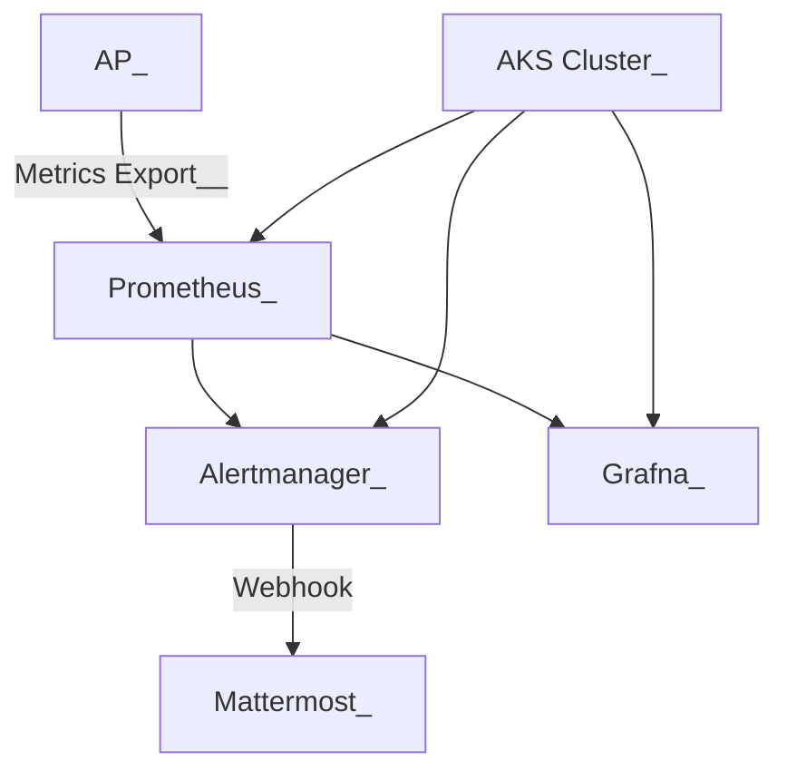

# Grafana + Prometheus + Alertmanager 설치 가이드


# 1. 개요


AKS(Kubernetes) 환경에 kube-prometheus-stack(Grafana + Prometheus + Alertmanager) 을 Helm Chart로 설치한다.


## 1) 모니터링 및 알림 시스템 구조

AP 에 부하 발생시 Alertmanager 에서 Mattermost 로 알림을 발송한다.

### Prometheus + Alertmanager + Mattermost 연동 구성



*	AP(Application) 부하 상태(Pod CPU/메모리/에러율 등)를 감지
*	Prometheus → Alertmanager 경유 → Mattermost 채널에 경고 메시지 전송


# 2. Install with Helm


## 1) helm 준비

```sh
$ helm repo add prometheus-community https://prometheus-community.github.io/helm-charts

$ helm repo update

$ helm search repo kube-prometheus-stack
NAME                                            CHART VERSION   APP VERSION     DESCRIPTION
prometheus-community/kube-prometheus-stack      71.1.0          v0.82.0         kube-prometheus-stack collects Kubernetes manif...


# values.yaml 확인
$ helm show values prometheus-community/kube-prometheus-stack > 11.values.yaml


```


## 2) helm Install

### NS 생성

```sh
$ kubectl create ns monitoring

```


### (2) 설치 명령

#### prom-stack-values.yaml 준비

```sh

$ mkdir -p ~/song/prom-stack
  cd ~/song/prom-stack

$ cat > prom-stack-values.yaml

```


```yaml
grafana:
  enabled: true
  persistence:
    enabled: true
    size: 10Gi
  ingress:
    enabled: true
    ingressClassName: nginx
    hosts:
      - grafana.cbiz.kubepia.net
    annotations:
      cert-manager.io/cluster-issuer: letsencrypt-prod
      nginx.ingress.kubernetes.io/ssl-redirect: "true"
    tls:
      - secretName: grafana-tls
        hosts:
          - grafana.cbiz.kubepia.net

prometheus:
  ingress:
    enabled: true
    ingressClassName: nginx
    hosts:
      - prometheus.cbiz.kubepia.net
    annotations:
      cert-manager.io/cluster-issuer: letsencrypt-prod
      nginx.ingress.kubernetes.io/ssl-redirect: "true"
    tls:
      - secretName: prometheus-tls
        hosts:
          - prometheus.cbiz.kubepia.net
  persistence:
    enabled: true
    size: 20Gi

alertmanager:
  enabled: true
  ingress:
    enabled: true
    ingressClassName: nginx
    hosts:
      - alertmanager.cbiz.kubepia.net
    annotations:
      cert-manager.io/cluster-issuer: letsencrypt-prod
      nginx.ingress.kubernetes.io/ssl-redirect: "true"
    tls:
      - secretName: alertmanager-tls
        hosts:
          - alertmanager.cbiz.kubepia.net
  persistence:
    enabled: true
    size: 10Gi
```


#### helm install

```sh
$ cd ~/song/prom-stack

$ helm -n monitoring upgrade --install prom-stack prometheus-community/kube-prometheus-stack \
    -f prom-stack-values.yaml


# dry-run
$ helm -n monitoring upgrade --install prom-stack prometheus-community/kube-prometheus-stack \
    -f prom-stack-values.yaml \
    --dry-run=true > dry-run.yaml


Visit https://github.com/prometheus-operator/kube-prometheus for instructions on how to create & configure Alertmanager and Prometheus instances using the Operator.


# 확인
$ helm -n monitoring ls
NAME            NAMESPACE       REVISION        UPDATED                                 STATUS          CHART                           APP VERSION
prom-stack      monitoring      1               2025-05-02 18:08:14.468729 +0900 KST    deployed        kube-prometheus-stack-71.1.0    v0.82.0
prom-stack      monitoring      3               2025-05-02 22:48:03.285607 +0900 KST    deployed        kube-prometheus-stack-71.1.0    v0.82.0
prom-stack      monitoring      4               2025-05-02 22:57:31.821629 +0900 KST    deployed        kube-prometheus-stack-71.1.0    v0.82.0
prom-stack      monitoring      7               2025-05-03 20:53:20.274697 +0900 KST    deployed        kube-prometheus-stack-71.1.0    v0.82.0


# 삭제시...
$ helm -n monitoring delete prom-stack


```


#### 주요 설정 항목 설명

| **항목**                 | **설명**                                         |
| ------------------------ | ------------------------------------------------ |
| grafana.ingress.*        | Grafana에 대한 Ingress 설정                      |
| grafana.persistence.*    | PVC를 이용한 Grafana 데이터 유지                 |
| prometheus.ingress.*     | Prometheus Web UI 접근 Ingress                   |
| prometheus.persistence.* | Prometheus 장기 데이터 저장을 위한 설정          |
| alertmanager.ingress.*   | Alertmanager Web UI 접근 설정                    |
| alertmanager.config      | Mattermost와 연동된 Webhook 기반 Alert 수신 설정 |


#### 설치된 values 확인

```sh


# values 확인
$ helm -n monitoring get values prom-stack
USER-SUPPLIED VALUES:
alertmanager:
  enabled: true
  ingress:
    annotations:
      cert-manager.io/cluster-issuer: letsencrypt-prod
      nginx.ingress.kubernetes.io/ssl-redirect: "true"
    enabled: true
    hosts:
    - alertmanager.cbiz.kubepia.net
    ingressClassName: nginx
    tls:
    - hosts:
      - alertmanager.cbiz.kubepia.net
      secretName: alertmanager-tls
  persistence:
    enabled: true
    size: 10Gi
grafana:
  enabled: true
  ingress:
    annotations:
      cert-manager.io/cluster-issuer: letsencrypt-prod
      nginx.ingress.kubernetes.io/ssl-redirect: "true"
    enabled: true
    hosts:
    - grafana.cbiz.kubepia.net
    ingressClassName: nginx
    tls:
    - hosts:
      - grafana.cbiz.kubepia.net
      secretName: grafana-tls
  persistence:
    enabled: true
    size: 10Gi
prometheus:
  ingress:
    annotations:
      cert-manager.io/cluster-issuer: letsencrypt-prod
      nginx.ingress.kubernetes.io/ssl-redirect: "true"
    enabled: true
    hosts:
    - prometheus.cbiz.kubepia.net
    ingressClassName: nginx
    tls:
    - hosts:
      - prometheus.cbiz.kubepia.net
      secretName: prometheus-tls
  persistence:
    enabled: true
    size: 20Gi


```


#### 설치 확인

```sh

$ kubectl get all -n monitoring
NAME                                                      READY   STATUS    RESTARTS   AGE
pod/prom-stack-grafana-bcf8d9bf6-flsc2                    3/3     Running   0          28m
pod/prom-stack-kube-prometheus-operator-7f44849fb-plnz7   1/1     Running   0          28m
pod/prom-stack-kube-state-metrics-56c4668688-2vqv4        1/1     Running   0          28m
pod/prom-stack-prometheus-node-exporter-df2zf             1/1     Running   0          28m
pod/prom-stack-prometheus-node-exporter-hnnrl             1/1     Running   0          28m
pod/prometheus-prom-stack-kube-prometheus-prometheus-0    2/2     Running   0          28m

NAME                                              TYPE        CLUSTER-IP        EXTERNAL-IP   PORT(S)             AGE
service/prom-stack-grafana                        ClusterIP   192.168.126.114   <none>        80/TCP              28m
service/prom-stack-kube-prometheus-alertmanager   ClusterIP   192.168.126.235   <none>        9093/TCP,8080/TCP   28m
service/prom-stack-kube-prometheus-operator       ClusterIP   192.168.126.75    <none>        443/TCP             28m
service/prom-stack-kube-prometheus-prometheus     ClusterIP   192.168.126.118   <none>        9090/TCP,8080/TCP   28m
service/prom-stack-kube-state-metrics             ClusterIP   192.168.126.151   <none>        8080/TCP            28m
service/prom-stack-prometheus-node-exporter       ClusterIP   192.168.126.79    <none>        9100/TCP            28m
service/prometheus-operated                       ClusterIP   None              <none>        9090/TCP            28m

NAME                                                 DESIRED   CURRENT   READY   UP-TO-DATE   AVAILABLE   NODE SELECTOR            AGE
daemonset.apps/prom-stack-prometheus-node-exporter   2         2         2       2            2           kubernetes.io/os=linux   28m

NAME                                                  READY   UP-TO-DATE   AVAILABLE   AGE
deployment.apps/prom-stack-grafana                    1/1     1            1           28m
deployment.apps/prom-stack-kube-prometheus-operator   1/1     1            1           28m
deployment.apps/prom-stack-kube-state-metrics         1/1     1            1           28m

NAME                                                            DESIRED   CURRENT   READY   AGE
replicaset.apps/prom-stack-grafana-bcf8d9bf6                    1         1         1       28m
replicaset.apps/prom-stack-kube-prometheus-operator-7f44849fb   1         1         1       28m
replicaset.apps/prom-stack-kube-state-metrics-56c4668688        1         1         1       28m

NAME                                                                READY   AGE
statefulset.apps/prometheus-prom-stack-kube-prometheus-prometheus   1/1     28m


$ kubectl get ingress -n monitoring
NAME                                      CLASS   HOSTS                           ADDRESS         PORTS     AGE
prom-stack-grafana                        nginx   grafana.cbiz.kubepia.net        4.230.150.113   80, 443   28m
prom-stack-kube-prometheus-alertmanager   nginx   alertmanager.cbiz.kubepia.net   4.230.150.113   80, 443   28m
prom-stack-kube-prometheus-prometheus     nginx   prometheus.cbiz.kubepia.net     4.230.150.113   80, 443   28m


```


#### alertmanager 확인

```sh
$ kubectl -n monitoring get pods -l app.kubernetes.io/name=alertmanager
$ kubectl -n monitoring get svc -l app.kubernetes.io/name=alertmanager


$ kubectl -n monitoring get alertmanager
NAME                                      VERSION   REPLICAS   READY   RECONCILED   AVAILABLE   AGE
prom-stack-kube-prometheus-alertmanager   v0.28.1   1          1       True         True        17h

$ kubectl -n monitoring get alertmanager prom-stack-kube-prometheus-alertmanager -o yaml
apiVersion: monitoring.coreos.com/v1
kind: Alertmanager
metadata:
  annotations:
    meta.helm.sh/release-name: prom-stack
    meta.helm.sh/release-namespace: monitoring
  creationTimestamp: "2025-05-02T13:40:00Z"
  generation: 1
  labels:
    app: kube-prometheus-stack-alertmanager
    app.kubernetes.io/instance: prom-stack
    app.kubernetes.io/managed-by: Helm
    app.kubernetes.io/part-of: kube-prometheus-stack
    app.kubernetes.io/version: 71.1.0
    chart: kube-prometheus-stack-71.1.0
    heritage: Helm
    release: prom-stack
  name: prom-stack-kube-prometheus-alertmanager
  namespace: monitoring
  resourceVersion: "2985133"
  uid: 3920384f-d636-4f12-a16f-7afe0bad0bf3
spec:
  affinity:
    podAntiAffinity:
      preferredDuringSchedulingIgnoredDuringExecution:
      - podAffinityTerm:
          labelSelector:
            matchExpressions:
            - key: app.kubernetes.io/name
              operator: In
              values:
              - alertmanager
            - key: alertmanager
              operator: In
              values:
              - prom-stack-kube-prometheus-alertmanager
          topologyKey: kubernetes.io/hostname
        weight: 100
  alertmanagerConfigNamespaceSelector: {}
  alertmanagerConfigSelector: {}
  automountServiceAccountToken: true
  externalUrl: http://alertmanager.cbiz.kubepia.net/
  image: quay.io/prometheus/alertmanager:v0.28.1
  listenLocal: false
  logFormat: logfmt
  logLevel: info
  paused: false
  portName: http-web
  replicas: 1
  retention: 120h
  routePrefix: /
  securityContext:
    fsGroup: 2000
    runAsGroup: 2000
    runAsNonRoot: true
    runAsUser: 1000
    seccompProfile:
      type: RuntimeDefault
  serviceAccountName: prom-stack-kube-prometheus-alertmanager
  version: v0.28.1
status:
  availableReplicas: 1
  conditions:
  - lastTransitionTime: "2025-05-02T13:48:28Z"
    message: ""
    observedGeneration: 1
    reason: ""
    status: "True"
    type: Available
  - lastTransitionTime: "2025-05-02T13:48:13Z"
    message: ""
    observedGeneration: 1
    reason: ""
    status: "True"
    type: Reconciled
  paused: false
  replicas: 1
  selector: alertmanager=prom-stack-kube-prometheus-alertmanager,app.kubernetes.io/instance=prom-stack-kube-prometheus-alertmanager,app.kubernetes.io/managed-by=prometheus-operator,app.kubernetes.io/name=alertmanager
  unavailableReplicas: 0
  updatedReplicas: 1
  


# spec.config 이 존재해야 함.


```


## 3) Grafana 접근 정보

​	•	기본 사용자: admin

​	•	초기 비밀번호:

```sh
$ kubectl --namespace monitoring get secrets prom-stack-grafana -o jsonpath="{.data.admin-password}" | base64 -d ; echo

prom-operator

```


```sh

https://grafana.cbiz.kubepia.net

https://prometheus.cbiz.kubepia.net

https://alertmanager.cbiz.kubepia.net
  
```


## **📝 Alert Rule 예시**


> 아래 파일을 ConfigMap으로 생성 후 Prometheus에 mount 하거나 Helm values로 전달

```
groups:
  - name: ap.rules
    rules:
      - alert: HighCpuUsage
        expr: sum(rate(container_cpu_usage_seconds_total{namespace="ap"}[1m])) by (pod) > 0.8
        for: 1m
        labels:
          severity: warning
        annotations:
          summary: "High CPU usage detected"
          description: "{{ $labels.pod }} has CPU usage > 80%."
```


## 2) Alertmanager 메시지 포맷 커스터마이징


Alertmanager는 메시지를 JSON 형태로 Webhook에 전달하며, template 파일을 통해 커스터마이징 가능합니다.


**🔧 Alertmanager values.yaml 또는 --set 설정 예시**


> Helm 설치 시 alertmanager.templateFiles 키를 사용하여 템플릿 지정 가능

```
alertmanager:
  templateFiles:
    mattermost_template.tmpl: |
      {{ define "mattermost.default.message" }}
      :rotating_light: **[{{ .Status | toUpper }}] Alert** :rotating_light:
      **Alert:** {{ .CommonAnnotations.summary }}
      **Description:** {{ .CommonAnnotations.description }}
      **Affected Pods:** {{ range .Alerts }} - `{{ .Labels.pod }}`{{ end }}
      **Severity:** {{ .CommonLabels.severity }}
      {{ end }}
```

위 템플릿은 다음 메시지 형식으로 전송됩니다:

```
:rotating_light: **[FIRING] Alert** :rotating_light:
**Alert:** High CPU usage detected
**Description:** ap-pod-1 has CPU > 90% for 1m
**Affected Pods:**
 - `ap-pod-1`
 - `ap-pod-2`
**Severity:** warning
```

**🔑 관련 필드 설명**

| **변수**                       | **설명**                              |
| ------------------------------ | ------------------------------------- |
| .Status                        | firing 또는 resolved                  |
| .CommonAnnotations.summary     | 알림 제목                             |
| .CommonAnnotations.description | 상세 설명                             |
| .Alerts                        | 발생한 Alert 목록 (여러 개일 수 있음) |
| .CommonLabels.severity         | 알림 심각도 (warning, critical 등)    |


**📥 Helm 설치 시 --set 예시**

```
--set alertmanager.templateFiles.mattermost_template.tmpl="$(< mattermost_template.tmpl)"

```

> 또는 values.yaml에 직접 넣고 -f values.yaml로 설치


**✅ 테스트 템플릿 적용 확인 방법**

```
kubectl -n monitoring delete pod -l app.kubernetes.io/name=alertmanager

```

Pod 재시작 후 템플릿이 적용된 상태로 Alert이 전송됩니다.


