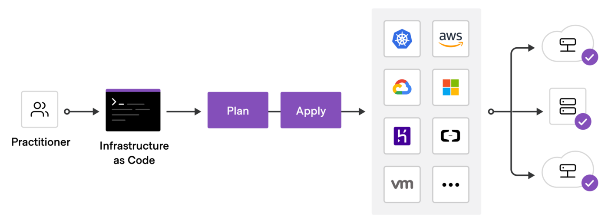
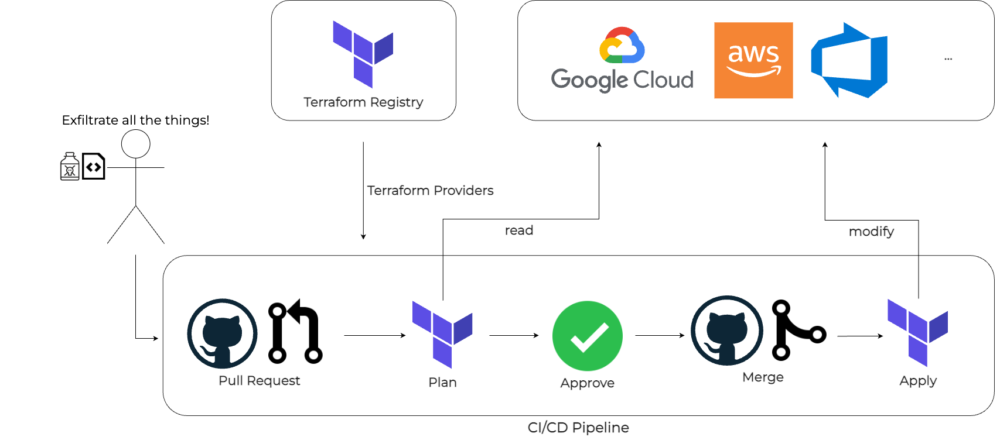

# Terraform


# 1. 개요

인프라 자동화와 데브옵스에서 중요한 역할을 수행할 수 있는 Terraform에 대해서 알아본다.  


# 2. 아키텍처

Terraform은 Terraform Core와 Providers, State, 모듈로 구성된다. 이 아키텍처는 인프라를 코드로 관리하고 다양한 클라우드 서비스 및 API와 상호작용할 수 있게 한다.


* IaC 로서의 Terraform



* Terraform Flow




## 1) Terraform 구성요소

1. Terraform Core: 사용자가 정의한 인프라 상태와 실제 상태를 비교하고, 리소스를 생성/수정/삭제.
2. Providers: 실제 클라우드 서비스와 상호작용하여 리소스를 관리.
3. State 파일: 현재 인프라의 상태를 저장하고 추적.
4. 모듈: 재사용 가능한 코드 블록을 제공하여 인프라 구성의 유지보수성을 높임.

Terraform의 아키텍처는 이러한 구성 요소들이 협력하여 인프라를 자동화하고, 코드로 관리할 수 있게 한다.


## 2) Terraform Core
Terraform의 중심 부분인 Terraform Core는 사용자가 작성한 구성 파일(코드)을 처리하고, 이를 통해 인프라 리소스를 생성하고 관리하는 역할을 한다. 이 코어는 다음과 같은 기능을 수행한다.

- 구성 파일 파싱: HCL(HashiCorp Configuration Language) 또는 JSON 형식으로 작성된 구성 파일을 읽고 분석한다.
- 플랜 생성: 실제 인프라 상태와 사용자가 정의한 원하는 상태(구성 파일)를 비교하여, 어떤 작업(리소스 생성, 업데이트, 삭제)이 필요한지 보여주는 플랜(plan)을 생성한다.
- 실행: 생성된 플랜을 바탕으로 실제 인프라에 적용하여 리소스를 프로비저닝하고 관리한다.

Terraform Core는 내부적으로 상태 파일(State)을 사용하여 현재 인프라 상태를 저장하고 추적한다. 이를 통해 계획된 변경 사항이 인프라에 어떻게 적용될지를 예측하고 조정할 수 있다.


## 3) Terraform Providers

Terraform은 Provider를 통해 실제 클라우드 서비스나 API와 상호작용한다. Provider는 각 클라우드 서비스(예: AWS, Azure, Google Cloud) 또는 서비스(API)와의 상호작용을 위한 플러그인 역할을 한다. 각 Provider는 자신이 지원하는 리소스를 정의하고, Terraform Core에서 이 리소스를 생성, 읽기, 수정, 삭제할 수 있게 한다.

예를 들어:
- AWS Provider: EC2 인스턴스, S3 버킷 등의 AWS 리소스를 관리.
- Azure Provider: Azure VM, Storage Account 등의 Azure 리소스를 관리.
- Google Cloud Provider: Google Cloud의 Compute Engine, Cloud Storage 등의 리소스를 관리.

사용자는 구성 파일에서 어떤 Provider를 사용할지 정의하고, 이를 통해 각 리소스에 접근할 수 있다.


## 4) 상태 파일 (State)

Terraform은 인프라의 현재 상태를 상태 파일에 저장한다. 이 상태 파일은 기본적으로 로컬 파일 시스템에 저장되지만, AWS S3나 Azure Blob Storage와 같은 원격 백엔드에 저장할 수도 있다. 이 상태 파일을 통해 Terraform은 현재 인프라와 계획된 변경 사항을 비교하고, 변경사항을 정확하게 반영할 수 있다.

- 로컬 상태 파일: 기본적으로 작업 디렉토리에 저장되며, 팀 작업 시 문제를 일으킬 수 있음.
- 원격 백엔드: 여러 팀이 협업할 때 상태 파일을 안전하게 공유하고 잠금 기능을 제공해 충돌을 방지.


## 5) Terraform Workflow

Terraform의 작업 흐름은 주로 다음 5 가지 단계로 구성된다.

1. scope : 프로젝트의 인프라를 식별
2. Author : 인프라를 정의하기 위한 환경구성 작성
3. init: Terraform이 필요한 Provider와 플러그인을 다운로드하고 초기화
4. plan: 실행 전에 계획을 미리 세우고, 어떤 리소스가 추가, 수정, 삭제될지를 확인
5. apply: 계획된 대로 실제 인프라를 생성하고 관리


## 6) 모듈 (Modules)

Terraform에서는 모듈을 통해 재사용 가능한 코드 블록을 정의할 수 있다. 이를 통해 인프라 설정을 쉽게 재사용하고, 코드의 가독성과 유지보수성을 높일 수 있다. 모듈은 기본적으로 디렉터리로 관리되며, 인프라를 구성하는 리소스를 그룹화하는 데 사용된다.


# 3. Install

VM 에 Terraform 을 설정해 보자.


## 1) install

참고링크 : https://developer.hashicorp.com/terraform/tutorials/azure-get-started/install-cli


### (1) **Terraform 저장소 추가**

```sh

sudo apt-get update && sudo apt-get install -y gnupg software-properties-common curl


# Install the HashiCorp GPG key.
$ wget -O- https://apt.releases.hashicorp.com/gpg | \
    gpg --dearmor | \
    sudo tee /usr/share/keyrings/hashicorp-archive-keyring.gpg > /dev/null

# Verify the key's fingerprint.
$ gpg --no-default-keyring \
    --keyring /usr/share/keyrings/hashicorp-archive-keyring.gpg \
    --fingerprint

# 공식 저장소 추가
echo "deb [signed-by=/usr/share/keyrings/hashicorp-archive-keyring.gpg] \
https://apt.releases.hashicorp.com $(lsb_release -cs) main" | \
sudo tee /etc/apt/sources.list.d/hashicorp.list

```


### (2) **Terraform 설치**

```sh

$ sudo apt-get update
$ sudo apt-get install terraform

# Terraform 설치 확인
$ terraform -v
Terraform v1.9.6
on linux_amd64

```


#### mac

```sh

$ brew tap hashicorp/tap
  brew install hashicorp/tap/terraform

$ terraform -v
Terraform v1.9.6
on darwin_arm64


## [참고] brew 관리

# 1) homebrew 캐시정리
brew cleanup
brew update

# 2) 재설치
brew uninstall terraform

# 3) 설치된 Terraform 버전 확인
terraform -v

```


## 2) 첫 provisioning(Nginx)

terraform 으로  nignx container 를 배포하는 것을 수행해보자.
사전에 docker 가 설치되어 있어야 한다.


### (1) tf 파일 생성

```sh

$ cd ~/song/terraform/install

$ mkdir learn-terraform-docker-container
  cd learn-terraform-docker-container

$ cat > main.tf

```


```python
terraform {
  required_providers {
    docker = {
      source  = "kreuzwerker/docker"
      version = "~> 3.0.1"
    }
  }
}

provider "docker" {}

resource "docker_image" "nginx" {
  name         = "nginx"
  keep_locally = false
}

resource "docker_container" "nginx" {
  image = docker_image.nginx.image_id
  name  = "tutorial"

  ports {
    internal = 80
    external = 8000
  }
}
```


### (2) init,plan,apply

```sh

# provider plugin 설치
$ terraform init


# plan
# 적용전 필요한 인프라 변경사항 확인
$ terraform plan


# 수행
$ terraform apply


# nginx 확인
curl http://localhost:8000/


```


### (3) show, destroy

```sh

# apply 된 리소스 상태 확인
$ terraform show


```


### (4) Clean up

```sh
# 리소스 삭제
$ terraform destroy

```


# 4. Sample


## 1) Azure 명령수행

Terraform 명령으로 Azure 내의 RG를 생성해보자.

Azure Cli 가 설치되어 있어야 한다.


### (1) azure CLI 설치

```sh

$ curl -sL https://aka.ms/InstallAzureCLIDeb | sudo bash


$ az login

```


### (2) Service Principal 생성

```sh

# subscriptions 확인
$ az account list -o table
Name         CloudName    SubscriptionId                        TenantId                              State    IsDefault
-----------  -----------  ------------------------------------  ------------------------------------  -------  -----------
axcoe        AzureCloud   1d6c45e0-bd9f-4771-bb67-36616452f239  a3870566-f011-4691-aa51-5b988c51c03a  Enabled  False

Subscription_ID="1d6c45e0-bd9f-4771-bb67-36616452f239"


# SP 생성
$ az ad sp create-for-rbac \
    --role="Contributor" \
    --scopes="/subscriptions/1d6c45e0-bd9f-4771-bb67-36616452f239"


Creating 'Contributor' role assignment under scope '/subscriptions/1d6c45e0-bd9f-4771-bb67-36616452f239'
The output includes credentials that you must protect. Be sure that you do not include these credentials in your code or check the credentials into your source control. For more information, see https://aka.ms/azadsp-cli
{
  "id": "22027e34-d6c2-49bb-8e2a-78a965b338a6",
  "appId": "....",
  "displayName": "azure-cli-2024-09-21-08-19-38",
  "password": "....",
  "tenant": "...."
}
# password 는 최초 한번만 식별 가능


# 확인
$ az ad sp show --id 22027e34-d6c2-49bb-8e2a-78a965b338a6
  
$ az ad sp list -o table
$ az ad sp list --display-name azure-cli-2024-09-21-08-19-38 
$ az ad sp list --display-name azure-cli-2024-09-21-08-19-38 -o table


# 삭제
$ az ad sp delete --id 22027e34-d6c2-49bb-8e2a-78a965b338a6


```


### (3) 환경변수 설정

```sh

export ARM_CLIENT_ID="<APPID_VALUE>"
export ARM_CLIENT_SECRET="<PASSWORD_VALUE>"
export ARM_SUBSCRIPTION_ID="<SUBSCRIPTION_ID>"
export ARM_TENANT_ID="<TENANT_VALUE>"


```


### (4) Resource Group 생성

#### 1. tf 파일 생성

```sh

$ cd ~/song

$ mkdir learn-terraform-azure
  cd learn-terraform-azure

$ cat > main.tf
```


```python
# Configure the Azure provider
terraform {
  required_providers {
    azurerm = {
      source  = "hashicorp/azurerm"
      version = "~> 3.0.2"
    }
  }

  required_version = ">= 1.1.0"
}

provider "azurerm" {
  features {}
}

resource "azurerm_resource_group" "rg" {
  name     = "myTFResourceGroup"
  location = "koreacentral"
}

```


```sh

# format
$ terraform fmt

# tf 파일 검증
$ terraform validate

```


#### 2. init,plan,apply,show

```sh
# provider plugin 설치
$ terraform init


# plan
# 적용전 필요한 인프라 변경사항 확인
$ terraform plan


# 수행
$ terraform apply


# 확인1
$ terraform state list
azurerm_resource_group.rg


# show, inspect, apply 된 리소스 상태 확인
$ terraform show
```


```sh

# 확인3
$ az group list -o table
Name                                                     Location       Status
-------------------------------------------------------  -------------  ---------
yj-rg                                                    koreacentral   Succeeded
myTFResourceGroup                                        koreacentral   Succeeded

```


### (5) Change


#### 1. 리소스 변경(Change)

Main.tf 파일에 아래 resource block 을 추가하자.


```sh

$ cat <<EOF >> main.tf

# Create a virtual network
resource "azurerm_virtual_network" "vnet" {
  name                = "myTFVnet"
  address_space       = ["10.0.0.0/16"]
  location            = "koreacentral"
  resource_group_name = azurerm_resource_group.rg.name
}
EOF
```


* plan,apply,show

```sh


# plan
# 적용전 필요한 인프라 변경사항 확인
$ terraform plan


# 수행
$ terraform apply -auto-approve


# 확인1
$ terraform state list 
azurerm_resource_group.rg
azurerm_virtual_network.vnet

# show, inspect, apply 된 리소스 상태 확인
$ terraform show
```


```sh
# 확인3
$ az group list -o table
Name                                                     Location       Status
-------------------------------------------------------  -------------  ---------
yj-rg                                                    koreacentral   Succeeded
myTFResourceGroup                                        koreacentral   Succeeded

$ az network vnet list -o table

```


#### 2. 리소스 수정(Modify)

기존에 배포된 리소스그룹에서 tag를 추가해 보자.

main.tf 파일을 아래처럼 수정하자.

```sh


# 수정전
resource "azurerm_resource_group" "rg" {
  name     = "myTFResourceGroup"
  location = "koreacentral"
}

# 수정후
--- 
resource "azurerm_resource_group" "rg" {
  name     = "myTFResourceGroup"
  location = "koreacentral"

  tags = {
    Environment = "Terraform Getting Started"
    Team = "DevOps"
  }
}

```


* apply,show

```sh

# plan
# 적용전 필요한 인프라 변경사항 확인
$ terraform plan


# 수행
$ terraform apply -auto-approve


# show, inspect, apply 된 리소스 상태 확인
$ terraform show
```


### (6) variable

variables 을 이용한다면 더욱 다이나믹하고 유연하게 환경을 구성할 수 있다.


#### 1. 변수선언

```sh 

$ cat > variables.tf
variable "resource_group_name" {
  default = "myTFResourceGroup"
}

```


#### 2. main.tf 에서 변수 적용


main.tf 파일을 아래처럼 수정하자.

```sh


# 수정전
resource "azurerm_resource_group" "rg" {
  name     = "myTFResourceGroup"
  location = "koreacentral"
}

# 수정후
resource "azurerm_resource_group" "rg" {
  name     = var.resource_group_name
  location = "koreacentral"
}

```


* apply,show

```sh
# plan
# 적용전 필요한 인프라 변경사항 확인
$ terraform plan


# 수행
$ terraform apply -auto-approve

$ terraform apply -auto-approve \
    -var "resource_group_name=myTFResourceGroup"


# show, inspect, apply 된 리소스 상태 확인
$ terraform show
```


### (9) Clean up

```sh

# 리소스 삭제
$ terraform destroy

```


# 5. Sample with docker


## 1) helloworld 


Docker를 사용하여 Terraform을 설치하지 않고 간단한 "Hello, World!" 예제를 실행하는 방법을 설명한다. 

Terraform의 Docker 이미지를 실행하고, 로컬 파일을 컨테이너와 공유하여 Terraform을 구성하고 실행할 수 있다.


### (1) tf 파일 생성

Terraform은 .tf 파일로 설정을 정의한다. 간단한 “Hello, World!” 수준의 Terraform 구성을 작성해 보자.

아래 파일을 main.tf 라는 파일로 생성한다.

```sh
$ mkdir -p ~/song/terraform/helloworld
  cd ~/song/terraform/helloworld

$ cat > main.tf
```


```python
provider "null" {}

resource "null_resource" "hello" {
  provisioner "local-exec" {
    command = "echo Hello, Terraform World!"
  }
}

```


### (2) Docker 컨테이너에서 Terraform 실행


#### (1) docker pull


```sh
$ docker pull hashicorp/terraform:light

```


#### (2) init

작성한 main.tf 파일이 있는 디렉토리를 컨테이너와 공유한 후, Terraform을 실행한다. 다음 명령어를 사용하여 현재 디렉토리를 컨테이너와 공유한 상태에서 Terraform을 실행한다.

```sh
$ cd ~/song/terraform/helloworld

$ docker run -it -v $(pwd):/workspace -w /workspace hashicorp/terraform:light init

```

이 명령어는 로컬 디렉토리를 `/workspace`로 마운트하고, Terraform 초기화 명령어를 실행한다.


#### (3) plan

초기화가 완료되면, Terraform의 플랜을 실행하여 어떤 작업이 수행될지 확인할 수 있다.

```bash
$ docker run -it -v $(pwd):/workspace -w /workspace hashicorp/terraform:light plan


WARNING: The requested image's platform (linux/amd64) does not match the detected host platform (linux/arm64/v8) and no specific platform was requested

Terraform used the selected providers to generate the following execution plan. Resource actions are indicated with the following symbols:
  + create

Terraform will perform the following actions:

  # null_resource.hello will be created
  + resource "null_resource" "hello" {
      + id = (known after apply)
    }

Plan: 1 to add, 0 to change, 0 to destroy.


```

이 명령어는 현재 디렉토리의 `main.tf` 파일을 읽고, 어떤 리소스가 생성될지 미리 보여줍니다.


#### (4) apply

모든 것이 정상적으로 설정되었다면, Terraform을 적용하여 리소스를 생성한다.

```bash
$ docker run -it -v $(pwd):/workspace -w /workspace hashicorp/terraform:light apply -auto-approve

WARNING: The requested image's platform (linux/amd64) does not match the detected host platform (linux/arm64/v8) and no specific platform was requested

Terraform used the selected providers to generate the following execution plan. Resource actions are indicated with the following symbols:
  + create

Terraform will perform the following actions:

  # null_resource.hello will be created
  + resource "null_resource" "hello" {
      + id = (known after apply)
    }

Plan: 1 to add, 0 to change, 0 to destroy.
null_resource.hello: Creating...
null_resource.hello: Provisioning with 'local-exec'...
null_resource.hello (local-exec): Executing: ["/bin/sh" "-c" "echo Hello, Terraform World!"]
null_resource.hello (local-exec): Hello, Terraform World!
null_resource.hello: Creation complete after 0s [id=5525355415972678660]

Apply complete! Resources: 1 added, 0 changed, 0 destroyed.


```

이 명령어는 Terraform 구성을 실제로 실행하여 "Hello, Terraform World!" 메시지를 출력하게 된다.


#### (5) show, destroy

Terraform으로 만든 리소스 상태를 확인하고, 필요할 경우 제거할 수 있다.

```bash
$ docker run -it -v $(pwd):/workspace -w /workspace hashicorp/terraform:light show

# null_resource.hello:
resource "null_resource" "hello" {
    id = "5525355415972678660"
}


$ docker run -it -v $(pwd):/workspace -w /workspace hashicorp/terraform:light destroy -auto-approve

null_resource.hello: Refreshing state... [id=5525355415972678660]

Terraform used the selected providers to generate the following execution plan. Resource actions are indicated with the following symbols:
  - destroy

Terraform will perform the following actions:

  # null_resource.hello will be destroyed
  - resource "null_resource" "hello" {
      - id = "5525355415972678660" -> null
    }

Plan: 0 to add, 0 to change, 1 to destroy.
null_resource.hello: Destroying... [id=5525355415972678660]
null_resource.hello: Destruction complete after 0s

Destroy complete! Resources: 1 destroyed.


```

이 명령어는 현재 리소스 상태를 확인하고, 모든 리소스를 정리한다.


### (9) clean up

```sh

$ docker rm -f 


```


# 7. edu 용 VM 생성 

terraform으로  edu용도의 VM을 대량 생성해 보자.


Terraform을 사용하여 Azure VM을 생성하고, 생성된 VM에 필요한 툴들을 설치하는 방법을 알아보자.


## 1) 구성 설명


### 1. **Resource Group, VNet, Subnet 생성**
먼저, **Resource Group**, **Virtual Network**, **Subnet**을 생성. 이 작업은 Azure에서 VM을 실행할 네트워크 환경을 설정하는 단계.


### 2. **Azure VM 생성 및 프로비저닝 스크립트 작성**
VM을 생성하고, 생성된 VM에 **Docker**, **K9s**, **Helm**을 설치하는 스크립트를 추가.


## 2) TF 파일 생성


### (1) VM에 설치할 Tools 스크립트


```sh

$ mkdir -p ~/song/terraform/eduVM
  cd ~/song/terraform/eduVM


$ cat > install_tools.sh
---
#!/bin/bash
sudo apt-get update
sudo apt-get install -y docker.io
sudo systemctl start docker
sudo systemctl enable docker
sudo snap install k9s
curl https://raw.githubusercontent.com/helm/helm/master/scripts/get-helm-3 | bash
---


sudo apt install vim -y
sudo apt install tree
sudo apt install iputils-ping
sudo apt install net-tools
sudo apt install netcat
sudo apt install unzip
sudo apt install git


```


### (2) VM 1개


```sh

$ mkdir -p ~/song/terraform/eduVM/vmfortest
  cd ~/song/terraform/eduVM/vmfortest

```


#### variable.tf

```sh

$ cat > variables.tf
```

```python
# variables.tf
variable "admin_username" {
  description = "Admin username for the VM"
  type        = string
}

variable "admin_password" {
  description = "Admin password for the VM"
  type        = string
  sensitive   = true
}

```


#### main.tf

```sh

$ cat > main.tf
```


```python
provider "azurerm" {
  features {}
}

# Resource Group 생성
resource "azurerm_resource_group" "rg" {
  name     = "yjedu-rg"
  location = "koreacentral"
}

# Virtual Network 생성
resource "azurerm_virtual_network" "vnet" {
  name                = "eduVnet"
  address_space       = ["10.0.0.0/16"]
  location            = azurerm_resource_group.rg.location
  resource_group_name = azurerm_resource_group.rg.name
}

# Subnet 생성
resource "azurerm_subnet" "subnet" {
  name                 = "eduSubnet"
  resource_group_name  = azurerm_resource_group.rg.name
  virtual_network_name = azurerm_virtual_network.vnet.name
  address_prefixes     = ["10.0.1.0/24"]
}

# Network Security Group
resource "azurerm_network_security_group" "nsg" {
  name                = "eduNSG"
  location            = azurerm_resource_group.rg.location
  resource_group_name = azurerm_resource_group.rg.name
}

# NSG inbound rule(SSH port 22)
resource "azurerm_network_security_rule" "ssh" {
  name                        = "SSH"
  priority                    = 1001
  direction                   = "Inbound"
  access                      = "Allow"
  protocol                    = "Tcp"
  source_port_range           = "*"
  destination_port_range      = "22"
  source_address_prefix       = "*"
  destination_address_prefix  = "*"
  network_security_group_name = azurerm_network_security_group.nsg.name
  resource_group_name         = azurerm_resource_group.rg.name
}


# Network Interface
resource "azurerm_network_interface" "nic" {
  name                = "eduNIC"
  location            = azurerm_resource_group.rg.location
  resource_group_name = azurerm_resource_group.rg.name

  ip_configuration {
    name                          = "eduNICConfiguration"
    subnet_id                     = azurerm_subnet.subnet.id
    private_ip_address_allocation = "Dynamic"
    
    # public IP Connect
    public_ip_address_id = azurerm_public_ip.pip.id
  }
}


# NSG NIC connect
resource "azurerm_network_interface_security_group_association" "nic_nsg" {
  network_interface_id      = azurerm_network_interface.nic.id
  network_security_group_id = azurerm_network_security_group.nsg.id
}


# Public IP
resource "azurerm_public_ip" "pip" {
  name                = "eduPublicIP"
  location            = azurerm_resource_group.rg.location
  resource_group_name = azurerm_resource_group.rg.name
  allocation_method   = "Static"   # Static IP 할당으로 변경
  sku                 = "Standard"
}

# VM
resource "azurerm_virtual_machine" "vm" {
  name                  = "eduVM"
  location              = azurerm_resource_group.rg.location
  resource_group_name   = azurerm_resource_group.rg.name
  network_interface_ids = [azurerm_network_interface.nic.id]
  vm_size               = "Standard_DS1_v2"

  # Ubuntu Image 사용
  storage_image_reference {
    publisher = "Canonical"
    offer     = "0001-com-ubuntu-server-jammy"
    sku       = "22_04-lts-gen2"
    version   = "latest"
  }

  # OS 디스크 설정
  storage_os_disk {
    name              = "eduOSDisk"
    caching           = "ReadWrite"
    create_option     = "FromImage"
    managed_disk_type = "Standard_LRS"
  }

  # 관리자 계정 설정
  os_profile {
    computer_name  = "eduVM"
    admin_username = var.admin_username
    admin_password = var.admin_password
  }

  # SSH 설정
  os_profile_linux_config {
    disable_password_authentication = false
  }
  
  # upload file to VM
  provisioner "file" {
    source      = "../install_tools.sh"
    destination = "/tmp/install_tools.sh"

    connection {
      type     = "ssh"
      user     = var.admin_username
      password = var.admin_password
      host     = azurerm_public_ip.pip.ip_address
      port     = 22
    }
  }

  # exec uploaded script
  provisioner "remote-exec" {
    inline = [
      "chmod +x /tmp/install_tools.sh",
      "sudo /tmp/install_tools.sh"
    ]

    connection {
      type     = "ssh"
      user     = var.admin_username
      password = var.admin_password
      host     = azurerm_public_ip.pip.ip_address
      port     = 22
    }
  }

  # 퍼블릭 IP
  depends_on = [azurerm_public_ip.pip]
}

# Output: Public IP
output "public_ip" {
  value = azurerm_public_ip.pip.ip_address
}
```


### (3) 대량 VM 생성


```sh

$ mkdir -p ~/song/terraform/eduVM/multivmfortest
  cd ~/song/terraform/eduVM/multivmfortest

```


#### variable.tf

```sh
$ cat > variables.tf
```

```python
# variables.tf
variable "admin_username" {
  description = "Admin username for the VM"
  type        = string
}

variable "admin_password" {
  description = "Admin password for the VM"
  type        = string
  sensitive   = true
}

variable "vm_cnt" {
  description = "Number of VMs to create"
  type        = number
  default     = 3
}


```


#### main.tf

```sh
$ cat > main.tf
```


```python
provider "azurerm" {
  features {}
}

# Resource Group 생성
resource "azurerm_resource_group" "rg" {
  name     = "yjedu-rg"
  location = "koreacentral"
}

# Virtual Network 생성
resource "azurerm_virtual_network" "vnet" {
  name                = "eduVnet"
  address_space       = ["10.0.0.0/16"]
  location            = azurerm_resource_group.rg.location
  resource_group_name = azurerm_resource_group.rg.name
}

# Subnet 생성
resource "azurerm_subnet" "subnet" {
  name                 = "eduSubnet"
  resource_group_name  = azurerm_resource_group.rg.name
  virtual_network_name = azurerm_virtual_network.vnet.name
  address_prefixes     = ["10.0.1.0/24"]
}

# Network Security Group
resource "azurerm_network_security_group" "nsg" {
  name                = "eduNSG"
  location            = azurerm_resource_group.rg.location
  resource_group_name = azurerm_resource_group.rg.name
}

# NSG inbound rule(SSH port 22)
resource "azurerm_network_security_rule" "ssh" {
  name                        = "SSH"
  priority                    = 1001
  direction                   = "Inbound"
  access                      = "Allow"
  protocol                    = "Tcp"
  source_port_range           = "*"
  destination_port_range      = "22"
  source_address_prefix       = "*"
  destination_address_prefix  = "*"
  network_security_group_name = azurerm_network_security_group.nsg.name
  resource_group_name         = azurerm_resource_group.rg.name
}

# Public IP (20 count create)
resource "azurerm_public_ip" "pip" {
  count               = var.vm_cnt
  name                = format("eduPublicIP%02d", count.index + 1)
  location            = azurerm_resource_group.rg.location
  resource_group_name = azurerm_resource_group.rg.name
  allocation_method   = "Static"
  sku                 = "Standard"
}

# Network Interface (20 count create)
resource "azurerm_network_interface" "nic" {
  count               = var.vm_cnt
  name                = format("eduNIC%02d", count.index + 1)
  location            = azurerm_resource_group.rg.location
  resource_group_name = azurerm_resource_group.rg.name

  ip_configuration {
    name                          = "eduNICConfiguration"
    subnet_id                     = azurerm_subnet.subnet.id
    private_ip_address_allocation = "Dynamic"
    
    # public IP Connect
    public_ip_address_id = azurerm_public_ip.pip[count.index].id
  }
}

# NSG NIC (20 count create)
resource "azurerm_network_interface_security_group_association" "nic_nsg" {
  count                  = var.vm_cnt
  network_interface_id    = azurerm_network_interface.nic[count.index].id
  network_security_group_id = azurerm_network_security_group.nsg.id
}

# VM (20 count create)
resource "azurerm_virtual_machine" "vm" {
  count                 = var.vm_cnt
  name                  = format("eduVM%02d", count.index + 1)
  location              = azurerm_resource_group.rg.location
  resource_group_name   = azurerm_resource_group.rg.name
  network_interface_ids = [azurerm_network_interface.nic[count.index].id]
  vm_size               = "Standard_DS1_v2"

  # Ubuntu Image 사용
  storage_image_reference {
    publisher = "Canonical"
    offer     = "0001-com-ubuntu-server-jammy"
    sku       = "22_04-lts-gen2"
    version   = "latest"
  }

  # OS 디스크 설정
  storage_os_disk {
    name              = format("eduOSDisk%02d", count.index + 1)
    caching           = "ReadWrite"
    create_option     = "FromImage"
    managed_disk_type = "Standard_LRS"
  }

  # 관리자 계정 설정
  os_profile {
    computer_name  = format("eduVM%02d", count.index + 1)
    admin_username = var.admin_username
    admin_password = var.admin_password
  }

  # SSH 설정
  os_profile_linux_config {
    disable_password_authentication = false
  }
  
  # upload file to VM
  provisioner "file" {
    source      = "../install_tools.sh"
    destination = "/tmp/install_tools.sh"

    connection {
      type     = "ssh"
      user     = var.admin_username
      password = var.admin_password
      host     = azurerm_public_ip.pip[count.index].ip_address
      port     = 22
    }
  }

  # exec uploaded script
  provisioner "remote-exec" {
    inline = [
      "chmod +x /tmp/install_tools.sh",
      "sudo /tmp/install_tools.sh"
    ]

    connection {
      type     = "ssh"
      user     = var.admin_username
      password = var.admin_password
      host     = azurerm_public_ip.pip[count.index].ip_address
      port     = 22
    }
  }

  # 퍼블릭 IP 의존성
  depends_on = [azurerm_public_ip.pip]
}

# Output: Public IP 목록 출력
output "public_ip_addresses" {
  value = azurerm_public_ip.pip[*].ip_address
}
```


## 3) **Terraform 단계별 실행**


### (1) azure env 설정

```sh

export ARM_CLIENT_ID="<APPID_VALUE>"
export ARM_CLIENT_SECRET="<PASSWORD_VALUE>"
export ARM_SUBSCRIPTION_ID="<SUBSCRIPTION_ID>"
export ARM_TENANT_ID="<TENANT_VALUE>"

export TF_VAR_admin_username="<vm_admin_username>"
export TF_VAR_admin_password="<vm_admin_password>"

```


### (2) 실행

```bash

terraform init

terraform validate

terraform plan

terraform apply
 

terraform show

```


### (3) trouble shooting

```sh

# 유효한 image 목록 확인
$ az vm image list --output table

```


