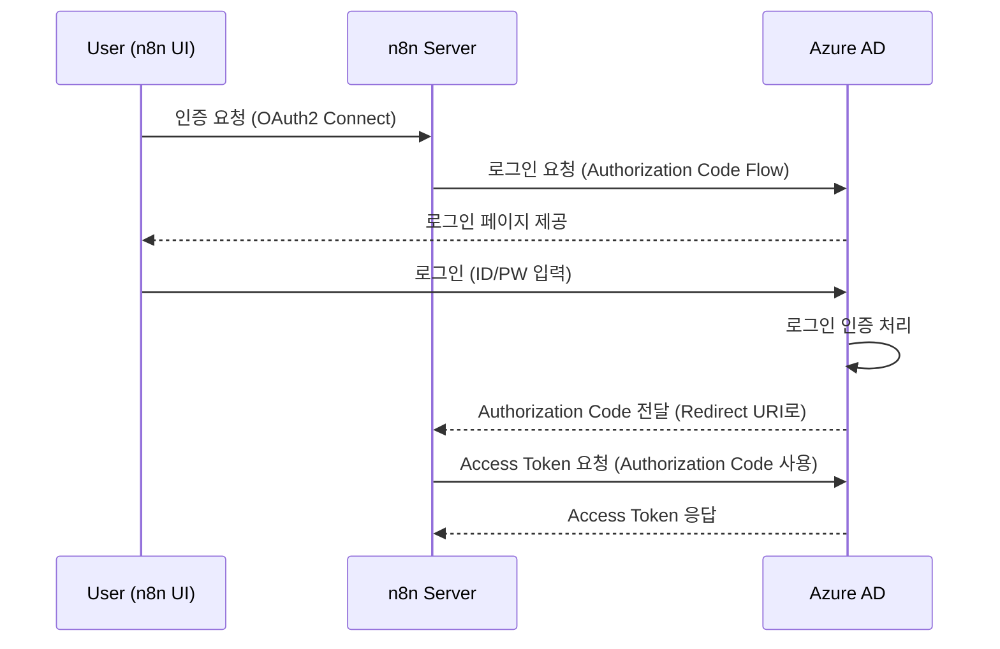

# VM Stop/Start Workflow


# 1. 개요

n8n을 사용하여 Azure Cloud의 Virtual Machine(VM)을 시작(Start)하거나 중지(Stop)하는 워크플로우를 작성한다.


# 2. 전체 진행 흐름

1) **Azure에서 App 등록**해서 n8n이 Azure API를 호출할 수 있게 **Client ID/Secret** 발급
2) n8n에서 **Azure Credential 연결** 만들기
3) n8n에서 **HTTP Request Node**를 써서 Azure VM **Start/Stop API** 호출
4) (선택) → 버튼 클릭으로 워크플로우 실행하게 만들기


# 3. Azure에서 App 등록 (Service Principal 생성)


## 1) App 등록

n8n이 Azure API를 호출할 수 있도록 App을 등록하고 Client Credentials를 발급받는다.

```sh

# Azure 로그인
az login

az account show

{
  "environmentName": "AzureCloud",
  "homeTenantId": "4f0a3bfd-1156-4cce-8dc2-a049a13dba23",
  "id": "0597e236-602e-4c54-9275-6e76e53a7bd7",
  "isDefault": true,
  "managedByTenants": [],
  "name": "sub-cloudbiz-cloudautomation-01",
  "state": "Enabled",
  "tenantDefaultDomain": "ktds.co.kr",
  "tenantDisplayName": "KTDS",
  "tenantId": "4f0a3bfd-1156-4cce-8dc2-a049a13dba23",
  "user": {
    "name": "82023066@ktds.co.kr",
    "type": "user"
  }
}


export SUM_NAME="sub-cloudbiz-cloudautomation-01"
export SUM_ID="0597e236-602e-4c54-9275-6e76e53a7bd7"

# 원하는 구독으로 변경
az account set --subscription $SUM_NAME

# Service Principal 생성
az ad sp create-for-rbac --name n8n-automation --role Contributor --scopes /subscriptions/$SUM_ID


```

**출력 예시:**

```
{
  "appId": "00000000-aaaa-bbbb-cccc-111111111111",
  "displayName": "n8n-automation",
  "password": "비밀번호",
  "tenant": "44444444-dddd-eeee-ffff-555555555555"
}


Creating 'Contributor' role assignment under scope '/subscriptions/0597e236-602e-4c54-9275-6e76e53a7bd7'
The output includes credentials that you must protect. Be sure that you do not include these credentials in your code or check the credentials into your source control. For more information, see https://aka.ms/azadsp-cli
{
  "appId": "f8a511c5-649e-4cac-94b0-3b78ca07a1fc",
  "displayName": "n8n-automation",
  "password": "Ycg8Q~.....",
  "tenant": "4f0a3bfd-1156-4cce-8dc2-a049a13dba23"
}


```

* appId = Client ID
* password = Client Secret
* tenant = Tenant ID


## 2) Redirect URI 등록


1. Azure Portal 접속

2. Azure Active
3. Directory → App registrations → n8n-automation 선택
4. 왼쪽 메뉴에서 **Authentication** 클릭
5. **Redirect URIs** 항목으로 이동
6. **Add a platform** 클릭
7. **Web** 선택
8. Redirect URI 추가:

```sh

# 샘플
https://<n8n-server-domain>/rest/oauth2-credential/callback

# 실제주소
https://n8n.cbiz.kubepia.net/rest/oauth2-credential/callback

```


### 인증과정




# 4. n8n Credential 등록


n8n 내에서 Azure API 호출을 위한 인증 정보를 등록한다.


## 1) Credential

요즘 최신 n8n 버전(특히 1.40+ 이상)에서는

Azure API 호출을 위한 Credential 생성

* 메뉴 : Credentials
  * Microsoft OAuth2 API 로 등록


| **항목**         | **값**                                                       |
| ---------------- | ------------------------------------------------------------ |
| Auth URL         | https://login.microsoftonline.com/<Tenant-ID>/oauth2/v2.0/authorize |
| Access Token URL | https://login.microsoftonline.com/<Tenant-ID>/oauth2/v2.0/token |


```
Tenant ID="4f0a3bfd-1156-4cce-8dc2-a049a13dba23"


Authorization URL
https://login.microsoftonline.com/4f0a3bfd-1156-4cce-8dc2-a049a13dba23/oauth2/v2.0/authorize

Access Token URL
https://login.microsoftonline.com/4f0a3bfd-1156-4cce-8dc2-a049a13dba23/oauth2/v2.0/token


```


| **항목**      | **값**                                |
| ------------- | ------------------------------------- |
| Client ID     | (Azure App의 appId)                   |
| Client Secret | (Azure App의 password)                |
| Scope         | https://management.azure.com/.default |

* **Scope** : https://management.azure.com/.default
  * 이렇게 넣어야 Azure Resource Manager API 호출이 가능
* Authorization URL, Access Token URL은 자동으로 세팅돼서 따로 입력할 필요 없음


### connect account 오류 내용

#### Multi tenant 에러

```

AADSTS50194: Application 'f8a511c5-649e-4cac-94b0-3b78ca07a1fc'(n8n-automation) is not configured as a multi-tenant application. 
Usage of the /common endpoint is not supported for such applications created after '10/15/2018'. 
Use a tenant-specific endpoint or configure the application to be multi-tenant.
```

* 조치내용
  * multi tenant 용이므로  /common 대신 tenant ID를 변경하여 시도한다.


#### url 등록에러

```

AADSTS500113: No reply address is registered for the application.

```

* 조치내용
  * redirect URL 등록 및
  * n8n deployment에 WEBHOOK_URL env 등록


# 5. 테스트 VM생성


## 1) VM 생성

테스트할 VM 생성한다.

```sh


# 1. Resource Group이 없다면 (이미 만들었을 수도 있지만)
az group create \
  --name rg-az01-poc-cloudautomation-yj-01 \
  --location koreacentral

# 2. Virtual Machine 생성
az vm create \
  --resource-group rg-az01-poc-cloudautomation-yj-01 \
  --name vm-az01-cloudauto-yj-01 \
  --image Ubuntu2404 \
  --size Standard_DS1_v2 \
  --admin-username song \
  --authentication-type password \
  --admin-password Songpass123! \
  --location koreacentral \
  --public-ip-sku Standard

# 3. 방화벽 규칙 추가 (SSH 포트 22 오픈)
az vm open-port \
  --port 22 \
  --resource-group rg-az01-poc-cloudautomation-yj-01 \
  --name vm-az01-cloudauto-yj-01


# 확인
$ az vm list -o table

Name                     ResourceGroup                      Location      Zones
-----------------------  ---------------------------------  ------------  -------
vm-az01-cloudauto-yj-01  RG-AZ01-POC-CLOUDAUTOMATION-YJ-01  koreacentral


```


# 6. 워크플로우 작성 (HTTP Request)

수동으로 워크플로우를 실행하여 Azure VM을 시작 또는 중지하는 플로우를 구성


## 1) Webhook Trigger Node 추가


**Webhook Node**를 하나 만들자.

| **항목**    | **값**                         |
| ----------- | ------------------------------ |
| HTTP Method | GET (또는 POST)                |
| Path        | /vm-control (원하는 경로 설정) |
| Respond     | Immediately                    |

예를 들어, Path를 vm-control로 설정하면:


> https://your-n8n-server/rest/webhook/vm-control


이 URL을 외부에서 호출하면 이 워크플로우가 시작된다.


```sh

# start
curl -i -X GET "https://n8n.cbiz.kubepia.net/webhook-test/vm-control?action=Start"


# stop
curl -i -X GET "https://n8n.cbiz.kubepia.net/webhook-test/vm-control?action=Stop"

```


## 2) Switch Node 추가


**Switch Node 추가하고 설정:**

| **항목**          | **설정값**             |
| ----------------- | ---------------------- |
| Value to Evaluate |                        |
| Rules             |                        |
| - Equals          | Start                  |
| - Equals          | Stop                   |
| (추가 가능)       | 기본값(Else) 처리 가능 |

* **Value to Evaluate**: {{$json["query"]["action"]}}
* **Rules**:
  * Equals ➔ Start
  * Equals ➔ Stop
* **Default (Else)** 처리:
  * 또는 그냥 워크플로우 종료


## 3) HTTP Request Node 추가


**VM Start API 호출**

| **항목**          | **값**                                                       |
| ----------------- | ------------------------------------------------------------ |
| Method            | POST                                                         |
| URL               | https://management.azure.com/subscriptions/<subscriptionId>/resourceGroups/<resourceGroupName>/providers/Microsoft.Compute/virtualMachines/<vmName>/start?api-version=2023-03-01 |
| Authentication    | 등록한 Azure Credential 사용                                 |
| Body Content Type | None                                                         |


```sh

subscriptionId="0597e236-602e-4c54-9275-6e76e53a7bd7"
resourceGroupName="rg-az01-poc-cloudautomation-yj-01"
vmName="vm-az01-cloudauto-yj-01"

https://management.azure.com/subscriptions/0597e236-602e-4c54-9275-6e76e53a7bd7/resourceGroups/rg-az01-poc-cloudautomation-yj-01/providers/Microsoft.Compute/virtualMachines/vm-az01-cloudauto-yj-01/start?api-version=2023-03-01


```


**VM Stop API 호출**

| **항목**          | **값**                                                       |
| ----------------- | ------------------------------------------------------------ |
| Method            | POST                                                         |
| URL               | https://management.azure.com/subscriptions/<subscriptionId>/resourceGroups/<resourceGroupName>/providers/Microsoft.Compute/virtualMachines/<vmName>/powerOff?api-version=2023-03-01 |
| Authentication    | 등록한 Azure Credential 사용                                 |
| Body Content Type | None                                                         |

```sh

subscriptionId="0597e236-602e-4c54-9275-6e76e53a7bd7"
resourceGroupName="rg-az01-poc-cloudautomation-yj-01"
vmName="vm-az01-cloudauto-yj-01"

https://management.azure.com/subscriptions/0597e236-602e-4c54-9275-6e76e53a7bd7/resourceGroups/rg-az01-poc-cloudautomation-yj-01/providers/Microsoft.Compute/virtualMachines/vm-az01-cloudauto-yj-01/powerOff?api-version=2023-03-01


```


# 7. 실행

## 1) 전체 워크플로우 구조

```

[Webhook Trigger] (action=Start/Stop)
    ↓
[Switch Node: action]
    ↓
Start --> [HTTP Request - Start VM]
Stop  --> [HTTP Request - Stop VM]
Else  --> [Send Teams Notification (Invalid Action)]


```


## 2) 실행

```sh

# start
curl -i -X GET "https://n8n.cbiz.kubepia.net/webhook/vm-control?action=Start"


# stop
curl -i -X GET "https://n8n.cbiz.kubepia.net/webhook/vm-control?action=Stop"

# error
curl -i -X GET "https://n8n.cbiz.kubepia.net/webhook/vm-control?action=sssss"

```


# 8. 스케쥴로 수행되도록


**Schedule Trigger Node**


| **조건**             | **설명**               |
| -------------------- | ---------------------- |
| 매일 오전 9시        | VM 켜기 (Start)        |
| 매일 오후 7시 (19시) | VM 끄기 (Stop)         |
| 적용 요일            | 월요일 ~ 금요일 (주중) |
| 주말 (토, 일)        | 아무것도 하지 않음     |


## **1. Schedule Trigger Node 추가**


**Schedule Trigger** 라는 Node 두 개를 추가

| **목적**            | **설명**   |
| ------------------- | ---------- |
| 하나는 09:00에 실행 | (Start VM) |
| 하나는 19:00에 실행 | (Stop VM)  |


9시용

| **설정 항목** | **값**                                         |
| ------------- | ---------------------------------------------- |
| Mode          | Every Day                                      |
| Time          | 09:00                                          |
| Timezone      | 본인 서버 기준 (예: Asia/Seoul)                |
| Weekdays Only | 월요일 ~ 금요일 체크 (Mon, Tue, Wed, Thu, Fri) |


19시용

| **설정 항목** | **값**               |
| ------------- | -------------------- |
| Mode          | Every Day            |
| Time          | 19:00                |
| Timezone      | (예: Asia/Seoul)     |
| Weekdays Only | 월요일 ~ 금요일 체크 |

