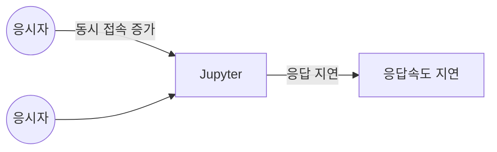
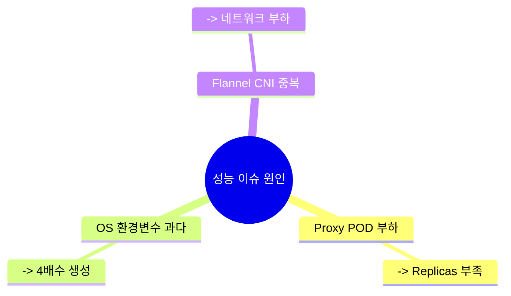
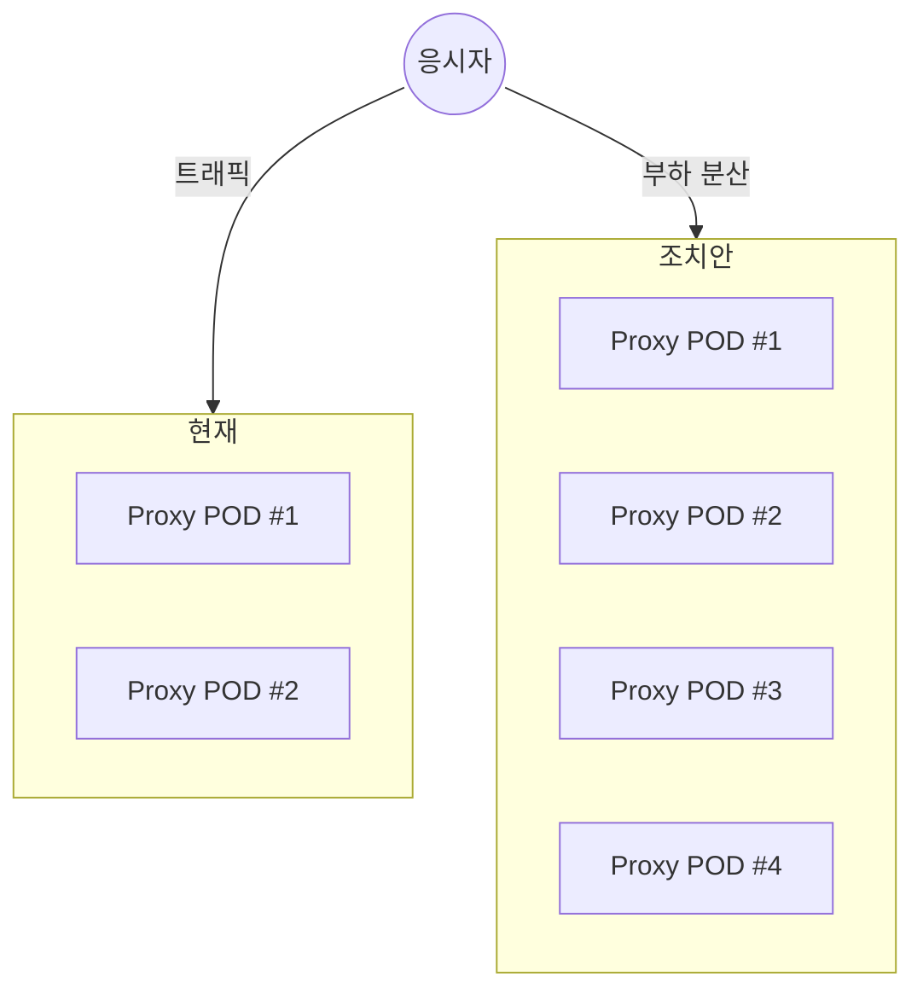
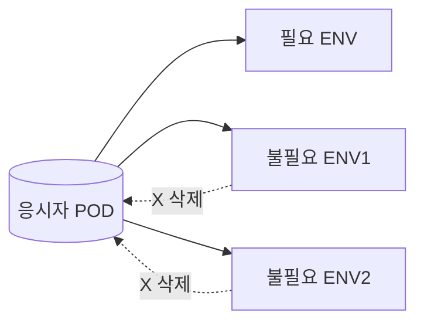
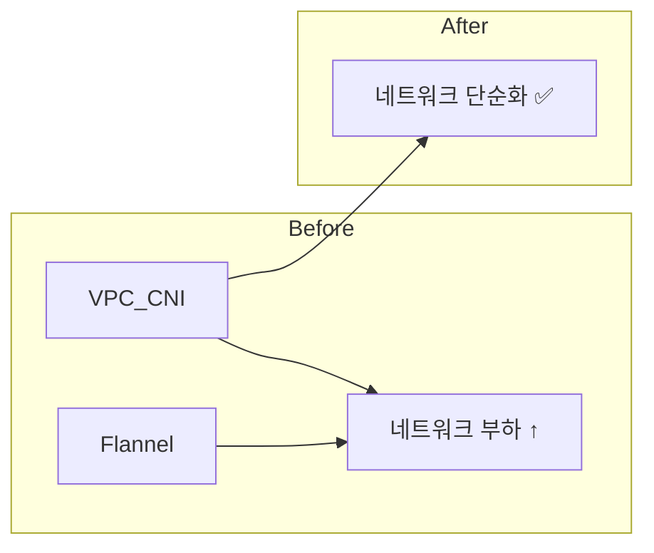
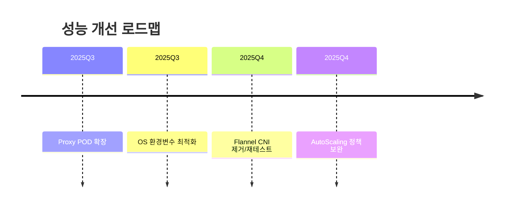

# 📑 PPT 초안 : AICE 성능 이슈 보고

## **슬라이드 1. 제목 슬라이드**

- **제목:** AICE 성능 이슈 분석 및 개선 방안
- **부제:** MSP 운영 관점 성능 개선 초안
- **하단:** Cloud Managed Team | 2025.08

(이미지 제안: Azure Cloud 아키텍처 아이콘, 성능/속도 관련 심볼)

------

## **슬라이드 2. AICE 성능 이슈 개요**

- **문제상황:** 최대 동시 접속자 수 증가 → Jupyter 응답 속도 지연
- **영향:** 시험 응시자 환경에서 사용자 불편 발생
- **분석 기준:** MSP 운영팀 모니터링 + 성능테스트 결과 기반

(이미지 제안:

- Jupyter Notebook 아이콘 + 사용자(응시자) 다수 아이콘 → 응답 지연 시계 아이콘)

------

## **슬라이드 3. 원인 및 조치 방안 개요**

- **예상 원인 Top 3**

  

  1. Proxy POD 부하 가능성
  2. 응시자 POD 내 불필요한 OS 환경변수
  3. Flannel CNI 중복 구성

  

- **조치 방향:** 단기(Quick Win) + 중기(구조적 개선)

(이미지 제안: Azure Kubernetes Service(AKS/EKS) 다이어그램, 노드-파드-네트워크 흐름도)

------

## **슬라이드 4. Proxy POD Replicas 확대**

- **예상원인:**

  - Proxy POD (응시자 ↔ 시험 POD 연결) → Replicas 2 유지 → 부하 가능성

- **조치방안:**

  - Proxy POD Replicas 2 → 4 확대 검토

- **비고:**

  - CPU/Memory 사용량 안정적 (기존 성능테스트 결과)

  

(이미지 제안:

- Pod 2개에서 Pod 4개로 확장되는 AKS Deployment 다이어그램
- Azure Monitor 그래프 아이콘)

------

## **슬라이드 5. 응시자 POD 내 OS 환경변수 삭제**

- **예상원인:**

  - 시험 응시자 POD 스케줄링 시 서비스(K8S) 개수의 4배수로 환경변수 생성 → AP 부하

- **조치방안:**

  - 불필요한 환경변수 생성 제거 설정 → 단순 조정 가능

- **비고:**

  - 동접자 증가 시 서비스/환경변수 증가로 영향도 확대 예상

  

(이미지 제안:

- Pod 내 ENV Variable 구조 → 불필요한 항목 X 표시
- 간단한 ConfigMap vs ENV 비교 다이어그램)

------

## **슬라이드 6. Flannel CNI 삭제 및 재테스트**

- **예상원인:**

  - VPC CNI + Flannel CNI 공존 시 불필요한 네트워크 부하

- **조치방안:**

  - Flannel CNI 삭제 완료 → 재테스트 필요

- **비고:**

  - 단일 CNI 환경으로 안정성 검증 필요

  

(이미지 제안:

- 네트워크 플로우 그림 (이중 CNI → 단일 CNI)
- Azure Virtual Network 아이콘)

## **슬라이드 6. Flannel CNI 삭제 및 재테스트**

------

## **슬라이드 7. 종합 결론 및 향후 계획**

- **단기:**

  - Proxy POD Replica 확대
  - OS 환경변수 설정 제거

  

- **중기:**

  - Flannel CNI 제거 후 재테스트
  - 필요 시 AutoScaling 정책 보완

  

- **기대효과:**

  - Jupyter 응답속도 개선
  - 안정적인 동접자 처리 가능

  

(이미지 제안:

- Before/After 성능 그래프
- 개선 효과를 상징하는 화살표 다이어그램)

