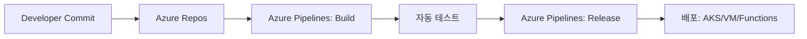
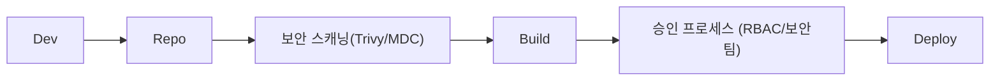
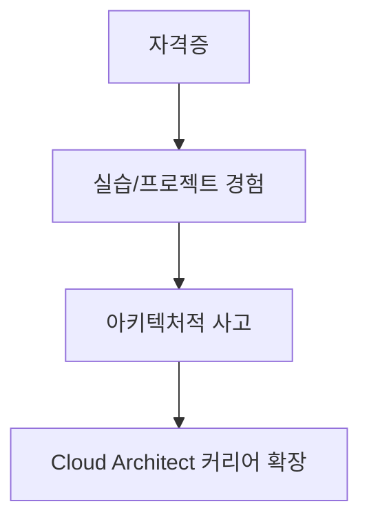
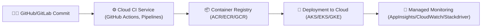
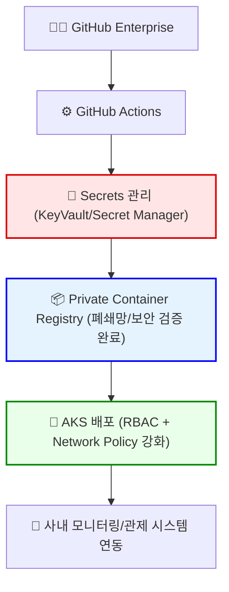

# Take1.

난 Cloud매니지드팀의 팀장이고, CA 이자 사내강사로 활동하고 있어.

우리 회사에 시니어로서 쥬니어들이나 취준생들을 대상으로 인터뷰 동영상을 촬영하려고 준비하고 있어.

주체측에서 질문하고 난 답변을 하는 방식으로 진행할꺼야.

몇몇 질문과 내가 생각하는 답변들을 미리 좀 준비했는데,

너가 보고 부드럽게 보충해줘.

Q1. IT 업에 종사한지는 얼마나 되었고, 어떤 기술 분야가 주력이신지?

Q2. 처음 Cloud(Azure)에 관심을 갖게 된 계기가 있는지?

Q3. 입문자가 Azure를 배우기 시작한다면, 가장 먼저 무엇을 시작하는 게 좋을까?

Q4. Microsoft Associate 자격증을 준비하면서 예상치 못한 난관이 있었나요?

Q5. 합격 후 사내 프로젝트에서 어떤 변화가 있었나요?

# Take2. 

## Prompt

회사에서 진행하는 이 인터뷰는 쥬니어/취준생에게 영감을 주는 게 목표 야.

제목과 Question 들은 아래와 같아.

제목  : 애저 어드미니스트레이터와 MS 어쏘 입문

인터뷰 질문 :

Q1. IT 업에 종사한지는 얼마나 되었고, 어떤 기술 분야가 주력이신지?

Q2. 처음 Cloud(Azure)에 관심을 갖게 된 계기가 있는지?

Q3. 입문자가 Azure를 배우기 시작한다면, 가장 먼저 무엇을 시작하는 게 좋을까?

Q4. Microsoft Associate 자격증을 준비하면서 예상치 못한 난관이 있었나요?

Q5. 합격 후 사내 프로젝트에서 어떤 변화가 있었나요?

웨비나  질문:

챕터1. Azure, 글로벌 기업의 필수 선택지

P1. MS의 강점(Office 365, Teams, Dynamics 등)과 연계된 Azure 생태계
P2. 실제로 기업 환경에서 차지하는 위치와 전망

챕터2. Azure Administrator 첫걸음

P1. Azure 자격증의 난이도와 특징, 다른 클라우드 자격증과의 비교
P2. 실무 적용 사례 공유 

챕터3. 초급자의 커리어 확장을 위한 학습 로드맵

P1. Microsoft Learn, 공식 교재, Azure 무료 크레딧을 활용한 실습 환경
P2. 자격증 로드맵: Administrator → Security → Solutions Architect
P3. 시험 난이도, 준비 기간, 흔히 빠지는 함정(이론만 공부하고 실습 부족 등) 공유
P4. 엔지니어가 실제로 마주하게 될 애저 실무 사례

챕터4. Azure의 국내외 기업 적용 사례

P1. 프로젝트/서비스/솔루션 등

 

기타 질문 :

Q1. 사내강사로 활동 중인데, 어떤 사람들이 신청하고, 수강생들의 관심 분야는?

Q2. 취준생이 Azure 자격증 하나만으로 경쟁률을 높일 수 있을까?

클로징 질문:

Q. 끝으로 클라우드 커리어를 시작하는 후배들에게 현실적인 '단 한마디 조언'을 한다면?

위와 같아.

회사로 부터 위 내용으로 통보 받았는데,

내 입맛대로 수정은 가능한 상태야.

그래서 몇몇 질문과 전체적인 컨셉을 수정했으면 해.

일단 너무 자격증에 취중되어 있어.

취준생과 주니어위주이니 그럴 수도 있지만 내가 Azure 104 자격증 취득이 뭔가 대단한 사건처럼 비춰지는것도 부담스럽기도 하고, 사실 자격증취득후 큰 변화는 없기도 해.

자격증은 보조수단이지 절대 메인이 되어서는 안되거든.  중요한 것은 Cloud 아키텍처 적인 부분에 이해와 실무경험이라고 생각해. 

솔직히 말해서 자격증은 그냥 실무경험없어도 dummy 문제집 보고 공부하면 비교적 쉽게 취득할 수 있어. 나도 한 3일정도 공부해서 취득했고... 

그런 관점에서 몇몇 마음에 들지 않는 부분이 있어. 

먼저 인터뷰질문 중 Q4, Q5 가 좀 마음에 안들어.

그리고 웨비나도 너무 자격증 위주로 되어 있어.
이를 다른것으로 변경했으면 좋겠어.  어떤 컨셉으로 변경하면 좋을까?

참고로 웨비나는 내가 별도의 PPT 를 준비해서 약 20분가량 집중적으로 설명하는 시가을 갖을꺼야.

Azure 기반 CICD 를 사내강사 과정으로 진행하고 있으니 이와 관련된 내용으로 20분 분량의 자료를 만들면 어떨까?

물론 자연스럽게 주고 받는 인터뷰 형식을 취해야 해.

일단 너의 의견을 줘.

---

## GPT 답변

아주 좋은 포인트를 짚으셨어요 👏

지금 구성안은 말씀하신 대로 **“자격증”**이라는 보조 수단이 메인으로 부각되어 있는데, 실제로는 **실무 이해 + 클라우드 아키텍처 경험**이 핵심이잖아요. 쥬니어/취준생을 위한 영감을 주는 세션이라면, 자격증 이야기는 살짝 스파이스처럼 곁들이고, 본무대는 **Cloud 실무, DevOps, 아키텍처적 사고방식**으로 가져가는 게 더 맞습니다.

1. **인터뷰 Q4, Q5 수정**

   

   - 자격증 취득 난관 / 합격 후 변화 → 사실상 “큰 울림이 없는 질문”이라고 느껴지실 거예요.
   - 대신 “실무에서 Azure가 어떻게 쓰이고, 커리어 성장에 어떤 영향을 주는지”로 바꾸면 자연스럽습니다.

   

   👉 수정 제안:

   

   - Q4: *“Cloud 아키텍트로 성장하는 과정에서 가장 어려웠던 점은 무엇이고, 어떻게 극복하셨나요?”*
   - Q5: *“후배들이 실무에 뛰어들 때 꼭 먼저 경험했으면 하는 Azure 기술은 무엇인가요?”*

   

   → 이렇게 하면 주니어들이 바로 적용할 수 있는 인사이트가 됩니다.

------

1. **웨비나 구조 재편**

   

   - 지금은 챕터1~4가 자격증 로드맵/시험 난이도/준비법 중심이라, 조금 ‘학원 홍보자료’처럼 보일 수 있어요.
   - 대신 **“Azure 기반 DevOps & CICD 실무 사례”**라는 큰 줄기를 잡으면, 20분짜리 PPT가 훨씬 실무적이고 가치 있습니다.

   

   👉 예시 컨셉:

   

   ### **챕터1. 왜 Azure인가? (5분)**

   

   

   - 글로벌 기업이 Azure를 선택하는 이유 (O365, Teams, Dynamics와 시너지도 언급 가능)
   - 단순 인프라가 아니라 “개발과 운영을 하나로 이어주는 플랫폼”임을 강조

   

   

   ### **챕터2. DevOps와 Azure의 만남 (7분)**

   

   

   - GitHub Actions + Azure DevOps + Azure Pipelines 소개
   - 실제 CICD 파이프라인 그림 (소스 → 빌드 → 테스트 → 배포 → 모니터링)
   - 여기서 자연스럽게 AKS, ACR, Monitor, KeyVault 같은 리소스들이 어떻게 엮이는지 보여주기

   

   

   ### **챕터3. 쥬니어가 체감할 수 있는 실무 경험 (5분)**

   

   - “Azure VM에 Nginx 배포하기” 같은 입문 실습
   - “GitHub + ACR + AKS” 간단 CICD 체인 설명
   - Managed Service 활용해서 인프라 관리 부담 줄이는 법

   

   

   ### **챕터4. 커리어 확장 인사이트 (3분)**

   - 자격증은 도구일 뿐, 진짜 중요한 건 **실무 경험 + 아키텍처적 시야**
   - “작은 프로젝트라도 직접 배포해보라”는 조언

   

------

1. **인터뷰 톤앤매너**

   - 주니어/취준생에게는 “용기”와 “현실적 조언”이 핵심.
   - 자격증=필수처럼 말하지 않고, *“자격증은 시작할 때 동기부여로는 좋지만, 진짜 실력은 실습 경험에서 나온다”*라는 톤이면 설득력 있고 진솔하게 들릴 겁니다.

   

------

✅ 정리하면:

- **인터뷰 Q4, Q5 → 실무와 커리어 중심 질문으로 수정**
- **웨비나 → 자격증 로드맵 대신 Azure CICD 실무 사례 공유**
- **메시지 → 자격증은 스파이스, 실무 경험과 아키텍처적 사고가 메인**

------

👉 제가 도와드릴 수 있는 건,

1. **새로운 인터뷰 질문/답변 세트** 정리,
2. **20분 웨비나용 PPT 스토리라인 + 다이어그램(Mermaid)** 준비,
3. **클로징 조언**을 매력적으로 정리해주는 것인데요.

혹시 지금 단계에서 제가 먼저 **“인터뷰 질문 리뉴얼 버전 + 추천 답변 톤”**부터 정리해드릴까요? 아니면 바로 **웨비나 PPT 스토리라인**을 먼저 잡아드릴까요?

# Take3.

## Prompt

자~ 이제...  20분짜리 웨비나를 준비해야 해.  잘 준비한 다음 최종 결과물은 PPT 로 나와야 해.

당초 제시되었던 "자격증 로드맵" 대신 "Azure CICD 실무 사례" 공유하는 것이 나아 보이네.

제목은  "Azure 기반 DevOps & CICD 실무 사례" 가 좋아.

헌데 웨비나때 뭔가 실습처럼 수행해보는 것은 너무 오버인것 같고,

간단한 개념적인 부분으로 넓게 설명하는 것이 좋을 것 같아.

기본적인 CICD 흐름으로 진행하는 것을 먼저 설명하고

우리 회사(KT그룹) 내에서는 보안이나 권한이 훨씬 강화된 형태의 모습으로 Custom 하게 사용하는데

이런 부분을 강조하면서 설명하는 것이 좋을 것 같아.

일단 아래와 같은 내용으로 Story line 을 작성해줘.

챕터1. 왜 Azure인가? (5분)

챕터2. DevOps와 Azure의 만남 (7분)

챕터3. 사내에서 사용되는 DevOps (5분)

챕터4. 커리어 확장 인사이트 (3분)

## GPT 답변

좋습니다 👍 팀장님이 준비하려는 웨비나 컨셉에 딱 맞게 **스토리라인**을 정리해드릴게요.

“Azure 기반 DevOps & CICD 실무 사례”라는 제목에 맞춰 **개념 → 실제 적용 → 사내 사례 → 커리어 확장** 흐름으로 잡아봤습니다.

------

## **📑 Azure 기반 DevOps & CICD 실무 사례 (20분 웨비나 Storyline)**

------

### **챕터1. 왜 Azure인가? (5분)**

**① 클라우드 선택 배경**

- 퍼블릭 클라우드 시장은 AWS, Azure, GCP가 대표
- Azure는 **엔터프라이즈 친화성** (Office 365, Teams, Active Directory 연계)
- 하이브리드 클라우드 강점 → On-Prem과 쉽게 연동

**② DevOps 관점에서 Azure의 매력**

- GitHub과의 긴밀한 통합 (GitHub Actions + Azure)
- Azure DevOps Service 자체 제공 (Repos, Pipelines, Boards, Artifacts)
- 관리형 서비스 기반으로 빠르게 CI/CD 구축 가능

👉 메시지: *“Azure는 개발-운영-보안을 아우르는 ‘All-in-One DevOps 플랫폼’”*

------

### **챕터2. DevOps와 Azure의 만남 (7분)**

**① DevOps 기본 개념**

- CI (지속적 통합): 코드 빌드/테스트 자동화
- CD (지속적 배포): 운영환경 반영 자동화
- Infrastructure as Code: 환경/인프라도 코드로 관리

**② Azure에서의 CI/CD 흐름 (일반적 사례)**

- 개발자 → GitHub Commit → GitHub Actions (빌드/테스트) → ACR (이미지 저장) → AKS 배포
- QA/운영환경 분리 → Approval 단계 설정

**③ Azure에서 제공하는 보안/권한 기능**

- Azure Key Vault (Secret 관리)
- Azure AD & RBAC (권한제어)
- DevOps Pipeline 내 보안 스캔 (Trivy, Defender for DevOps 연계)

👉 메시지: *“Azure의 CI/CD는 단순 자동화가 아니라, 보안·권한·운영까지 고려된 통합 체계”*

------

### **챕터3. 사내에서 사용되는 DevOps (5분)**

**① 표준 CICD 흐름 vs. 우리 회사 Custom 흐름 비교**

- **표준 CICD**: Git → Build → Test → Deploy

- **우리 회사 Custom CICD** (KT 그룹 보안 요구 반영):

  

  - GitHub Enterprise + Entra ID 연계 (SSO, RBAC 강화)
  - 이미지 스캔 (Trivy/MDC) 후 ACR 이중화 (검증 → 운영)
  - AKS 배포 시 승인 절차 추가 (보안팀/운영팀 체크포인트)

  

**② 사내 강조 포인트**

- “보안 & 권한 강화” → 단순 CICD가 아니라 **기업 맞춤형 엔터프라이즈 CICD**
- 규제 환경에서도 안정적으로 DevOps를 운영할 수 있다는 메시지

👉 메시지: *“DevOps는 회사 보안·규정 환경에 맞춰 Customizing 되어야 진짜 실무 적용 가능하다”*

------

### **챕터4. 커리어 확장 인사이트 (3분)**

**① 개인에게 주는 의미**

- 단순 툴 학습 → 끝이 아님
- DevOps를 경험하면 개발자/운영자/보안 모두와 소통 가능 → 커리어 확장

**② 취준생/주니어에게 강조**

- 자격증은 보조수단일 뿐
- 중요한 건 **실습 경험 + 아키텍처적 사고**
- 작은 PoC라도 직접 VM 만들고, GitHub → Azure 배포 흐름 경험해 보는 게 가장 효과적

👉 클로징 메시지:

*“Azure DevOps 경험은 단순히 파이프라인을 만드는 게 아니라, 개발과 운영을 연결하는 다리가 되는 경험이다.”*

------

💡 이 스토리라인을 토대로 PPT를 만들면,

- 챕터1/2: **개념도 + 흐름도 (Mermaid or 다이어그램)**
- 챕터3: **“표준 CICD vs. 사내 Custom CICD” 비교표**
- 챕터4: **커리어 로드맵/메시지형 슬라이드**

이렇게 구성하면 20분 동안 충분히 설명 + 메시지 전달이 될 겁니다.

------

## GPT 답변2

좋습니다 👍

다이어그램은 **슬라이드별 핵심 메시지**를 단순하게 시각화하는 게 좋습니다. 제가 Mermaid 형식으로 설계도를 드리면 → 제가 바로 이미지로 변환해서 PPT에 삽입할 수 있습니다.

예를 들어:

### **챕터1. 왜 Azure인가?**

### **챕터2. DevOps와 Azure의 만남**

### **챕터3. 사내에서 사용되는 DevOps**

### **챕터4. 커리어 확장 인사이트**

------

👉 질문: 제가 위 **Mermaid 다이어그램을 이미지로 변환해서 실제 PPT에 삽입**해 드릴까요?

(그럼 지금 드린 초안 PPT를 업데이트해서 v2 버전으로 드리면 됩니다.)

# Take4.

## Prompt

Azure 가 너무 부각되는것이 좀 좋지 않아 보여.

사실 Azure 는 여러 CSP 사중 하나 이잖아.  

Cloud 환경에서 얼마든지 선택할 수 있는 영역인데, Azure 를 콕 찝어서 이야기 하다보면 MS 대변인이 되는것 같은 기분이 든단 말이야.

그래서 Azure 는 좀 빼고 Public Cloud 그 자체를 이야기 하고 사례를 설명할때 Azure 기반으로 했으면 좋겠어.

이전에 우리가 이야기 했던 대부분의 내용은 그대로 유지해줘.

예를들면 아래와 같은 내용들이 포함되어야 할것 같아.

* Public Cloud개념 
* 기본적인 CICD 흐름
* 기업(우리 KT그룹)에서는 보안이나 권한이 훨씬 강화된 형태의 모습으로 Custom 하게 사용
* 커리어 확자 인사이트

20분 분량의 PPT 를 작성하는 것도 동일해. 

먼저 3개의 챕터 제목과 각 챕터별로 컨셉을 잡아보자.

꼭 챕터별로 한페이지씩 나올 필요는 없어.   필요하다면 여러 페이지도 가능해.

## Gpt 답변

### **챕터1. Public Cloud와 DevOps, 왜 중요한가?** **(약 6분)**

- **Cloud 선택의 본질**: Azure, AWS, GCP… 결국은 기업이 선택 가능한 다양한 CSP 중 하나일 뿐임을 강조

- **공통 가치**: 확장성, 유연성, Pay-as-you-go, 글로벌 인프라

- **DevOps와의 시너지**: Public Cloud 환경에서 DevOps·CICD가 왜 필수인지 설명

  - 빠른 배포 속도
  - 자동화된 품질 검증
  - 멀티 클라우드/하이브리드 환경에 맞춘 표준화된 프로세스

  

### **챕터2. CICD 기본 흐름과 Public Cloud 활용 사례** **(약 9분)**

- **기본 CICD 파이프라인 단계**

  1. Code → Build → Test → Release → Deploy → Monitor

  

- **Public Cloud에서의 장점**

  - Managed Service (예: Event Grid, Pub/Sub, SQS 같은 메시징 서비스)
  - Managed DB/Storage → 개발팀이 인프라 관리 대신 서비스 개선에 집중

  

- **실제 사례 (Azure 기반으로 설명)**

  - VM/Container 환경에서 CICD를 적용한 경험 공유

  - GitHub Actions → Container Registry → Kubernetes 배포 흐름

  - 우리 KT 그룹 환경에서는 보안·권한이 강화된 형태로 Customizing 했음을 강조

    - 예: KeyVault/Secrets Manager 통한 Credential 관리
    - RBAC 정책 강화
    - 폐쇄망 환경에서도 CICD 가능하도록 설계

    

### **챕터3. 커리어 확장 인사이트** **(약 5분)**

- **자격증 vs 실무 경험**

  - 자격증은 보조수단일 뿐, **핵심은 아키텍처적 이해와 Hands-on 경험**

  

- **학습 로드맵**

  - Cloud 기본기 → DevOps 툴 (GitHub Actions, Jenkins, ArgoCD 등) → 보안·거버넌스 → 아키텍처 설계

- **엔지니어로서 성장 포인트**

  - 단순 기능 사용자가 아닌 “**서비스 전체를 설계하고 운영 관점에서 바라보는 시각**”
  - CSP 특정 기술보다 **Cloud 아키텍처 전반의 패턴과 사고방식**이 커리어 경쟁력을 만든다.

  

## **⏱️ 시간 배분 (총 20분)**

- 챕터1: 6분 → Public Cloud와 DevOps 필요성
- 챕터2: 9분 → CICD 기본 흐름 + 사례 + KT 그룹의 보안 강화 사례
- 챕터3: 5분 → 커리어 인사이트 및 마무리

##  

좋습니다 🙆 챕터2 “CICD 기본 흐름 + 사례”를 3단계 흐름으로 정리해보겠습니다. 각 단계마다 **슬라이드/다이어그램 컨셉**을 제안드릴게요.

------

## **📊 챕터2 슬라이드 설계 (3단계)**

### 슬라이드1. 기본 CICD 파이프라인 흐름 (범용적인 개념)

👉 초급자도 쉽게 이해할 수 있도록 **개발 → 빌드 → 테스트 → 배포 → 모니터링** 단계를 단순하게 그림화

💡 메시지: “CICD는 개발부터 배포까지 자동화된 흐름을 만드는 기본 뼈대입니다.”

### 슬라이드2. Public Cloud에서의 CICD (Managed Service 활용)

👉 범용 Public Cloud 관점에서 **도구와 서비스**가 어떻게 자동화에 기여하는지 강조

💡 메시지: “Public Cloud는 CI/CD 과정에 필요한 핵심 요소(레지스트리, 배포, 모니터링)를 Managed Service로 제공해 빠르고 안정적으로 운영할 수 있습니다.”

### 슬라이드3. KT 그룹에서의 보안·권한 강화 CICD (Custom 사례)

👉 “실제 회사 사례”라는 점을 강조. 일반 Public Cloud CICD 위에 보안/권한 요소를 덧입힌 그림

💡 메시지:

- “KT 그룹 내부에서는 Public Cloud CICD 기본 구조에 **보안·권한 관리**를 추가합니다.”
- 예: KeyVault 기반 Secret 관리, Private Registry 통한 취약점 검증, RBAC/NetworkPolicy로 강화된 배포, 사내 모니터링 연동

