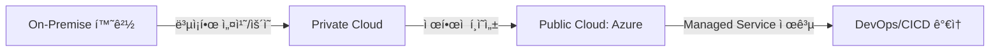
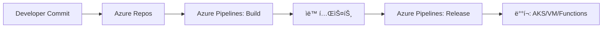
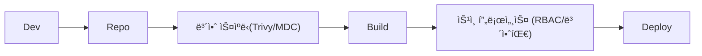
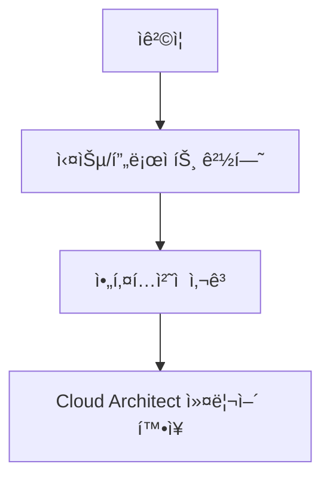
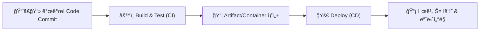
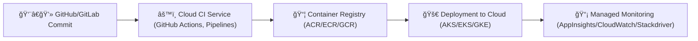
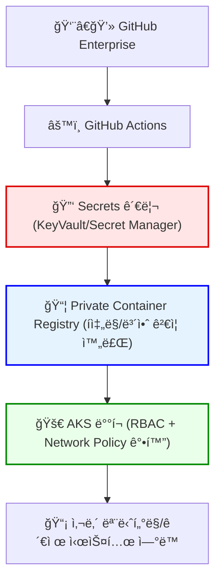

# Take1.

ë‚œ Cloudë§¤ë‹ˆì§€ë“œíŒ€ì˜ íŒ€ì¥ì´ê³ , CA ì´ì 사내강사로 활ë™í•˜ê³  ìˆì–´.

우리 íšŒì‚¬ì— ì‹œë‹ˆì–´ë¡œì„œ 쥬니어들ì´ë‚˜ 취준ìƒë“¤ì„ 대ìƒìœ¼ë¡œ ì¸í„°ë·° ë™ì˜ìƒì„ ì´¬ì˜í•˜ë ¤ê³  준비하고 ìˆì–´.

주체측ì—ì„œ 질문하고 ë‚œ ë‹µë³€ì„ í•˜ëŠ” ë°©ì‹ìœ¼ë¡œ 진행할꺼야.

몇몇 질문과 ë‚´ê°€ ìƒê°í•˜ëŠ” ë‹µë³€ë“¤ì„ ë¯¸ë¦¬ 좀 준비했는ë°,

너가 보고 부드럽게 보충해줘.

Q1. IT ì—…ì— ì¢…ì‚¬í•œì§€ëŠ” 얼마나 ë˜ì—ˆê³ , ì–´ë–¤ 기술 분야가 주력ì´ì‹ ì§€?

Q2. ì²˜ìŒ Cloud(Azure)ì— ê´€ì‹¬ì„ ê°–ê²Œ ëœ ê³„ê¸°ê°€ ìˆëŠ”지?

Q3. ì…문ìê°€ Azure를 배우기 ì‹œì‘한다면, ê°€ì¥ ë¨¼ì € ë¬´ì—‡ì„ ì‹œì‘하는 게 좋ì„까?

Q4. Microsoft Associate ì격ì¦ì„ 준비하면서 예ìƒì¹˜ 못한 ë‚œê´€ì´ ìˆì—ˆë‚˜ìš”?

Q5. 합격 후 사내 프로ì íŠ¸ì—ì„œ ì–´ë–¤ 변화가 ìˆì—ˆë‚˜ìš”?

# Take2. 

## Prompt

회사ì—ì„œ 진행하는 ì´ ì¸í„°ë·°ëŠ” 쥬니어/취준ìƒì—게 ì˜ê°ì„ 주는 게 목표 야.

제목과 Question ë“¤ì€ ì•„ë˜ì™€ 같아.

제목  : ì• ì € 어드미니스트레ì´í„°ì™€ MS ì–´ì˜ ì…문

ì¸í„°ë·° 질문 :

Q1. IT ì—…ì— ì¢…ì‚¬í•œì§€ëŠ” 얼마나 ë˜ì—ˆê³ , ì–´ë–¤ 기술 분야가 주력ì´ì‹ ì§€?

Q2. ì²˜ìŒ Cloud(Azure)ì— ê´€ì‹¬ì„ ê°–ê²Œ ëœ ê³„ê¸°ê°€ ìˆëŠ”지?

Q3. ì…문ìê°€ Azure를 배우기 ì‹œì‘한다면, ê°€ì¥ ë¨¼ì € ë¬´ì—‡ì„ ì‹œì‘하는 게 좋ì„까?

Q4. Microsoft Associate ì격ì¦ì„ 준비하면서 예ìƒì¹˜ 못한 ë‚œê´€ì´ ìˆì—ˆë‚˜ìš”?

Q5. 합격 후 사내 프로ì íŠ¸ì—ì„œ ì–´ë–¤ 변화가 ìˆì—ˆë‚˜ìš”?

웨비나  질문:

챕터1. Azure, 글로벌 ê¸°ì—…ì˜ í•„ìˆ˜ ì„ íƒì§€

P1. MSì˜ ê°•ì (Office 365, Teams, Dynamics 등)ê³¼ ì—°ê³„ëœ Azure ìƒíƒœê³„
P2. 실제로 기업 환경ì—ì„œ 차지하는 위치와 ì „ë§

챕터2. Azure Administrator 첫걸ìŒ

P1. Azure ì격ì¦ì˜ ë‚œì´ë„와 특징, 다른 í´ë¼ìš°ë“œ ì격ì¦ê³¼ì˜ 비êµ
P2. 실무 ì ìš© 사례 공유 

챕터3. 초급ìì˜ ì»¤ë¦¬ì–´ 확ì¥ì„ 위한 학습 로드맵

P1. Microsoft Learn, ê³µì‹ êµì¬, Azure 무료 í¬ë ˆë”§ì„ 활용한 실습 환경
P2. ìê²©ì¦ ë¡œë“œë§µ: Administrator → Security → Solutions Architect
P3. 시험 ë‚œì´ë„, 준비 기간, í”íˆ ë¹ ì§€ëŠ” 함정(ì´ë¡ ë§Œ 공부하고 실습 부족 등) 공유
P4. 엔지니어가 실제로 마주하게 ë  ì• ì € 실무 사례

챕터4. Azureì˜ êµ­ë‚´ì™¸ 기업 ì ìš© 사례

P1. 프로ì íŠ¸/서비스/솔루션 등

 

기타 질문 :

Q1. 사내강사로 í™œë™ ì¤‘ì¸ë°, ì–´ë–¤ 사ëŒë“¤ì´ 신청하고, 수강ìƒë“¤ì˜ 관심 분야는?

Q2. 취준ìƒì´ Azure ìê²©ì¦ í•˜ë‚˜ë§Œìœ¼ë¡œ ê²½ìŸë¥ ì„ ë†’ì¼ ìˆ˜ ìˆì„까?

í´ë¡œì§• 질문:

Q. ë으로 í´ë¼ìš°ë“œ 커리어를 ì‹œì‘하는 후배들ì—게 현실ì ì¸ '단 한마디 ì¡°ì–¸'ì„ í•œë‹¤ë©´?

위와 같아.

회사로 부터 위 내용으로 통보 받았는ë°,

ë‚´ ì…맛대로 ìˆ˜ì •ì€ ê°€ëŠ¥í•œ ìƒíƒœì•¼.

ê·¸ë˜ì„œ 몇몇 질문과 ì „ì²´ì ì¸ ì»¨ì…‰ì„ ìˆ˜ì •í–ˆìœ¼ë©´ í•´.

ì¼ë‹¨ 너무 ì격ì¦ì— 취중ë˜ì–´ ìˆì–´.

취준ìƒê³¼ 주니어위주ì´ë‹ˆ 그럴 ìˆ˜ë„ ìˆì§€ë§Œ ë‚´ê°€ Azure 104 ìê²©ì¦ ì·¨ë“ì´ ë­”ê°€ 대단한 사건처럼 ë¹„ì¶°ì§€ëŠ”ê²ƒë„ ë¶€ë‹´ìŠ¤ëŸ½ê¸°ë„ í•˜ê³ , 사실 ì격ì¦ì·¨ë“후 í° ë³€í™”ëŠ” ì—†ê¸°ë„ í•´.

ì격ì¦ì€ 보조수단ì´ì§€ 절대 ë©”ì¸ì´ ë˜ì–´ì„œëŠ” 안ë˜ê±°ë“ .  중요한 ê²ƒì€ Cloud 아키í…처 ì ì¸ ë¶€ë¶„ì— ì´í•´ì™€ 실무경험ì´ë¼ê³  ìƒê°í•´. 

솔ì§íˆ ë§í•´ì„œ ì격ì¦ì€ 그냥 ì‹¤ë¬´ê²½í—˜ì—†ì–´ë„ dummy 문제집 ë³´ê³  공부하면 비êµì  쉽게 ì·¨ë“í•  수 ìˆì–´. ë‚˜ë„ í•œ 3ì¼ì •ë„ 공부해서 ì·¨ë“했고... 

그런 ê´€ì ì—ì„œ 몇몇 마ìŒì— 들지 않는 ë¶€ë¶„ì´ ìˆì–´. 

먼저 ì¸í„°ë·°ì§ˆë¬¸ 중 Q4, Q5 ê°€ 좀 마ìŒì— 안들어.

그리고 ì›¨ë¹„ë‚˜ë„ ë„ˆë¬´ ìê²©ì¦ ìœ„ì£¼ë¡œ ë˜ì–´ ìˆì–´.
ì´ë¥¼ 다른것으로 변경했으면 좋겠어.  ì–´ë–¤ 컨셉으로 변경하면 좋ì„까?

참고로 웨비나는 ë‚´ê°€ 별ë„ì˜ PPT 를 준비해서 약 20분가량 집중ì ìœ¼ë¡œ 설명하는 ì‹œê°€ì„ ê°–ì„꺼야.

Azure 기반 CICD 를 사내강사 과정으로 진행하고 ìˆìœ¼ë‹ˆ ì´ì™€ ê´€ë ¨ëœ ë‚´ìš©ìœ¼ë¡œ 20분 ë¶„ëŸ‰ì˜ ì료를 만들면 어떨까?

물론 ì연스럽게 주고 받는 ì¸í„°ë·° 형ì‹ì„ 취해야 í•´.

ì¼ë‹¨ ë„ˆì˜ ì˜ê²¬ì„ 줘.

---

## GPT 답변

아주 ì¢‹ì€ í¬ì¸íŠ¸ë¥¼ 짚으셨어요 ğŸ‘

지금 êµ¬ì„±ì•ˆì€ ë§ì”€í•˜ì‹  대로 **“ì격ì¦â€**ì´ë¼ëŠ” ë³´ì¡° ìˆ˜ë‹¨ì´ ë©”ì¸ìœ¼ë¡œ 부ê°ë˜ì–´ ìˆëŠ”ë°, 실제로는 **실무 ì´í•´ + í´ë¼ìš°ë“œ 아키í…처 경험**ì´ í•µì‹¬ì´ì–ì•„ìš”. 쥬니어/취준ìƒì„ 위한 ì˜ê°ì„ 주는 세션ì´ë¼ë©´, ìê²©ì¦ ì´ì•¼ê¸°ëŠ” ì‚´ì§ ìŠ¤íŒŒì´ìŠ¤ì²˜ëŸ¼ ê³ë“¤ì´ê³ , 본무대는 **Cloud 실무, DevOps, 아키í…ì²˜ì  ì‚¬ê³ ë°©ì‹**으로 가져가는 게 ë” ë§ìŠµë‹ˆë‹¤.

1. **ì¸í„°ë·° Q4, Q5 수정**

   

   - ìê²©ì¦ ì·¨ë“ ë‚œê´€ / 합격 후 변화 → ì‚¬ì‹¤ìƒ â€œí° ìš¸ë¦¼ì´ ì—†ëŠ” 질문â€ì´ë¼ê³  ëŠê»´ì§€ì‹¤ 거예요.
   - 대신 “실무ì—ì„œ Azureê°€ 어떻게 ì“°ì´ê³ , 커리어 성ì¥ì— ì–´ë–¤ ì˜í–¥ì„ 주는지â€ë¡œ 바꾸면 ì연스럽습니다.

   

   👉 수정 제안:

   

   - Q4: *“Cloud 아키í…트로 성ì¥í•˜ëŠ” 과정ì—ì„œ ê°€ì¥ ì–´ë ¤ì› ë˜ ì ì€ 무엇ì´ê³ , 어떻게 극복하셨나요?â€*
   - Q5: *â€œí›„ë°°ë“¤ì´ ì‹¤ë¬´ì— ë›°ì–´ë“¤ ë•Œ ê¼­ 먼저 경험했으면 하는 Azure ê¸°ìˆ ì€ ë¬´ì—‡ì¸ê°€ìš”?â€*

   

   → ì´ë ‡ê²Œ 하면 ì£¼ë‹ˆì–´ë“¤ì´ ë°”ë¡œ ì ìš©í•  수 ìˆëŠ” ì¸ì‚¬ì´íŠ¸ê°€ ë©ë‹ˆë‹¤.

------

1. **웨비나 구조 ì¬í¸**

   

   - ì§€ê¸ˆì€ ì±•í„°1~4ê°€ ìê²©ì¦ ë¡œë“œë§µ/시험 ë‚œì´ë„/준비법 중심ì´ë¼, 조금 â€˜í•™ì› í™ë³´ì료’처럼 ë³´ì¼ ìˆ˜ ìˆì–´ìš”.
   - 대신 **“Azure 기반 DevOps & CICD 실무 사례â€**ë¼ëŠ” í° ì¤„ê¸°ë¥¼ ì¡ìœ¼ë©´, 20분짜리 PPTê°€ 훨씬 실무ì ì´ê³  가치 ìˆìŠµë‹ˆë‹¤.

   

   👉 예시 컨셉:

   

   ### **챕터1. 왜 Azureì¸ê°€? (5분)**

   

   

   - 글로벌 ê¸°ì—…ì´ Azure를 ì„ íƒí•˜ëŠ” ì´ìœ  (O365, Teams, Dynamics와 ì‹œë„ˆì§€ë„ ì–¸ê¸‰ 가능)
   - 단순 ì¸í”„ë¼ê°€ ì•„ë‹ˆë¼ â€œê°œë°œê³¼ ìš´ì˜ì„ 하나로 ì´ì–´ì£¼ëŠ” 플ë«í¼â€ì„ì„ ê°•ì¡°

   

   

   ### **챕터2. DevOps와 Azureì˜ ë§Œë‚¨ (7분)**

   

   

   - GitHub Actions + Azure DevOps + Azure Pipelines 소개
   - 실제 CICD 파ì´í”„ë¼ì¸ 그림 (소스 → 빌드 → 테스트 → ë°°í¬ â†’ 모니터ë§)
   - 여기서 ì연스럽게 AKS, ACR, Monitor, KeyVault ê°™ì€ ë¦¬ì†ŒìŠ¤ë“¤ì´ ì–´ë–»ê²Œ ì—®ì´ëŠ”지 보여주기

   

   

   ### **챕터3. 쥬니어가 ì²´ê°í•  수 ìˆëŠ” 실무 경험 (5분)**

   

   - “Azure VMì— Nginx ë°°í¬í•˜ê¸°â€ ê°™ì€ ì…문 실습
   - “GitHub + ACR + AKS†간단 CICD ì²´ì¸ ì„¤ëª…
   - Managed Service 활용해서 ì¸í”„ë¼ ê´€ë¦¬ 부담 줄ì´ëŠ” 법

   

   

   ### **챕터4. 커리어 í™•ì¥ ì¸ì‚¬ì´íŠ¸ (3분)**

   - ì격ì¦ì€ ë„êµ¬ì¼ ë¿, 진짜 중요한 ê±´ **실무 경험 + 아키í…ì²˜ì  ì‹œì•¼**
   - “ì‘ì€ í”„ë¡œì íŠ¸ë¼ë„ ì§ì ‘ ë°°í¬í•´ë³´ë¼â€ëŠ” ì¡°ì–¸

   

------

1. **ì¸í„°ë·° 톤앤매너**

   - 주니어/취준ìƒì—게는 “용기â€ì™€ â€œí˜„ì‹¤ì  ì¡°ì–¸â€ì´ 핵심.
   - ì격ì¦=필수처럼 ë§í•˜ì§€ ì•Šê³ , *“ì격ì¦ì€ ì‹œì‘í•  ë•Œ ë™ê¸°ë¶€ì—¬ë¡œëŠ” 좋지만, 진짜 ì‹¤ë ¥ì€ ì‹¤ìŠµ 경험ì—ì„œ 나온다â€*ë¼ëŠ” 톤ì´ë©´ 설ë“ë ¥ ìˆê³  진솔하게 들릴 ê²ë‹ˆë‹¤.

   

------

✅ 정리하면:

- **ì¸í„°ë·° Q4, Q5 → 실무와 커리어 중심 질문으로 수정**
- **웨비나 → ìê²©ì¦ ë¡œë“œë§µ 대신 Azure CICD 실무 사례 공유**
- **메시지 → ì격ì¦ì€ 스파ì´ìŠ¤, 실무 경험과 아키í…ì²˜ì  ì‚¬ê³ ê°€ ë©”ì¸**

------

👉 제가 ë„와드릴 수 ìˆëŠ” ê±´,

1. **새로운 ì¸í„°ë·° 질문/답변 세트** 정리,
2. **20분 웨비나용 PPT 스토리ë¼ì¸ + 다ì´ì–´ê·¸ë¨(Mermaid)** 준비,
3. **í´ë¡œì§• ì¡°ì–¸**ì„ ë§¤ë ¥ì ìœ¼ë¡œ 정리해주는 것ì¸ë°ìš”.

혹시 지금 단계ì—ì„œ 제가 먼저 **“ì¸í„°ë·° 질문 리뉴얼 버전 + 추천 답변 톤â€**부터 정리해드릴까요? 아니면 바로 **웨비나 PPT 스토리ë¼ì¸**ì„ ë¨¼ì € ì¡ì•„드릴까요?

# Take3.

## Prompt

ì~ ì´ì œ...  20분짜리 웨비나를 준비해야 í•´.  ì˜ ì¤€ë¹„í•œ ë‹¤ìŒ ìµœì¢… ê²°ê³¼ë¬¼ì€ PPT ë¡œ 나와야 í•´.

당초 제시ë˜ì—ˆë˜ "ìê²©ì¦ ë¡œë“œë§µ" 대신 "Azure CICD 실무 사례" 공유하는 ê²ƒì´ ë‚˜ì•„ ë³´ì´ë„¤.

ì œëª©ì€  "Azure 기반 DevOps & CICD 실무 사례" ê°€ 좋아.

í—Œë° ì›¨ë¹„ë‚˜ë•Œ 뭔가 실습처럼 수행해보는 ê²ƒì€ ë„ˆë¬´ 오버ì¸ê²ƒ 같고,

간단한 ê°œë…ì ì¸ 부분으로 넓게 설명하는 ê²ƒì´ ì¢‹ì„ ê²ƒ 같아.

기본ì ì¸ CICD í름으로 진행하는 ê²ƒì„ ë¨¼ì € 설명하고

우리 회사(KT그룹) ë‚´ì—서는 보안ì´ë‚˜ ê¶Œí•œì´ í›¨ì”¬ ê°•í™”ëœ í˜•íƒœì˜ ëª¨ìŠµìœ¼ë¡œ Custom 하게 사용하는ë°

ì´ëŸ° ë¶€ë¶„ì„ ê°•ì¡°í•˜ë©´ì„œ 설명하는 ê²ƒì´ ì¢‹ì„ ê²ƒ 같아.

ì¼ë‹¨ ì•„ë˜ì™€ ê°™ì€ ë‚´ìš©ìœ¼ë¡œ Story line ì„ ì‘성해줘.

챕터1. 왜 Azureì¸ê°€? (5분)

챕터2. DevOps와 Azureì˜ ë§Œë‚¨ (7분)

챕터3. 사내ì—ì„œ 사용ë˜ëŠ” DevOps (5분)

챕터4. 커리어 í™•ì¥ ì¸ì‚¬ì´íŠ¸ (3분)

## GPT 답변

좋습니다 👠팀ì¥ë‹˜ì´ 준비하려는 웨비나 ì»¨ì…‰ì— ë”± ë§ê²Œ **스토리ë¼ì¸**ì„ ì •ë¦¬í•´ë“œë¦´ê²Œìš”.

“Azure 기반 DevOps & CICD 실무 사례â€ë¼ëŠ” ì œëª©ì— ë§ì¶° **ê°œë… â†’ 실제 ì ìš© → 사내 사례 → 커리어 확ì¥** í름으로 ì¡ì•„봤습니다.

------

## **📑 Azure 기반 DevOps & CICD 실무 사례 (20분 웨비나 Storyline)**

------

### **챕터1. 왜 Azureì¸ê°€? (5분)**

**â‘  í´ë¼ìš°ë“œ ì„ íƒ ë°°ê²½**

- í¼ë¸”릭 í´ë¼ìš°ë“œ ì‹œì¥ì€ AWS, Azure, GCPê°€ 대표
- Azure는 **엔터프ë¼ì´ì¦ˆ 친화성** (Office 365, Teams, Active Directory 연계)
- 하ì´ë¸Œë¦¬ë“œ í´ë¼ìš°ë“œ ê°•ì  â†’ On-Premê³¼ 쉽게 ì—°ë™

**â‘¡ DevOps ê´€ì ì—ì„œ Azureì˜ ë§¤ë ¥**

- GitHubê³¼ì˜ ê¸´ë°€í•œ 통합 (GitHub Actions + Azure)
- Azure DevOps Service ìì²´ 제공 (Repos, Pipelines, Boards, Artifacts)
- 관리형 서비스 기반으로 빠르게 CI/CD 구축 가능

👉 메시지: *“Azure는 개발-ìš´ì˜-ë³´ì•ˆì„ ì•„ìš°ë¥´ëŠ” ‘All-in-One DevOps 플ë«í¼â€™â€*

------

### **챕터2. DevOps와 Azureì˜ ë§Œë‚¨ (7분)**

**â‘  DevOps 기본 ê°œë…**

- CI (지ì†ì  통합): 코드 빌드/테스트 ìë™í™”
- CD (지ì†ì  ë°°í¬): ìš´ì˜í™˜ê²½ ë°˜ì˜ ìë™í™”
- Infrastructure as Code: 환경/ì¸í”„ë¼ë„ 코드로 관리

**â‘¡ Azureì—ì„œì˜ CI/CD í름 (ì¼ë°˜ì  사례)**

- 개발ì → GitHub Commit → GitHub Actions (빌드/테스트) → ACR (ì´ë¯¸ì§€ ì €ì¥) → AKS ë°°í¬
- QA/ìš´ì˜í™˜ê²½ 분리 → Approval 단계 설정

**â‘¢ Azureì—ì„œ 제공하는 보안/권한 기능**

- Azure Key Vault (Secret 관리)
- Azure AD & RBAC (권한제어)
- DevOps Pipeline 내 보안 스캔 (Trivy, Defender for DevOps 연계)

👉 메시지: *“Azureì˜ CI/CD는 단순 ìë™í™”ê°€ 아니ë¼, 보안·권한·운ì˜ê¹Œì§€ ê³ ë ¤ëœ í†µí•© 체계â€*

------

### **챕터3. 사내ì—ì„œ 사용ë˜ëŠ” DevOps (5분)**

**â‘  표준 CICD í름 vs. 우리 회사 Custom í름 비êµ**

- **표준 CICD**: Git → Build → Test → Deploy

- **우리 회사 Custom CICD** (KT 그룹 보안 요구 ë°˜ì˜):

  

  - GitHub Enterprise + Entra ID 연계 (SSO, RBAC 강화)
  - ì´ë¯¸ì§€ 스캔 (Trivy/MDC) 후 ACR ì´ì¤‘í™” (ê²€ì¦ â†’ ìš´ì˜)
  - AKS ë°°í¬ ì‹œ ìŠ¹ì¸ ì ˆì°¨ 추가 (보안팀/ìš´ì˜íŒ€ ì²´í¬í¬ì¸íŠ¸)

  

**â‘¡ 사내 ê°•ì¡° í¬ì¸íŠ¸**

- “보안 & 권한 강화†→ 단순 CICDê°€ ì•„ë‹ˆë¼ **기업 ë§ì¶¤í˜• 엔터프ë¼ì´ì¦ˆ CICD**
- 규제 환경ì—ì„œë„ ì•ˆì •ì ìœ¼ë¡œ DevOps를 ìš´ì˜í•  수 ìˆë‹¤ëŠ” 메시지

👉 메시지: *“DevOps는 회사 보안·규정 í™˜ê²½ì— ë§ì¶° Customizing ë˜ì–´ì•¼ 진짜 실무 ì ìš© 가능하다â€*

------

### **챕터4. 커리어 í™•ì¥ ì¸ì‚¬ì´íŠ¸ (3분)**

**â‘  ê°œì¸ì—게 주는 ì˜ë¯¸**

- 단순 툴 학습 → ëì´ ì•„ë‹˜
- DevOps를 경험하면 개발ì/ìš´ì˜ì/보안 모ë‘와 소통 가능 → 커리어 확ì¥

**â‘¡ 취준ìƒ/주니어ì—게 ê°•ì¡°**

- ì격ì¦ì€ ë³´ì¡°ìˆ˜ë‹¨ì¼ ë¿
- 중요한 ê±´ **실습 경험 + 아키í…ì²˜ì  ì‚¬ê³ **
- ì‘ì€ PoCë¼ë„ ì§ì ‘ VM 만들고, GitHub → Azure ë°°í¬ í름 경험해 보는 게 ê°€ì¥ íš¨ê³¼ì 

👉 í´ë¡œì§• 메시지:

*“Azure DevOps ê²½í—˜ì€ ë‹¨ìˆœíˆ íŒŒì´í”„ë¼ì¸ì„ 만드는 게 아니ë¼, 개발과 ìš´ì˜ì„ 연결하는 다리가 ë˜ëŠ” 경험ì´ë‹¤.â€*

------

💡 ì´ ìŠ¤í† ë¦¬ë¼ì¸ì„ 토대로 PPT를 만들면,

- 챕터1/2: **ê°œë…ë„ + íë¦„ë„ (Mermaid or 다ì´ì–´ê·¸ë¨)**
- 챕터3: **“표준 CICD vs. 사내 Custom CICD†비êµí‘œ**
- 챕터4: **커리어 로드맵/메시지형 슬ë¼ì´ë“œ**

ì´ë ‡ê²Œ 구성하면 20분 ë™ì•ˆ ì¶©ë¶„íˆ ì„¤ëª… + 메시지 ì „ë‹¬ì´ ë  ê²ë‹ˆë‹¤.

------

## GPT 답변2

좋습니다 ğŸ‘

다ì´ì–´ê·¸ë¨ì€ **슬ë¼ì´ë“œë³„ 핵심 메시지**를 단순하게 ì‹œê°í™”하는 게 좋습니다. 제가 Mermaid 형ì‹ìœ¼ë¡œ 설계ë„를 드리면 → 제가 바로 ì´ë¯¸ì§€ë¡œ 변환해서 PPTì— ì‚½ì…í•  수 ìˆìŠµë‹ˆë‹¤.

예를 들어:

### **챕터1. 왜 Azureì¸ê°€?**

### **챕터2. DevOps와 Azureì˜ ë§Œë‚¨**

### **챕터3. 사내ì—ì„œ 사용ë˜ëŠ” DevOps**

### **챕터4. 커리어 í™•ì¥ ì¸ì‚¬ì´íŠ¸**

------

👉 질문: 제가 위 **Mermaid 다ì´ì–´ê·¸ë¨ì„ ì´ë¯¸ì§€ë¡œ 변환해서 실제 PPTì— ì‚½ì…**í•´ 드릴까요?

(그럼 지금 드린 초안 PPT를 ì—…ë°ì´íŠ¸í•´ì„œ v2 버전으로 드리면 ë©ë‹ˆë‹¤.)

# Take4.

## Prompt

Azure ê°€ 너무 부ê°ë˜ëŠ”ê²ƒì´ ì¢€ 좋지 ì•Šì•„ ë³´ì—¬.

사실 Azure 는 여러 CSP 사중 하나 ì´ì–ì•„.  

Cloud 환경ì—ì„œ 얼마든지 ì„ íƒí•  수 ìˆëŠ” ì˜ì—­ì¸ë°, Azure 를 콕 ì°ì–´ì„œ ì´ì•¼ê¸° 하다보면 MS 대변ì¸ì´ ë˜ëŠ”것 ê°™ì€ ê¸°ë¶„ì´ ë“ ë‹¨ ë§ì´ì•¼.

ê·¸ë˜ì„œ Azure 는 좀 빼고 Public Cloud ê·¸ ì체를 ì´ì•¼ê¸° 하고 사례를 설명할때 Azure 기반으로 했으면 좋겠어.

ì´ì „ì— ìš°ë¦¬ê°€ ì´ì•¼ê¸° í–ˆë˜ ëŒ€ë¶€ë¶„ì˜ ë‚´ìš©ì€ ê·¸ëŒ€ë¡œ 유지해줘.

예를들면 ì•„ë˜ì™€ ê°™ì€ ë‚´ìš©ë“¤ì´ í¬í•¨ë˜ì–´ì•¼ 할것 같아.

* Public Cloudê°œë… 
* 기본ì ì¸ CICD í름
* 기업(우리 KT그룹)ì—서는 보안ì´ë‚˜ ê¶Œí•œì´ í›¨ì”¬ ê°•í™”ëœ í˜•íƒœì˜ ëª¨ìŠµìœ¼ë¡œ Custom 하게 사용
* 커리어 확ì ì¸ì‚¬ì´íŠ¸

20분 ë¶„ëŸ‰ì˜ PPT 를 ì‘성하는 ê²ƒë„ ë™ì¼í•´. 

먼저 3ê°œì˜ ì±•í„° 제목과 ê° ì±•í„°ë³„ë¡œ ì»¨ì…‰ì„ ì¡ì•„ë³´ì.

ê¼­ 챕터별로 í•œí˜ì´ì§€ì”© 나올 필요는 없어.   필요하다면 여러 í˜ì´ì§€ë„ 가능해.

## Gpt 답변

### **챕터1. Public Cloud와 DevOps, 왜 중요한가?** **(약 6분)**

- **Cloud ì„ íƒì˜ 본질**: Azure, AWS, GCP… ê²°êµ­ì€ ê¸°ì—…ì´ ì„ íƒ ê°€ëŠ¥í•œ 다양한 CSP 중 í•˜ë‚˜ì¼ ë¿ì„ì„ ê°•ì¡°

- **공통 가치**: 확ì¥ì„±, 유연성, Pay-as-you-go, 글로벌 ì¸í”„ë¼

- **DevOpsì™€ì˜ ì‹œë„ˆì§€**: Public Cloud 환경ì—ì„œ DevOps·CICDê°€ 왜 필수ì¸ì§€ 설명

  - 빠른 ë°°í¬ ì†ë„
  - ìë™í™”ëœ í’ˆì§ˆ ê²€ì¦
  - 멀티 í´ë¼ìš°ë“œ/하ì´ë¸Œë¦¬ë“œ í™˜ê²½ì— ë§ì¶˜ í‘œì¤€í™”ëœ í”„ë¡œì„¸ìŠ¤

  

### **챕터2. CICD 기본 í름과 Public Cloud 활용 사례** **(약 9분)**

- **기본 CICD 파ì´í”„ë¼ì¸ 단계**

  1. Code → Build → Test → Release → Deploy → Monitor

  

- **Public Cloudì—ì„œì˜ ì¥ì **

  - Managed Service (예: Event Grid, Pub/Sub, SQS ê°™ì€ ë©”ì‹œì§• 서비스)
  - Managed DB/Storage → ê°œë°œíŒ€ì´ ì¸í”„ë¼ ê´€ë¦¬ 대신 서비스 ê°œì„ ì— ì§‘ì¤‘

  

- **실제 사례 (Azure 기반으로 설명)**

  - VM/Container 환경ì—ì„œ CICD를 ì ìš©í•œ 경험 공유

  - GitHub Actions → Container Registry → Kubernetes ë°°í¬ í름

  - 우리 KT 그룹 환경ì—서는 ë³´ì•ˆÂ·ê¶Œí•œì´ ê°•í™”ëœ í˜•íƒœë¡œ Customizing í–ˆìŒì„ ê°•ì¡°

    - 예: KeyVault/Secrets Manager 통한 Credential 관리
    - RBAC ì •ì±… ê°•í™”
    - íì‡„ë§ í™˜ê²½ì—ì„œë„ CICD 가능하ë„ë¡ ì„¤ê³„

    

### **챕터3. 커리어 í™•ì¥ ì¸ì‚¬ì´íŠ¸** **(약 5분)**

- **ìê²©ì¦ vs 실무 경험**

  - ì격ì¦ì€ ë³´ì¡°ìˆ˜ë‹¨ì¼ ë¿, **í•µì‹¬ì€ ì•„í‚¤í…ì²˜ì  ì´í•´ì™€ Hands-on 경험**

  

- **학습 로드맵**

  - Cloud 기본기 → DevOps 툴 (GitHub Actions, Jenkins, ArgoCD 등) → 보안·거버넌스 → 아키í…처 설계

- **엔지니어로서 ì„±ì¥ í¬ì¸íŠ¸**

  - 단순 기능 사용ìê°€ ì•„ë‹Œ “**서비스 전체를 설계하고 ìš´ì˜ ê´€ì ì—ì„œ ë°”ë¼ë³´ëŠ” ì‹œê°**â€
  - CSP 특정 기술보다 **Cloud 아키í…처 ì „ë°˜ì˜ íŒ¨í„´ê³¼ 사고방ì‹**ì´ ì»¤ë¦¬ì–´ ê²½ìŸë ¥ì„ 만든다.

  

## **â±ï¸ 시간 배분 (ì´ 20분)**

- 챕터1: 6분 → Public Cloud와 DevOps 필요성
- 챕터2: 9분 → CICD 기본 í름 + 사례 + KT ê·¸ë£¹ì˜ ë³´ì•ˆ ê°•í™” 사례
- 챕터3: 5분 → 커리어 ì¸ì‚¬ì´íŠ¸ ë° ë§ˆë¬´ë¦¬

##  

좋습니다 🙆 챕터2 “CICD 기본 í름 + 사례â€ë¥¼ 3단계 í름으로 정리해보겠습니다. ê° ë‹¨ê³„ë§ˆë‹¤ **슬ë¼ì´ë“œ/다ì´ì–´ê·¸ë¨ 컨셉**ì„ ì œì•ˆë“œë¦´ê²Œìš”.

------

## **📊 챕터2 슬ë¼ì´ë“œ 설계 (3단계)**

### 슬ë¼ì´ë“œ1. 기본 CICD 파ì´í”„ë¼ì¸ í름 (범용ì ì¸ ê°œë…)

👉 초급ìë„ ì‰½ê²Œ ì´í•´í•  수 ìˆë„ë¡ **개발 → 빌드 → 테스트 → ë°°í¬ â†’ 모니터ë§** 단계를 단순하게 그림화

💡 메시지: “CICD는 개발부터 ë°°í¬ê¹Œì§€ ìë™í™”ëœ íë¦„ì„ ë§Œë“œëŠ” 기본 뼈대ì…니다.â€

### 슬ë¼ì´ë“œ2. Public Cloudì—ì„œì˜ CICD (Managed Service 활용)

👉 범용 Public Cloud ê´€ì ì—ì„œ **ë„구와 서비스**ê°€ 어떻게 ìë™í™”ì— ê¸°ì—¬í•˜ëŠ”ì§€ ê°•ì¡°

💡 메시지: “Public Cloud는 CI/CD ê³¼ì •ì— í•„ìš”í•œ 핵심 요소(레지스트리, ë°°í¬, 모니터ë§)를 Managed Serviceë¡œ 제공해 빠르고 안정ì ìœ¼ë¡œ ìš´ì˜í•  수 ìˆìŠµë‹ˆë‹¤.â€

### 슬ë¼ì´ë“œ3. KT 그룹ì—ì„œì˜ ë³´ì•ˆÂ·ê¶Œí•œ ê°•í™” CICD (Custom 사례)

👉 “실제 회사 사례â€ë¼ëŠ” ì ì„ ê°•ì¡°. ì¼ë°˜ Public Cloud CICD ìœ„ì— ë³´ì•ˆ/권한 요소를 ë§ì…íŒ ê·¸ë¦¼

💡 메시지:

- “KT 그룹 내부ì—서는 Public Cloud CICD 기본 êµ¬ì¡°ì— **보안·권한 관리**를 추가합니다.â€
- 예: KeyVault 기반 Secret 관리, Private Registry 통한 ì·¨ì•½ì  ê²€ì¦, RBAC/NetworkPolicyë¡œ ê°•í™”ëœ ë°°í¬, 사내 ëª¨ë‹ˆí„°ë§ ì—°ë™

