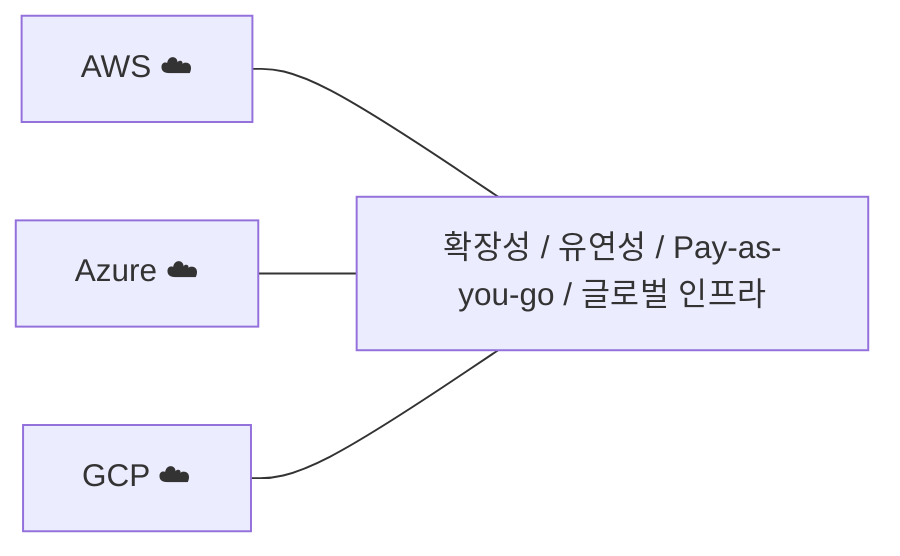
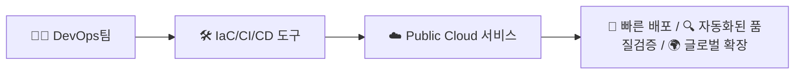
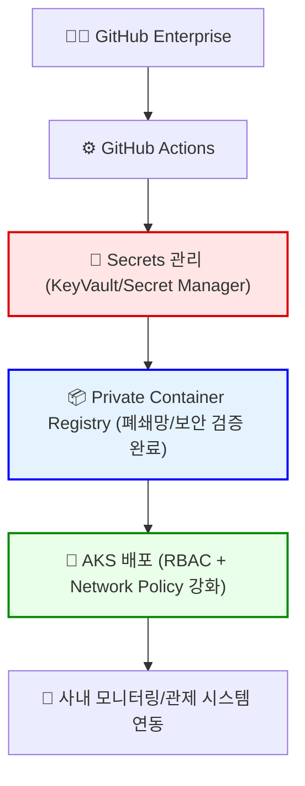
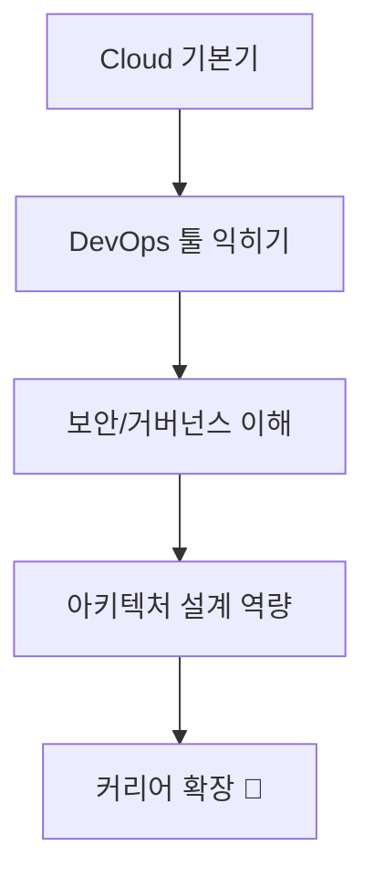

# **3. 웨비나**

## 제목 : Public Cloud에서 CICD 구현하는 방법

소제목 : Azure기반의 CICD 실무 인사이트

## **챕터1. Public Cloud와 DevOps, 왜 중요한가?** **(약 6분)**

### 약식

- **Cloud 선택의 본질**: Azure, AWS, GCP… 결국은 기업이 선택 가능한 다양한 CSP 중 하나일 뿐임을 강조

- **공통 가치**: 확장성, 유연성, Pay-as-you-go, 글로벌 인프라

- **DevOps와의 시너지**: Public Cloud 환경에서 DevOps·CICD가 왜 필수인지 설명
  - 빠른 배포 속도
  - 자동화된 품질 검증
  - 멀티 클라우드/하이브리드 환경에 맞춘 표준화된 프로세스

### **P1. Cloud 선택의 본질**

- Azure, AWS, GCP… CSP(Cloud Service Provider)는 다양
- 핵심은 **“특정 기술이 아니라 Cloud가 제공하는 공통 가치”**

💡 메시지: “Public Cloud는 **확장성·유연성·글로벌 인프라**라는 공통 가치를 제공합니다. 특정 벤더가 아닌, Cloud 자체가 혁신의 기반입니다.”

👉 특정 벤더 대신 **공통된 클라우드 가치**를 강조

### **P2. DevOps와 Public Cloud의 시너지**

- On-premises에서는 DevOps 구현이 **환경 구축/운영 부담**으로 어려움

- Public Cloud는 DevOps를 위한 도구/서비스를 **기본 제공**

  - IaC (ARM, CloudFormation, Terraform)
  - CI/CD Service (GitHub Actions, Azure DevOps, CodePipeline 등)
  - Observability (AppInsights, CloudWatch, Stackdriver 등)

  

💡 메시지: “Public Cloud는 DevOps의 실행력을 배가시킵니다. 자동화, 표준화, 글로벌 확장이 가능해집니다.”

👉 DevOps와 Public Cloud가 결합했을 때 생기는 **가치 흐름**을 단순화

### **P3. 실제 적용 사례 (Azure 중심 설명)**

- Azure 기반 DevOps를 활용했을 때 효과
  - 빠른 신규 서비스 배포 → KT 그룹 실무 적용
  - 하이브리드 환경에서도 통합된 DevOps 파이프라인 가능
- 단순 이론이 아니라 **실제 기업 운영에서 필수 요소**임을 강조

💡 메시지: “우리 회사(KT 그룹)도 결국 Public Cloud 위에서 DevOps를 실무에 녹여내고 있습니다. Cloud는 도구, DevOps는 방법론, 이 둘이 만나야 기업 혁신이 완성됩니다.”

## **챕터2. CICD 기본 흐름과 Public Cloud 활용 사례** **(약 9분)**

### P1. 기본 CICD 파이프라인 단계

* Code → Build → Test → Release → Deploy → Monitor

💡 메시지: “CICD는 개발부터 배포까지 자동화된 흐름을 만드는 기본 뼈대입니다.”

👉 초급자도 쉽게 이해할 수 있도록 **개발 → 빌드 → 테스트 → 배포 → 모니터링** 단계를 단순하게 그림화

### P2. Public Cloud에서의 장점

- Managed Service (예: Event Grid, Pub/Sub, SQS 같은 메시징 서비스)
- Managed DB/Storage → 개발팀이 인프라 관리 대신 서비스 개선에 집중

💡 메시지: “Public Cloud는 CI/CD 과정에 필요한 핵심 요소(레지스트리, 배포, 모니터링)를 Managed Service로 제공해 빠르고 안정적으로 운영할 수 있습니다.”

👉 범용 Public Cloud 관점에서 **도구와 서비스**가 어떻게 자동화에 기여하는지 강조

### P3. 실제 사례 (Azure 기반으로 설명)

- VM/Container 환경에서 CICD를 적용한 경험 공유

- GitHub Actions → Container Registry → Kubernetes 배포 흐름

- 우리 KT 그룹 환경에서는 보안·권한이 강화된 형태로 Customizing 했음을 강조

  - 예: KeyVault/Secrets Manager 통한 Credential 관리
  - RBAC 정책 강화
  - 폐쇄망 환경에서도 CICD 가능하도록 설계

  

💡 메시지:

- “KT 그룹 내부에서는 Public Cloud CICD 기본 구조에 **보안·권한 관리**를 추가합니다.”
- 예: KeyVault 기반 Secret 관리, Private Registry 통한 취약점 검증, RBAC/NetworkPolicy로 강화된 배포, 사내 모니터링 연동

👉 “실제 회사 사례”라는 점을 강조. 일반 Public Cloud CICD 위에 보안/권한 요소를 덧입힌 그림

## **챕터3. 커리어 확장 인사이트** **(약 5분)**

### 약식설명

P1. 학습 로드맵

- Cloud 기본기 → DevOps 툴 (GitHub Actions, Jenkins, ArgoCD 등) → 보안·거버넌스 → 아키텍처 설계
- 자격증 vs 실무 경험
  - 자격증은 보조수단일 뿐, **핵심은 아키텍처적 이해와 Hands-on 경험**

P2 엔지니어로서 성장 포인트

- 단순 기능 사용자가 아닌 “**서비스 전체를 설계하고 운영 관점에서 바라보는 시각**”
- CSP 특정 기술보다 **Cloud 아키텍처 전반의 패턴과 사고방식**이 커리어 경쟁력을 만든다.

### **P1. 학습 로드맵**

- **Cloud 기본기** → VM, 네트워크, 스토리지, 보안
- **DevOps 툴** → GitHub Actions, Jenkins, ArgoCD, Terraform 등 IaC
- **보안·거버넌스** → RBAC, KeyVault/Secret Manager, Policy, 네트워크 보안
- **아키텍처 설계** → MSA, CICD, DR, 하이브리드/멀티클라우드 설계

💡 메시지: “자격증은 보조수단일 뿐, **핵심은 아키텍처적 이해와 Hands-on 경험**입니다.”

👉 **순차적인 성장 단계**를 그림으로 보여주면 직관적

### **P2. 엔지니어 성장 포인트**

- **단순 사용자** → “서비스를 그냥 쓰는 단계”
- **숙련 엔지니어** → “서비스를 자동화·최적화하는 단계”
- **아키텍트적 시각** → “서비스 전체를 설계·운영·보안 관점에서 바라보는 단계”

💡 메시지: “CSP 특정 기술보다 **Cloud 아키텍처 전반의 패턴과 사고방식**이 커리어 경쟁력을 만듭니다.”

### **P3. KT 그룹 실무 사례에서 얻은 교훈**

- 단순히 Azure CICD 도입 → 끝이 아님
- **보안·권한 강화(Customizing)**가 핵심 경쟁력
  - Private Registry + 취약점 스캐닝
  - KeyVault 통한 Secret 관리
  - RBAC/정책 기반 접근 제어
- 엔지니어로서 성장하려면 **“기술 자체보다 그것을 운영 환경에 맞게 적용·변형하는 능력”**이 필요

💡 메시지: “Cloud 커리어는 단순히 기술을 배우는 게 아니라, **실제 기업 환경에 맞게 재해석하고 설계하는 능력**에서 차이가 납니다.”

👉 챕터3은 결국 **취준생/주니어 → 시니어/아키텍트로 성장하는 로드맵**을 보여주는 챕터로 설계하면 됩니다.

