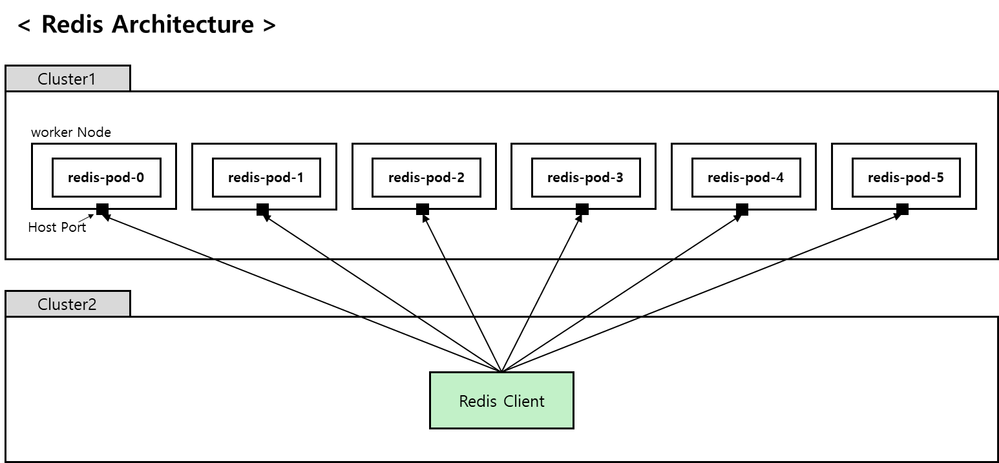
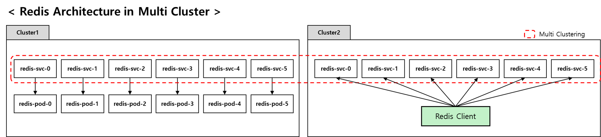
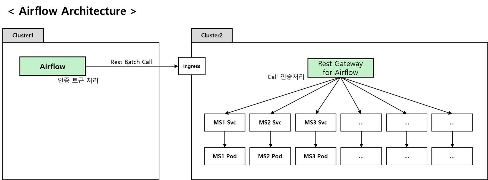
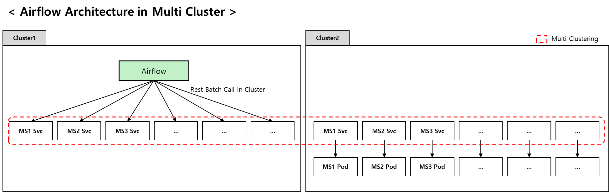
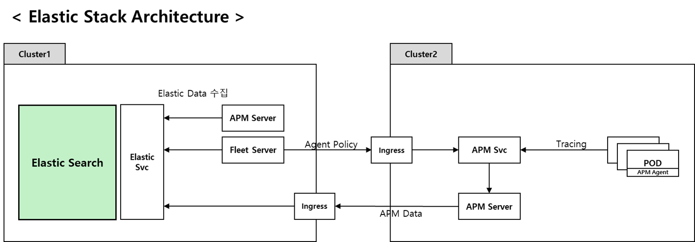
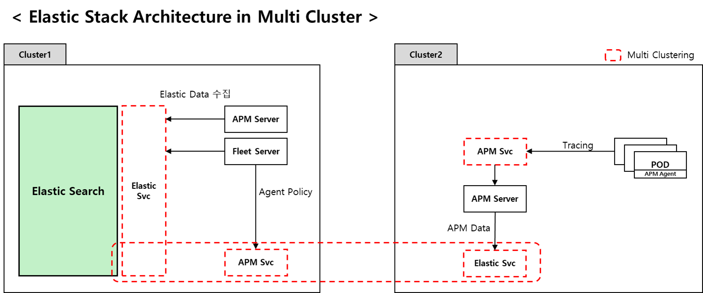
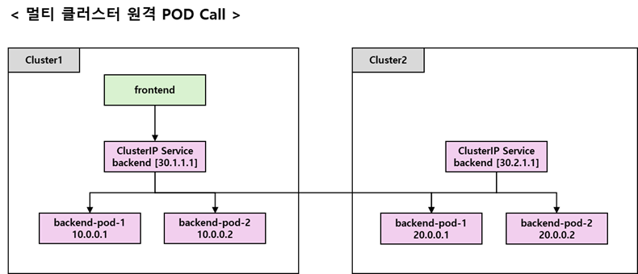
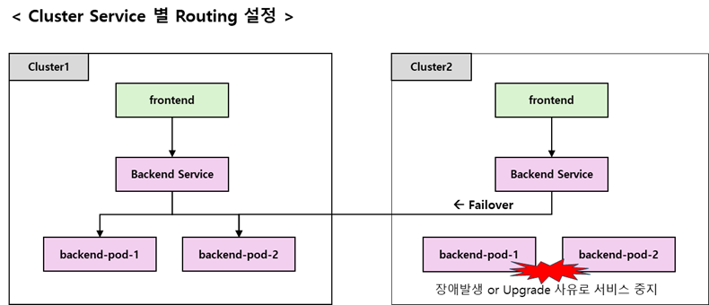

# Kubernetes 멀티 클러스터

> Cilium을 활용한 멀티 클러스터


[TOC]


# 1. 개요

컨테이너 오케스트레이션 도구로 많은 제품들이 존재하지만 대부분의 기업들은 Kubernetes 를 선택하고 있으며 기술적으로 완성도를 높여 나가고 있는 추세이다.  컨테이너 기술 채택이라는 과제를 극복한 이후에는 구성을 확장하는 것을 고려 해야 한다.

계속 해서 증가되는 컨테이너 AP 들을 충족하기 위해 더 많은 Cluster가 필요하다. 또한 단순 장애를 넘어 재해를 대비한 안정성을 위한다면 원거리 지역에 위치한 Cluster도 생각해 볼 수 있다.

단일 클러스터에서는 쉽게 해결될 수 있는 이슈이지만 이런 다중화된 클러스터 환경에서는 관리 및 기술 난이도가 높아질 수 밖에 없다. 본 글에서는 다수의 클러스터를 하나의 거대한 클러스터처럼 사용할 수 있는 멀티 클러스터에 대해서 살펴본다.


## 1) 클러스터 확장의 필요성

물론 단일 클러스터에서 리소스가 부족시에 Worker Node를 추가할 수 있지만 클러스터당 한계에 도달할 수 있다.  그러므로 더 많은 자원을 확보하기 위해 클러스터 단위의 확장이 필요하다.  그리고 지역을 분산하여 클러스터를 배치하게 되면 장애 및 재해시 서비스 중단을 최소화하고 고가용성을 달성할 수 있다. 또한 지역 간 로드 밸런싱을 통해 지역별 트래픽을 효과적으로 관리할 수 있다.  이러한 사유로 클러스터 확장을 반드시 고려해야 한다.


## 2) 멀티 클러스터 이점

다수개의 클러스터가 존재할 경우 멀티 클러스터 기능을 이용하여 하나의 거대한 클러스터로 연결 시킬 수 있다. 이런 경우 클러스터 추가시 현재 구성되어 있는 아키텍처를 크게 변경하지 않고도 쉽게 확장시킬 수 있으며 마치 단일 클러스터내에서 통신 하는 방식의 구조를 가져 갈 수 있으므로 보안 수준을 그대로 유지할 수 있으며 복잡도 또한 낮출 수 있다.

하지만 이런 멀티 클러스터 구성은 관리 및 운영 측면에서 기술의 난이도를 증가시킬 수 있으며 클러스터 간의 네트워킹은 추가 오버헤드를 초래할 수 있는 점도 충분히 고려되어야 한다.


# 2. 사례 분석

다중화된 클러스터 환경에서는 다양한 이슈들이 발생한다.

이렇게 분산된 클러스터를 사용하는 환경에서 멀티 클러스터 사용 전후로 어떻게 아키텍처가 변경되는지 살펴보자. 


## 1) 사례1. Redis Cluster

Redis Cluster의 경우 N개의 Redis Node로 구성된다. Client에서 Read 시도시 Data가 존재하는 Node로 Redirect 되며 이때 Client는 Redirect 된 Node 주소를 인식가능 해야 한다.

만약 Client 가 Redis와 다른 클러스터에 위치해 있다고 가정해 보자. K8s 클러스터간 통신은 일반적으로 Rest 만 지원 가능하므로 Ingress 를 통한 통신은 허용하지 않는다. 또한 Redirect을 고려하여 Node 별 인식가능한 구조로 구성해야 한다. 그러므로 타 Cluster에서 Redis 를 접근하기 위해서는 Client에서도 인식가능한 Worker Node IP 와 Host Port 를 사용한 아키텍처로 구성해야 한다.  이러한 구성 방안은 Container 환경에서는 가급적 지양 하는 HostPort 을 사용하고 있으며 설치 및 운용의 복잡도가 증가한다.

아래는 6개의 node 로 구성된 Redis Cluster 라고 가정한 아키텍처이다.




6개 Worker Node에 Host port 를 설정하여 Worker Node 별로 한개의 Redis Node가 탑재되도록 한다.  Redis Client 들은 6개의 Worker Node 로 직접 Connect 하는 구조이다.


멀티 클러스터로 구성하는 경우에는 어떻게 Connect 되는지 살펴보자.

Cluster1, Cluster2 를 하나의 클러스터로 연결했기 때문에 Cluster 2에 위치한 Redis Client는  마치 동일한 K8s Service명으로 접근 가능한 상태가 된다.  Client 에서 tcp 통신을 사용할 수 있으며 Redirect 된 주소 인식 가능하다.  전체적으로 두개의 Kubernetes 클러스터가 한개처럼 인식되므로 복잡도가 낮아지는 효과를 보게 된다.




**※ 참고 : Redis**

- **개발자**: Redis Ltd.
- **라이선스**: BSD 라이선스
- **웹사이트**: [Redis 공식 웹사이트](https://redis.io/)


## 2) 사례2. Airflow Rest Call

Batch Work Flow 용도의 오픈소스인 Airflow 라는 솔루션의 사례에서도 비슷한 사례를 볼수 있다.

해당 Airflow는 특정 클러스터에 위치해 있고 다른 클러스터에 위치한 Batch(AP)를 Rest로 Call 해야 하는 상황이라고 가정하자.  단일 클러스터라면 k8s Service 로 Rest Call 만으로 해결 되겠지만 다른 클러스터에 위치한 AP를 실행하기 위해서는 Ingress가 필요하다. 상황에 따라서는 해당 Ingress를 위해 별도 인증서를 구입해하며 불필요한 Call 을 막기 위해 인증 토큰이나 권한 체크 프로세스도 포함되어야 한다.  또한 해당 인증서를 연단위로 갱신하는 등 추가적인 관리가 필요하다.

아래는 원격 클러스터에 호출되는 Airflow 아키텍처이다.




이러한 구조를 멀티 클러스터로 구성한다면 어떻게 연결되는지 살펴보자.

Batch 실행이 필요한 AP들이 동일한 클러스터로 간주되므로 Kubernetes Rest Call 가능하다. 별도 인증처리를 하지 않아도 되며 Ingress 가 필요없다.  전체적으로 복잡도가 낮아지는 효과를 볼 수 있다.




**※ 참고 : Airflow**

- **개발자**: Apache Software Foundation
- **라이선스**: Apache License 2.0
- **웹사이트**: [Apache Airflow 공식 웹사이트](https://airflow.apache.org/)


## 3) 사례3. Elastic Stack Data 수집

클러스터 모니터링 도구로 Logging, Metric, APM 등 다양한 지표를 모니터할 수 있는 Elastic Stack 을 많이 사용하는데 관련 사례를 살펴보자.

각 클러스터에서 발생하는 지표들을 특정 클러스터에 위치하는 Elastic Search 에 저장하게 되는데, 이 또한 클러스터간 통신이 필요하다. 그러므로 클러스터 경계에는 각각 Ingress가 필요하며 이에 따라 Domain 및 인증서 관리가 되어야 한다.

아래는 클러스터간 Elastic Data(Metric,Log,APM)를 전송하는 일반적인 아키텍처 이다.




멀티 클러스터를 구성하게 된다면 간결한 아키텍처로 구성될 수 있다.

2개의 Cluster 가 한개로 간주되며 (Kubernetes) Service Call 만으로 접근 가능하다.  전체적으로 복잡도가 낮아지며 관리포인트가 줄어들거나 존재하지 않기 때문에 꽤 괜찮은 아키텍처이다.




**※ 참고 : Elastic Stack**

- **개발자**: Elastic NV
- **라이선스**: Elastic License
- **웹사이트**: [Elastic 공식 웹사이트](https://www.elastic.co/)


## 4) 기타

위 3가지 사례뿐 아니라 클러스터간 발생하는 TCP/Rest 통신이 필요한 경우 다양한 사례가 있을 수 있다.


# 3. Cilium을 활용한 멀티 클러스터 구성

멀티 클러스터를 구성하므로 변화되는 아키텍처에 대해서 알아보았다.  이제는 멀티 클러스터를 구성하는 방법에 대해서 살펴보자.


##  1)  Cilium 개요

Kubernetes에서 멀티 클러스터 구성을 지원하는 CNI tool 들이 많이 존재한다.  Cilium, Calico, Flannel, Weave Net 등이 있는데 그 중 최근 가장 각광 받고 있는 CNI는 Cilium이다.  Cilium 은 BPF(Berkeley Packet Filter) 기반의 강력한 네트워킹 및 보안 기능을 제공하는 현대적이고 고성능의 CNI 이다.

클러스터의 CNI로 Cilium을 채택한다면 각 클러스터별 메시를 통해 모든 클러스터의 서비스를 검색하고 액세스할 수 있다. 또한 여러 클러스터를 대규모로 통합한 네트워크에 효과적으로 결합할 수 있다.

**※ 참고 : Cilium**

- **개발자**: Cilium 커뮤니티
- **라이선스**: Apache License 2.0
- **웹사이트**: [Cilium 공식 웹사이트](https://cilium.io/)


Cilium을 활용하여 멀티 클러스터를 구성해 보자.


## 2) Cluster 구조도

Cilium은 클러스터간 동일한 Namespace, Service를 글로벌 Service로 자동  병합 하는 구조로 동작한다.  특정 서비스로 유입된 트래픽은 자신의 클러스터 POD 뿐 아니라 연결된 원격 클러스터의 POD 들도 RoundRobbin 대상이 된다.





클러스터 서비스별로 작동 가능 여부를 동적으로 설정 가능하다. 예를들면, 업그레이드를 위해 일시적으로 오프라인을 유지해야 하는 경우나  리소스 부족으로 인해 서비스 장애와 같은 경우이다.  각 클러스터내 서비스의 접근을 동적으로 조정하여 유연한 사용을 제공한다.





## 3) Cilium cli install

Cilium 을 설정하기 위해서는 먼저 CLI tool 을 먼저 설치해야 한다.  클러스터에 접근 가능한 위치에서 아래와 같이 CLI tool 을 다운로드 받아 설치하자.

```sh
$ mkdir -p ~/song/cilium
  cd ~/song/cilium

$ CILIUM_CLI_VERSION=$(curl -s https://raw.githubusercontent.com/cilium/cilium-cli/main/stable.txt)

$ CLI_ARCH=amd64

$ if [ "$(uname -m)" = "aarch64" ]; then CLI_ARCH=arm64; fi

$ curl -L --fail --remote-name-all https://github.com/cilium/cilium-cli/releases/download/${CILIUM_CLI_VERSION}/cilium-linux-${CLI_ARCH}.tar.gz{,.sha256sum}

$ sha256sum --check cilium-linux-${CLI_ARCH}.tar.gz.sha256sum

$ sudo tar xzvfC cilium-linux-${CLI_ARCH}.tar.gz /usr/local/bin

$ rm cilium-linux-${CLI_ARCH}.tar.gz{,.sha256sum}

$ cilium version --client
cilium-cli: v0.15.8 compiled with go1.21.0 on linux/amd64
cilium image (default): v1.14.1
cilium image (stable): v1.14.1

```


## 4) 다중 클러스터 접근 구성

멀티 클러스터를 구성하기 위해서는 각 클러스터를 접속할 수 있는 환경과 다수의 클러스터에 접근할 수 있도록 설정한다. 

아래는 bastions02 클러스터와 bastion03 클러스터에 각각 접근하는 Context 와 일괄로 셋팅한 Context 를 보여준다.

```yaml
# bastion02
$ cat ~/.kube/config
...
clusters:
- cluster:
    certificate-authority-data: LS0tLS1CRUdJTiBDRVJUSUZJQ0FURS0tLS0tCk1JSUJlRENDQVIyZ0F3SUJBZ0lCQURBS0JnZ3Foa2pPUFFRREFqQWpNU0V3SHdZRFZRUUREQmhyTTNNdGMyVnkKZG1WeUxXTmhRREUyT1RRM05qQXhOVEV3SGhjTk1qTXdPVEUxTURZME1qTXhXaGNOTXpNd09URXlNRFkwTWpNeApXakFqTVNFd0h3WURWUVFEREJock0zTXRjMlZ5ZG1WeUxXTmhRREUyT1RRM05qQXhOVEV3V1RBVEJnY3Foa2pPClBRSUJCZ2dxaGtqT1BRTUJCd05DQUFSY2VzRDRWOHJyZHBWOHRucWo5L2h5UUxBU05PT1JjSDUrdTZmaHpBNVoKMkRQWFZKQ0s5TjJBYUx1NklNRmJWWlFUSGVyai8wZGk0cStMTzhPN01uMEJvMEl3UURBT0JnTlZIUThCQWY4RQpCQU1DQXFRd0R3WURWUjBUQVFIL0JBVXdBd0VCL3pBZEJnTlZIUTRFRmdRVXlHYmxHUXBlVkJGMUFuS2ZHcDIwCkNwYVl6ZHN3Q2dZSUtvWkl6ajBFQXdJRFNRQXdSZ0loQUoya3lPdVF1TTUvY2Q4NVlwNGhXenRYd3BNdTlQM0EKSGpjWFNwN0Z2cE9vQWlFQStaTm0xdEdEVzRiTXgxdkRqQzVIZ3liVklIRnV2MmFwcjFERm5qeGFZN009Ci0tLS0tRU5EIENFUlRJRklDQVRFLS0tLS0K
    server: https://172.30.1.89:6443
  name: bastion02
users:
- name: bastion02
  user:
    client-certificate-data: LS0tLS1CRUdJTiBDRVJUSUZJQ0FURS0tLS0tCk1JSUJrRENDQVRlZ0F3SUJBZ0lJVElTZkFKUE1YbXN3Q2dZSUtvWkl6ajBFQXdJd0l6RWhNQjhHQTFVRUF3d1kKYXpOekxXTnNhV1Z1ZEMxallVQXhOamswTnpZd01UVXhNQjRYRFRJek1Ea3hOVEEyTkRJek1Wb1hEVEkwTURreApOREEyTkRJek1Wb3dNREVYTUJVR0ExVUVDaE1PYzNsemRHVnRPbTFoYzNSbGNuTXhGVEFUQmdOVkJBTVRESE41CmMzUmxiVHBoWkcxcGJqQlpNQk1HQnlxR1NNNDlBZ0VHQ0NxR1NNNDlBd0VIQTBJQUJCckJaUFh6TVBONlIvZTkKNTFPekV6UGx6elhzQUx0aE50SnlFdDd3YWdlWnYxSGszMWpQRVMzSWMyaUJYZHM4MWx3bW93L2srelBoditwagpwMlpvc2l5alNEQkdNQTRHQTFVZER3RUIvd1FFQXdJRm9EQVRCZ05WSFNVRUREQUtCZ2dyQmdFRkJRY0RBakFmCkJnTlZIU01FR0RBV2dCUytKWk05RS9sd2xGOXVraTkxWjhXZ2szV2pqREFLQmdncWhrak9QUVFEQWdOSEFEQkUKQWlBbE02cTVMQ0pyUDdtUmlqUUFtc1hTamQraUdjRjQxRlpmaHRJaHc4bnZ0Z0lnTUFNV3FEdkM4NjlUTmcrYgo3cEZydDNrRDdpREJoT2gzVXpReUY2T0tNRms9Ci0tLS0tRU5EIENFUlRJRklDQVRFLS0tLS0KLS0tLS1CRUdJTiBDRVJUSUZJQ0FURS0tLS0tCk1JSUJkekNDQVIyZ0F3SUJBZ0lCQURBS0JnZ3Foa2pPUFFRREFqQWpNU0V3SHdZRFZRUUREQmhyTTNNdFkyeHAKWlc1MExXTmhRREUyT1RRM05qQXhOVEV3SGhjTk1qTXdPVEUxTURZME1qTXhXaGNOTXpNd09URXlNRFkwTWpNeApXakFqTVNFd0h3WURWUVFEREJock0zTXRZMnhwWlc1MExXTmhRREUyT1RRM05qQXhOVEV3V1RBVEJnY3Foa2pPClBRSUJCZ2dxaGtqT1BRTUJCd05DQUFUUlpZbVU3bDcxb29UTXRVa2NKV0lhdkI5OGlvUC9Jc2JDOC96RUowcEIKRzErbjQvTy9yaW9NV2dZcFRqOVBTcWlVdXJFQ25YbngyTk93UVN5TGJhK1pvMEl3UURBT0JnTlZIUThCQWY4RQpCQU1DQXFRd0R3WURWUjBUQVFIL0JBVXdBd0VCL3pBZEJnTlZIUTRFRmdRVXZpV1RQUlA1Y0pSZmJwSXZkV2ZGCm9KTjFvNHd3Q2dZSUtvWkl6ajBFQXdJRFNBQXdSUUlnTjEyNUdBc3Jnc0RtWndPT2pXdStKTEhFVEtXaFJqMGkKTEdReEpSMzZpZklDSVFDS0dYSEcwWE9uSVNSRFk4WE4xY05XNVdSbWthRkRib2NxdXpPb1BxNlZCUT09Ci0tLS0tRU5EIENFUlRJRklDQVRFLS0tLS0K
    client-key-data: LS0tLS1CRUdJTiBFQyBQUklWQVRFIEtFWS0tLS0tCk1IY0NBUUVFSUtkbGFMaWQ2OXlPU0dRaS93WktSNGpuYTk2UVdsMFVBb0lpQS9RcWUxNkFvQW9HQ0NxR1NNNDkKQXdFSG9VUURRZ0FFR3NGazlmTXc4M3BIOTczblU3TVRNK1hQTmV3QXUyRTIwbklTM3ZCcUI1bS9VZVRmV004UgpMY2h6YUlGZDJ6eldYQ2FqRCtUN00rRy82bU9uWm1peUxBPT0KLS0tLS1FTkQgRUMgUFJJVkFURSBLRVktLS0tLQo=
...


# bastion03
$ cat ~/.kube/config
...
clusters:
- cluster:
    certificate-authority-data: LS0tLS1CRUdJTiBDRVJUSUZJQ0FURS0tLS0tCk1JSUJlRENDQVIyZ0F3SUJBZ0lCQURBS0JnZ3Foa2pPUFFRREFqQWpNU0V3SHdZRFZRUUREQmhyTTNNdGMyVnkKZG1WeUxXTmhRREUyT1RRM05qSTJNRGd3SGhjTk1qTXdPVEUxTURjeU16STRXaGNOTXpNd09URXlNRGN5TXpJNApXakFqTVNFd0h3WURWUVFEREJock0zTXRjMlZ5ZG1WeUxXTmhRREUyT1RRM05qSTJNRGd3V1RBVEJnY3Foa2pPClBRSUJCZ2dxaGtqT1BRTUJCd05DQUFUSlE1TUU2cjdrTk1kNXhFU1A0cmN0bWFLTWRKa1pvZzVwck05TTdNN1QKdlFmS0JRTEVXVHA0N01BV1NDMFVGYVlvSlBtT3dQa2FoUlloeXRDNXB5aHFvMEl3UURBT0JnTlZIUThCQWY4RQpCQU1DQXFRd0R3WURWUjBUQVFIL0JBVXdBd0VCL3pBZEJnTlZIUTRFRmdRVXhDeEYraXgraDd6ZkhmUDZzeVFrClY0UmJQdjh3Q2dZSUtvWkl6ajBFQXdJRFNRQXdSZ0loQUpENnBqU1ZUbmNxZnB4VFV3VnJpNXEyMTZjc044Y2MKNmVkcTM0Q2Yva25DQWlFQSsxUGpxbHJrd3BZNUhFTTgzaW5jRXdOei9aRm1VanZKY2t1QlVjeTJ5QW89Ci0tLS0tRU5EIENFUlRJRklDQVRFLS0tLS0K
    server: https://172.30.1.85:6443
  name: bastion03
users:
- name: bastion03
  user:
    client-certificate-data: LS0tLS1CRUdJTiBDRVJUSUZJQ0FURS0tLS0tCk1JSUJrRENDQVRlZ0F3SUJBZ0lJTjQ3Y1IyWDIrSEV3Q2dZSUtvWkl6ajBFQXdJd0l6RWhNQjhHQTFVRUF3d1kKYXpOekxXTnNhV1Z1ZEMxallVQXhOamswTnpZeU5qQTRNQjRYRFRJek1Ea3hOVEEzTWpNeU9Gb1hEVEkwTURreApOREEzTWpNeU9Gb3dNREVYTUJVR0ExVUVDaE1PYzNsemRHVnRPbTFoYzNSbGNuTXhGVEFUQmdOVkJBTVRESE41CmMzUmxiVHBoWkcxcGJqQlpNQk1HQnlxR1NNNDlBZ0VHQ0NxR1NNNDlBd0VIQTBJQUJMeXV5VmQrS2NHTzllU0YKUFcrK2N4R3d4VUkvZHF2TTlyYmcwVHVqUmdUUndQSTBBOWdHZUdhaFB4V2U0QTZXVGg3cERLWXVkRWp5MTVvKwpGMWFXMjllalNEQkdNQTRHQTFVZER3RUIvd1FFQXdJRm9EQVRCZ05WSFNVRUREQUtCZ2dyQmdFRkJRY0RBakFmCkJnTlZIU01FR0RBV2dCUm9ubjYyblJmK2dDM1dUcDJmZ29hM0JlNlIxekFLQmdncWhrak9QUVFEQWdOSEFEQkUKQWlBOXdDaERZWDU1cENVNERBdE8ydXdiQ09zUjVrMGlEb1E5VmVubUkrYkdJUUlnVDh5UlhMMk1RNUdOWDdMMAptYjVGTENvZU92NnVNQ2lqY1FadWs1WW1jZE09Ci0tLS0tRU5EIENFUlRJRklDQVRFLS0tLS0KLS0tLS1CRUdJTiBDRVJUSUZJQ0FURS0tLS0tCk1JSUJkakNDQVIyZ0F3SUJBZ0lCQURBS0JnZ3Foa2pPUFFRREFqQWpNU0V3SHdZRFZRUUREQmhyTTNNdFkyeHAKWlc1MExXTmhRREUyT1RRM05qSTJNRGd3SGhjTk1qTXdPVEUxTURjeU16STRXaGNOTXpNd09URXlNRGN5TXpJNApXakFqTVNFd0h3WURWUVFEREJock0zTXRZMnhwWlc1MExXTmhRREUyT1RRM05qSTJNRGd3V1RBVEJnY3Foa2pPClBRSUJCZ2dxaGtqT1BRTUJCd05DQUFSRGlib2VRNGk0VUlhS0l3aEEraFd5VVJzMnRscEgvaHFmK3NkcVNzd2gKaEIzSzR2Y2sveWtpcFFkWExKck1CclV4ZVdhQUV4R1dkcHhXMHNVcDRRZ2VvMEl3UURBT0JnTlZIUThCQWY4RQpCQU1DQXFRd0R3WURWUjBUQVFIL0JBVXdBd0VCL3pBZEJnTlZIUTRFRmdRVWFKNSt0cDBYL29BdDFrNmRuNEtHCnR3WHVrZGN3Q2dZSUtvWkl6ajBFQXdJRFJ3QXdSQUlnTmtxak9Dck0wUkdaWGhDdEIrY215bWhxVDhHdTJNb2oKSThZRGVGdU1xSFVDSUd4YTlYS2ZhMVE0QUI4TU1LQVRRSDlZSWlacDdCWlg5WlJSN3hjMXlsQWMKLS0tLS1FTkQgQ0VSVElGSUNBVEUtLS0tLQo=
    client-key-data: LS0tLS1CRUdJTiBFQyBQUklWQVRFIEtFWS0tLS0tCk1IY0NBUUVFSUJPZEVWMEZ4RCtHQmlqWGo2ZVhscmdLVnJqZ1FKZG80bW01dUZxZjFNTkVvQW9HQ0NxR1NNNDkKQXdFSG9VUURRZ0FFdks3SlYzNHB3WTcxNUlVOWI3NXpFYkRGUWo5MnE4ejJ0dURSTzZOR0JOSEE4alFEMkFaNApacUUvRlo3Z0RwWk9IdWtNcGk1MFNQTFhtajRYVnBiYjF3PT0KLS0tLS1FTkQgRUMgUFJJVkFURSBLRVktLS0tLQo=

...


# bastion02 에 만들어 준다. 
$ cat > ~/.kube/config-multi
---
apiVersion: v1
clusters:
- cluster:
    certificate-authority-data: LS0tLS1CRUdJTiBDRVJUSUZJQ0FURS0tLS0tCk1JSUJlRENDQVIyZ0F3SUJBZ0lCQURBS0JnZ3Foa2pPUFFRREFqQWpNU0V3SHdZRFZRUUREQmhyTTNNdGMyVnkKZG1WeUxXTmhRREUyT1RRM05qQXhOVEV3SGhjTk1qTXdPVEUxTURZME1qTXhXaGNOTXpNd09URXlNRFkwTWpNeApXakFqTVNFd0h3WURWUVFEREJock0zTXRjMlZ5ZG1WeUxXTmhRREUyT1RRM05qQXhOVEV3V1RBVEJnY3Foa2pPClBRSUJCZ2dxaGtqT1BRTUJCd05DQUFSY2VzRDRWOHJyZHBWOHRucWo5L2h5UUxBU05PT1JjSDUrdTZmaHpBNVoKMkRQWFZKQ0s5TjJBYUx1NklNRmJWWlFUSGVyai8wZGk0cStMTzhPN01uMEJvMEl3UURBT0JnTlZIUThCQWY4RQpCQU1DQXFRd0R3WURWUjBUQVFIL0JBVXdBd0VCL3pBZEJnTlZIUTRFRmdRVXlHYmxHUXBlVkJGMUFuS2ZHcDIwCkNwYVl6ZHN3Q2dZSUtvWkl6ajBFQXdJRFNRQXdSZ0loQUoya3lPdVF1TTUvY2Q4NVlwNGhXenRYd3BNdTlQM0EKSGpjWFNwN0Z2cE9vQWlFQStaTm0xdEdEVzRiTXgxdkRqQzVIZ3liVklIRnV2MmFwcjFERm5qeGFZN009Ci0tLS0tRU5EIENFUlRJRklDQVRFLS0tLS0K
    server: https://172.30.1.89:6443
  name: bastion02
- cluster:
    certificate-authority-data: LS0tLS1CRUdJTiBDRVJUSUZJQ0FURS0tLS0tCk1JSUJlRENDQVIyZ0F3SUJBZ0lCQURBS0JnZ3Foa2pPUFFRREFqQWpNU0V3SHdZRFZRUUREQmhyTTNNdGMyVnkKZG1WeUxXTmhRREUyT1RRM05qSTJNRGd3SGhjTk1qTXdPVEUxTURjeU16STRXaGNOTXpNd09URXlNRGN5TXpJNApXakFqTVNFd0h3WURWUVFEREJock0zTXRjMlZ5ZG1WeUxXTmhRREUyT1RRM05qSTJNRGd3V1RBVEJnY3Foa2pPClBRSUJCZ2dxaGtqT1BRTUJCd05DQUFUSlE1TUU2cjdrTk1kNXhFU1A0cmN0bWFLTWRKa1pvZzVwck05TTdNN1QKdlFmS0JRTEVXVHA0N01BV1NDMFVGYVlvSlBtT3dQa2FoUlloeXRDNXB5aHFvMEl3UURBT0JnTlZIUThCQWY4RQpCQU1DQXFRd0R3WURWUjBUQVFIL0JBVXdBd0VCL3pBZEJnTlZIUTRFRmdRVXhDeEYraXgraDd6ZkhmUDZzeVFrClY0UmJQdjh3Q2dZSUtvWkl6ajBFQXdJRFNRQXdSZ0loQUpENnBqU1ZUbmNxZnB4VFV3VnJpNXEyMTZjc044Y2MKNmVkcTM0Q2Yva25DQWlFQSsxUGpxbHJrd3BZNUhFTTgzaW5jRXdOei9aRm1VanZKY2t1QlVjeTJ5QW89Ci0tLS0tRU5EIENFUlRJRklDQVRFLS0tLS0K
    server: https://172.30.1.85:6443
  name: bastion03
contexts:
- context:
    cluster: bastion02
    user: bastion02
  name: bastion02
- context:
    cluster: bastion03
    user: bastion03
  name: bastion03
current-context: bastion02
kind: Config
preferences: {}
users:
- name: bastion02
  user:
    client-certificate-data: LS0tLS1CRUdJTiBDRVJUSUZJQ0FURS0tLS0tCk1JSUJrRENDQVRlZ0F3SUJBZ0lJVElTZkFKUE1YbXN3Q2dZSUtvWkl6ajBFQXdJd0l6RWhNQjhHQTFVRUF3d1kKYXpOekxXTnNhV1Z1ZEMxallVQXhOamswTnpZd01UVXhNQjRYRFRJek1Ea3hOVEEyTkRJek1Wb1hEVEkwTURreApOREEyTkRJek1Wb3dNREVYTUJVR0ExVUVDaE1PYzNsemRHVnRPbTFoYzNSbGNuTXhGVEFUQmdOVkJBTVRESE41CmMzUmxiVHBoWkcxcGJqQlpNQk1HQnlxR1NNNDlBZ0VHQ0NxR1NNNDlBd0VIQTBJQUJCckJaUFh6TVBONlIvZTkKNTFPekV6UGx6elhzQUx0aE50SnlFdDd3YWdlWnYxSGszMWpQRVMzSWMyaUJYZHM4MWx3bW93L2srelBoditwagpwMlpvc2l5alNEQkdNQTRHQTFVZER3RUIvd1FFQXdJRm9EQVRCZ05WSFNVRUREQUtCZ2dyQmdFRkJRY0RBakFmCkJnTlZIU01FR0RBV2dCUytKWk05RS9sd2xGOXVraTkxWjhXZ2szV2pqREFLQmdncWhrak9QUVFEQWdOSEFEQkUKQWlBbE02cTVMQ0pyUDdtUmlqUUFtc1hTamQraUdjRjQxRlpmaHRJaHc4bnZ0Z0lnTUFNV3FEdkM4NjlUTmcrYgo3cEZydDNrRDdpREJoT2gzVXpReUY2T0tNRms9Ci0tLS0tRU5EIENFUlRJRklDQVRFLS0tLS0KLS0tLS1CRUdJTiBDRVJUSUZJQ0FURS0tLS0tCk1JSUJkekNDQVIyZ0F3SUJBZ0lCQURBS0JnZ3Foa2pPUFFRREFqQWpNU0V3SHdZRFZRUUREQmhyTTNNdFkyeHAKWlc1MExXTmhRREUyT1RRM05qQXhOVEV3SGhjTk1qTXdPVEUxTURZME1qTXhXaGNOTXpNd09URXlNRFkwTWpNeApXakFqTVNFd0h3WURWUVFEREJock0zTXRZMnhwWlc1MExXTmhRREUyT1RRM05qQXhOVEV3V1RBVEJnY3Foa2pPClBRSUJCZ2dxaGtqT1BRTUJCd05DQUFUUlpZbVU3bDcxb29UTXRVa2NKV0lhdkI5OGlvUC9Jc2JDOC96RUowcEIKRzErbjQvTy9yaW9NV2dZcFRqOVBTcWlVdXJFQ25YbngyTk93UVN5TGJhK1pvMEl3UURBT0JnTlZIUThCQWY4RQpCQU1DQXFRd0R3WURWUjBUQVFIL0JBVXdBd0VCL3pBZEJnTlZIUTRFRmdRVXZpV1RQUlA1Y0pSZmJwSXZkV2ZGCm9KTjFvNHd3Q2dZSUtvWkl6ajBFQXdJRFNBQXdSUUlnTjEyNUdBc3Jnc0RtWndPT2pXdStKTEhFVEtXaFJqMGkKTEdReEpSMzZpZklDSVFDS0dYSEcwWE9uSVNSRFk4WE4xY05XNVdSbWthRkRib2NxdXpPb1BxNlZCUT09Ci0tLS0tRU5EIENFUlRJRklDQVRFLS0tLS0K
    client-key-data: LS0tLS1CRUdJTiBFQyBQUklWQVRFIEtFWS0tLS0tCk1IY0NBUUVFSUtkbGFMaWQ2OXlPU0dRaS93WktSNGpuYTk2UVdsMFVBb0lpQS9RcWUxNkFvQW9HQ0NxR1NNNDkKQXdFSG9VUURRZ0FFR3NGazlmTXc4M3BIOTczblU3TVRNK1hQTmV3QXUyRTIwbklTM3ZCcUI1bS9VZVRmV004UgpMY2h6YUlGZDJ6eldYQ2FqRCtUN00rRy82bU9uWm1peUxBPT0KLS0tLS1FTkQgRUMgUFJJVkFURSBLRVktLS0tLQo=
- name: bastion03
  user:
    client-certificate-data: LS0tLS1CRUdJTiBDRVJUSUZJQ0FURS0tLS0tCk1JSUJrRENDQVRlZ0F3SUJBZ0lJTjQ3Y1IyWDIrSEV3Q2dZSUtvWkl6ajBFQXdJd0l6RWhNQjhHQTFVRUF3d1kKYXpOekxXTnNhV1Z1ZEMxallVQXhOamswTnpZeU5qQTRNQjRYRFRJek1Ea3hOVEEzTWpNeU9Gb1hEVEkwTURreApOREEzTWpNeU9Gb3dNREVYTUJVR0ExVUVDaE1PYzNsemRHVnRPbTFoYzNSbGNuTXhGVEFUQmdOVkJBTVRESE41CmMzUmxiVHBoWkcxcGJqQlpNQk1HQnlxR1NNNDlBZ0VHQ0NxR1NNNDlBd0VIQTBJQUJMeXV5VmQrS2NHTzllU0YKUFcrK2N4R3d4VUkvZHF2TTlyYmcwVHVqUmdUUndQSTBBOWdHZUdhaFB4V2U0QTZXVGg3cERLWXVkRWp5MTVvKwpGMWFXMjllalNEQkdNQTRHQTFVZER3RUIvd1FFQXdJRm9EQVRCZ05WSFNVRUREQUtCZ2dyQmdFRkJRY0RBakFmCkJnTlZIU01FR0RBV2dCUm9ubjYyblJmK2dDM1dUcDJmZ29hM0JlNlIxekFLQmdncWhrak9QUVFEQWdOSEFEQkUKQWlBOXdDaERZWDU1cENVNERBdE8ydXdiQ09zUjVrMGlEb1E5VmVubUkrYkdJUUlnVDh5UlhMMk1RNUdOWDdMMAptYjVGTENvZU92NnVNQ2lqY1FadWs1WW1jZE09Ci0tLS0tRU5EIENFUlRJRklDQVRFLS0tLS0KLS0tLS1CRUdJTiBDRVJUSUZJQ0FURS0tLS0tCk1JSUJkakNDQVIyZ0F3SUJBZ0lCQURBS0JnZ3Foa2pPUFFRREFqQWpNU0V3SHdZRFZRUUREQmhyTTNNdFkyeHAKWlc1MExXTmhRREUyT1RRM05qSTJNRGd3SGhjTk1qTXdPVEUxTURjeU16STRXaGNOTXpNd09URXlNRGN5TXpJNApXakFqTVNFd0h3WURWUVFEREJock0zTXRZMnhwWlc1MExXTmhRREUyT1RRM05qSTJNRGd3V1RBVEJnY3Foa2pPClBRSUJCZ2dxaGtqT1BRTUJCd05DQUFSRGlib2VRNGk0VUlhS0l3aEEraFd5VVJzMnRscEgvaHFmK3NkcVNzd2gKaEIzSzR2Y2sveWtpcFFkWExKck1CclV4ZVdhQUV4R1dkcHhXMHNVcDRRZ2VvMEl3UURBT0JnTlZIUThCQWY4RQpCQU1DQXFRd0R3WURWUjBUQVFIL0JBVXdBd0VCL3pBZEJnTlZIUTRFRmdRVWFKNSt0cDBYL29BdDFrNmRuNEtHCnR3WHVrZGN3Q2dZSUtvWkl6ajBFQXdJRFJ3QXdSQUlnTmtxak9Dck0wUkdaWGhDdEIrY215bWhxVDhHdTJNb2oKSThZRGVGdU1xSFVDSUd4YTlYS2ZhMVE0QUI4TU1LQVRRSDlZSWlacDdCWlg5WlJSN3hjMXlsQWMKLS0tLS1FTkQgQ0VSVElGSUNBVEUtLS0tLQo=
    client-key-data: LS0tLS1CRUdJTiBFQyBQUklWQVRFIEtFWS0tLS0tCk1IY0NBUUVFSUJPZEVWMEZ4RCtHQmlqWGo2ZVhscmdLVnJqZ1FKZG80bW01dUZxZjFNTkVvQW9HQ0NxR1NNNDkKQXdFSG9VUURRZ0FFdks3SlYzNHB3WTcxNUlVOWI3NXpFYkRGUWo5MnE4ejJ0dURSTzZOR0JOSEE4alFEMkFaNApacUUvRlo3Z0RwWk9IdWtNcGk1MFNQTFhtajRYVnBiYjF3PT0KLS0tLS1FTkQgRUMgUFJJVkFURSBLRVktLS0tLQo=
---


```

kubernetes  공식 Document site 를 참고하자.

참고링크 : https://kubernetes.io/docs/tasks/access-application-cluster/configure-access-multiple-clusters/


현재 사용하고자 하는 kubeconfig 파일을 정의 한다. 

```sh
# multi kubeconfig 적용
$ export KUBECONFIG="${HOME}/.kube/config-multi"

```

특정 클러스터에 접근하기 위해서 아래와 같이 환경변수를 설정한다.

```sh
$ export CLUSTER1=bastion02
  export CLUSTER2=bastion03
```

이제는 아래 명령으로 특정 클러스터를 지정해서 명령을 수행할 수 있다.

```sh
$ kubectl --context $CLUSTER1 -n kube-system get svc

$ kubectl --context $CLUSTER2 -n kube-system get svc
```


## 5) Cilium Install

클러스터별 환경설정이 마무리 되었다면 이제는 Cilium 을 Install 하자.


먼저 첫번째 클러스터에서 cilium 을 설치한다. cluster.id 와 cluster.name 을 고유하게 설정한다.

```sh
# cilium ingressController enable
$ cilium install --context $CLUSTER1 \
  --set cluster.id=1 \
  --set cluster.name=cluster1 \
  --version 1.14.1


🔮 Auto-detected Kubernetes kind: K3s
ℹ️  Using Cilium version 1.14.1
ℹ️  Using cluster name "cluster1"

```


먼저 두번째 클러스터에서 cilium을 설치한다.

```sh
# cilium ingressController enable
$ cilium install --context $CLUSTER2 \
  --set cluster.id=2 \
  --set cluster.name=cluster2
  --version 1.14.1

```


cilium status 명령으로 현재 Cilium 상태를  확인할 수 있다.

```sh
$ cilium status --context $CLUSTER1

    /¯¯\
 /¯¯\__/¯¯\    Cilium:             OK
 \__/¯¯\__/    Operator:           OK
 /¯¯\__/¯¯\    Envoy DaemonSet:    disabled (using embedded mode)
 \__/¯¯\__/    Hubble Relay:       disabled
    \__/       ClusterMesh:        OK

Deployment             cilium-operator          Desired: 1, Ready: 1/1, Available: 1/1
DaemonSet              cilium                   Desired: 1, Ready: 1/1, Available: 1/1
Deployment             clustermesh-apiserver    Desired: 1, Ready: 1/1, Available: 1/1
Containers:            cilium                   Running: 1
                       cilium-operator          Running: 1
                       clustermesh-apiserver    Running: 1
Cluster Pods:          11/11 managed by Cilium
Helm chart version:    1.14.1
Image versions         cilium                   quay.io/cilium/cilium:v1.14.1@sha256:edc1d05ea1365c4a8f6ac6982247d5c145181704894bb698619c3827b6963a72: 1
                       cilium-operator          quay.io/cilium/operator-generic:v1.14.1@sha256:e061de0a930534c7e3f8feda8330976367971238ccafff42659f104effd4b5f7: 1
                       clustermesh-apiserver    quay.io/coreos/etcd:v3.5.4@sha256:795d8660c48c439a7c3764c2330ed9222ab5db5bb524d8d0607cac76f7ba82a3: 1
                       clustermesh-apiserver    quay.io/cilium/clustermesh-apiserver:v1.14.1@sha256:a7353669b1f7cb96cd600d98c7dd12e909d876843a7a272a1bc407e114ed225c: 1


$ cilium status --context $CLUSTER2
    /¯¯\
 /¯¯\__/¯¯\    Cilium:             OK
 \__/¯¯\__/    Operator:           OK
 /¯¯\__/¯¯\    Envoy DaemonSet:    disabled (using embedded mode)
 \__/¯¯\__/    Hubble Relay:       disabled
    \__/       ClusterMesh:        OK

Deployment             cilium-operator          Desired: 1, Ready: 1/1, Available: 1/1
Deployment             clustermesh-apiserver    Desired: 1, Ready: 1/1, Available: 1/1
DaemonSet              cilium                   Desired: 1, Ready: 1/1, Available: 1/1
Containers:            clustermesh-apiserver    Running: 1
                       cilium                   Running: 1
                       cilium-operator          Running: 1
Cluster Pods:          8/8 managed by Cilium
Helm chart version:    1.14.1
Image versions         cilium                   quay.io/cilium/cilium:v1.14.1@sha256:edc1d05ea1365c4a8f6ac6982247d5c145181704894bb698619c3827b6963a72: 1
                       cilium-operator          quay.io/cilium/operator-generic:v1.14.1@sha256:e061de0a930534c7e3f8feda8330976367971238ccafff42659f104effd4b5f7: 1
                       clustermesh-apiserver    quay.io/coreos/etcd:v3.5.4@sha256:795d8660c48c439a7c3764c2330ed9222ab5db5bb524d8d0607cac76f7ba82a3: 1
                       clustermesh-apiserver    quay.io/cilium/clustermesh-apiserver:v1.14.1@sha256:a7353669b1f7cb96cd600d98c7dd12e909d876843a7a272a1bc407e114ed225c: 1

```


cilium 삭제시에는 uninstall 명령만으로 간단히  제거할 수 있다.

```sh
# cilium 삭제시... 
$ cilium uninstall
🔥 Deleting pods in cilium-test namespace...
🔥 Deleting cilium-test namespace...


$ cilium status --wait

```


## 6) Cluster Mesh 설정 및 Cluster 연결

Cilium Install이 마무리되었다면 Cluster별로 연결을 시도해 보자.


먼저 수행해야 할 작업은 Cilium Cluster Mesh Enable 이다.  Cluster1, Cluster2 에서 아래 명령어를  각각 수행한다.

```sh

## cluster1 에서
$ cilium clustermesh enable --context $CLUSTER1 --service-type=NodePort
⚠️  Using service type NodePort may fail when nodes are removed from the cluster!


$ cilium clustermesh status --context $CLUSTER1
⚠️  Service type NodePort detected! Service may fail when nodes are removed from the cluster!
✅ Service "clustermesh-apiserver" of type "NodePort" found
✅ Cluster access information is available:
  - 172.30.1.89:32379
✅ Deployment clustermesh-apiserver is ready
🔌 No cluster connected
🔀 Global services: [ min:0 / avg:0.0 / max:0 ]


## cluster2 에서
$ cilium clustermesh enable --context $CLUSTER2 --service-type=NodePort


$ cilium clustermesh status --context $CLUSTER1
⚠️  Service type NodePort detected! Service may fail when nodes are removed from the cluster!
✅ Service "clustermesh-apiserver" of type "NodePort" found
✅ Cluster access information is available:
  - 172.30.1.89:32379
✅ Deployment clustermesh-apiserver is ready
🔌 No cluster connected
🔀 Global services: [ min:0 / avg:0.0 / max:0 ]


```


Mesh enable 까지 설정했다면 Cluster 연결준비가 완료된 상태이다.  Cluster Mesh Connect 명령으로 연결을 시도해 보자.

```sh
# clustermesh connect 설정

$ cilium clustermesh connect --context $CLUSTER1 --destination-context $CLUSTER2

✅ Detected Helm release with Cilium version 1.14.1
✨ Extracting access information of cluster cluster2...
🔑 Extracting secrets from cluster cluster2...
⚠️  Service type NodePort detected! Service may fail when nodes are removed from the cluster!
ℹ️  Found ClusterMesh service IPs: [172.30.1.85]
✨ Extracting access information of cluster cluster1...
🔑 Extracting secrets from cluster cluster1...
⚠️  Service type NodePort detected! Service may fail when nodes are removed from the cluster!
ℹ️  Found ClusterMesh service IPs: [172.30.1.89]
⚠️ Cilium CA certificates do not match between clusters. Multicluster features will be limited!
ℹ️ Configuring Cilium in cluster 'bastion02' to connect to cluster 'bastion03'
ℹ️ Configuring Cilium in cluster 'bastion03' to connect to cluster 'bastion02'
✅ Connected cluster bastion02 and bastion03!


# 확인
# 클러스터를 연결하는 데 약간의 시간이 걸릴 수 있다.
$ cilium clustermesh status --context $CLUSTER1 --wait
⚠️  Service type NodePort detected! Service may fail when nodes are removed from the cluster!
✅ Service "clustermesh-apiserver" of type "NodePort" found
✅ Cluster access information is available:
  - 172.30.1.89:32379
✅ Deployment clustermesh-apiserver is ready
✅ All 1 nodes are connected to all clusters [min:1 / avg:1.0 / max:1]
🔌 Cluster Connections:
  - cluster2: 1/1 configured, 1/1 connected
🔀 Global services: [ min:0 / avg:0.0 / max:0 ]

```

클러스터 연결은 한방향으로 수행하지만 자동으로 양방향 설정 된다.


연결이 잘되는 테스트 해보기 위해서 connectivity test 명령을 수행해 보자. 

각종 svc, deploy, pod 들이 자동으로 실행되면서 테스트를 수행할 것이다.

```sh
$ cilium connectivity test --context $CLUSTER1 --multi-cluster $CLUSTER2
# 각종 deployment / pod / svc 들이 설치된다.


# 수작업 테스트
curl -i echo-other-node:8080
curl -i echo-same-node:8080

```


# 4. Sample app 배포

Cilium으로 연결된 멀티 클러스터 환경에 userlist 라는 Sample AP 를 배포해 보자.


## 1) Userlist Deploy

먼저 적당한 namespace 를 생성하자.  여기서는 song 라는 namespace 로 생성할 것이다.

각 클러스터별로 namespace 를 각각 생성해야 하며 이름이 동일해야 한다는 점을 명심하자.

```sh
$ kubectl create --context=$CLUSTER1 namespace song
  kubectl create --context=$CLUSTER2 namespace song
```


service 와 deployment 를 생성해 보자.

```sh
$ mkdir -p ~/temp/userlist
  cd ~/temp/userlist

$ cat <<EOF > 11.userlist-deployment.yaml
apiVersion: apps/v1
kind: Deployment
metadata:
  name: userlist
  labels:
    app: userlist
spec:
  replicas: 1
  selector:
    matchLabels:
      app: userlist
  template:
    metadata:
      labels:
        app: userlist
    spec:
      containers:
      - name: userlist
        image: ssongman/userlist:v1
        ports:
        - containerPort: 8181
EOF


$ cat <<EOF > 12.userlist-svc.yaml
apiVersion: v1
kind: Service
metadata:
  name: userlist-svc
  annotations:
    service.cilium.io/global: "true"    # global LB 설정
    service.cilium.io/shared: "true"    # remote에 endpoint 공유 여부
spec:
  selector:
    app: userlist
  ports:
  - name: http
    protocol: TCP
    port: 80
    targetPort: 8181
  type: ClusterIP
EOF

```

클러스터간 연결이 service 설정으로 이루어진다.  위 annotations  global / shared 옵션을 보면 모두 true 라고 설정되어 있다. 

위 yaml 이 실행되면 원격 클러스터로 공유가능한 service 가 된다.


해당 yaml 을 실행해보자.

```sh
$ cd ~/song/cilium/userlist


# cluster1
$ kubectl --context=$CLUSTER1 -n song apply -f 11.userlist-deployment.yaml
  kubectl --context=$CLUSTER1 -n song apply -f 12.userlist-svc.yaml

# cluster2
$ kubectl --context=$CLUSTER2 -n song apply -f 11.userlist-deployment.yaml
  kubectl --context=$CLUSTER2 -n song apply -f 12.userlist-svc.yaml

# 확인
$ kubectl --context=$CLUSTER1 -n song get pod
  kubectl --context=$CLUSTER2 -n song get pod


# [참고] clean up

$ kubectl --context=$CLUSTER1 -n song delete -f 11.userlist-deployment.yaml
  kubectl --context=$CLUSTER1 -n song delete -f 12.userlist-svc.yaml
  
$ kubectl --context=$CLUSTER2 -n song delete -f 11.userlist-deployment.yaml
  kubectl --context=$CLUSTER2 -n song delete -f 12.userlist-svc.yaml
  
  
```

userlist 가 잘 실행되었을 것이다.


curl  test 를 위해 적당한 pod 를 실행해보자.

```sh
$ kubectl create deploy curltest \
    --context $CLUSTER1 \
    --namespace song \
    --image=curlimages/curl -- sleep 365d

  kubectl create deploy curltest \
    --context $CLUSTER2 \
    --namespace song \
    --image=curlimages/curl -- sleep 365d


$ kubectl --context $CLUSTER1 -n song get pod
$ kubectl --context $CLUSTER2 -n song get pod


## [참고] 삭제시...
$ kubectl -n song delete deploy curltest


```


yaml 이 실행 완료 되었다면 cluster1에서 userlist 호출 시도해 보자.

Cluster2 에 실행되는 POD 까지 모두 확인 될 것이다.

```sh
$ kubectl --context $CLUSTER1 -n song \
    exec -it deploy/curltest -- sh

$ curl -sS userlist-svc.song.svc:80/users/1

# while 문으로 call
$ while true;do curl -sS userlist-svc.song.svc:80/users/1;sleep 1; echo; done;

```


cluster2에서도 userlist 호출 시도해 보자. 역시나 cluster1, cluster2 의 pod 들의 내용이 모두 확인 될 것이다.

```sh

$ kubectl --context $CLUSTER2 -n song \
    exec -it deploy/curltest -- sh

$ curl -sS userlist-svc.song.svc:80/users/1

# while 문으로 call
$ while true;do curl -sS userlist-svc.song.svc:80/users/1;sleep 1; echo; done;


```

어느 한쪽의 replicas 를 0 으로 변경 한다면 양쪽에서 모두 하나의 pod 로만 호출될 것이다.


## 2) service affinity 

바로 위에서 테스트 한 것처럼 Cluster1 에서 또는 Cluster2 에서 테스트할 때 모든 Cluster 의 POD들이 RoundRobbin 대상이 되지만  이런 로드 밸런싱은 경우에 따라서 이상적이지 않을 수 있다.  즉, 특정 순간에는 local Cluster 로만 집중시키고 싶은 경우가 있을 것이고 아니면 remote Cluster 로 Call 을 집중시키길 희망하는 경우가 있을 수 있다. 이런 경우 annotation affinity로 endpoint 대상을 지정할 수 있다.

```yaml
service.cilium.io/affinity: "local|remote|none"


# 사용사례
apiVersion: v1
kind: Service
metadata:
  name: rebel-base
  annotations:
     service.cilium.io/global: "true"
     # Possible values:
     # - local
     #    preferred endpoints from local cluster if available
     # - remote
     #    preferred endpoints from remote cluster if available
     # none (default)
     #    no preference. Default behavior if this annotation does not exist
     service.cilium.io/affinity: "local"
     
     
```

아래와 같이 local / remote / none 등으로 반영해 보자.

```sh
# local 로 변경
$ kubectl --context $CLUSTER1 -n song \
    annotate service userlist-svc service.cilium.io/affinity=local --overwrite


# remote 로 변경
$ kubectl --context $CLUSTER1 -n song \
    annotate service userlist-svc service.cilium.io/affinity=remote --overwrite


# none 로 변경
$ kubectl --context $CLUSTER1 -n song \
    annotate service userlist-svc service.cilium.io/affinity=none --overwrite


# annotation 제거
$ kubectl --context $CLUSTER1 -n song \
    annotate service userlist-svc service.cilium.io/affinity-  --overwrite


```


이렇게 affinity 설정시 어떤 방식으로 endpoint 가 지정될까?

이를 확인하기 위해서 cilium cli로 service list 명령을 수행해 보자.

```sh
$ kubectl exec -n kube-system -ti ds/cilium -- cilium service list --clustermesh-affinity    
ID   Frontend            Service Type   Backend
2    10.43.0.10:53       ClusterIP      1 => 10.0.0.164:53 (active)
3    10.43.0.10:9153     ClusterIP      1 => 10.0.0.164:9153 (active)
4    10.43.34.32:443     ClusterIP      1 => 10.0.0.33:10250 (active)
5    10.43.0.1:443       ClusterIP      1 => 172.30.1.89:6443 (active)
6    10.43.163.230:80    ClusterIP      1 => 10.0.0.59:8000 (active)
7    10.43.163.230:443   ClusterIP      1 => 10.0.0.59:8443 (active)
12   10.43.63.76:443     ClusterIP      1 => 172.30.1.89:4244 (active)
13   10.43.130.72:2379   ClusterIP      1 => 10.0.0.207:2379 (active)
17   10.43.112.141:80    ClusterIP      1 => 10.0.0.165:8181 (active)
                                        2 => 10.0.0.239:8181 (active) (preferred)

```

remote 로 변경시 cluster.id 2 에 preferred 로 선언되었다.   그러므로 Cluster2 로 트래픽이 흐른다는 사실을 확인할 수 있다.

Service list 가 사실상 routing 역할을 수행한다.


userlist 라는 sample app 을 통해서 멀티 클러스터를 구성해 보았다.


# 5. 결론

오늘날 Kubernetes는 전 세계 기업에서 널리 채택되어 사용하고 있고, 운영 노하우가 쌓여 가면서 기술 성숙도 역시 높아지고 있다. 이에 따라 새로운 이슈들이 생겨나게  되고 점점 더 높은 기술 난이도를 요구할 것이다.  클러스터는 확장성/고가용성 등을 위해서 점점 더 거대해 질 것이며 이러한 다중화된 클러스터 환경에서는 기술 난이도 또한 더 심화될 것이다. 

Kubernetes 클러스터들을 멀티 클러스터로 구성한다면 환경구성의 복잡도를 낮추고 좀 더 간결한 아키텍처를 가져 갈 수 있다.

