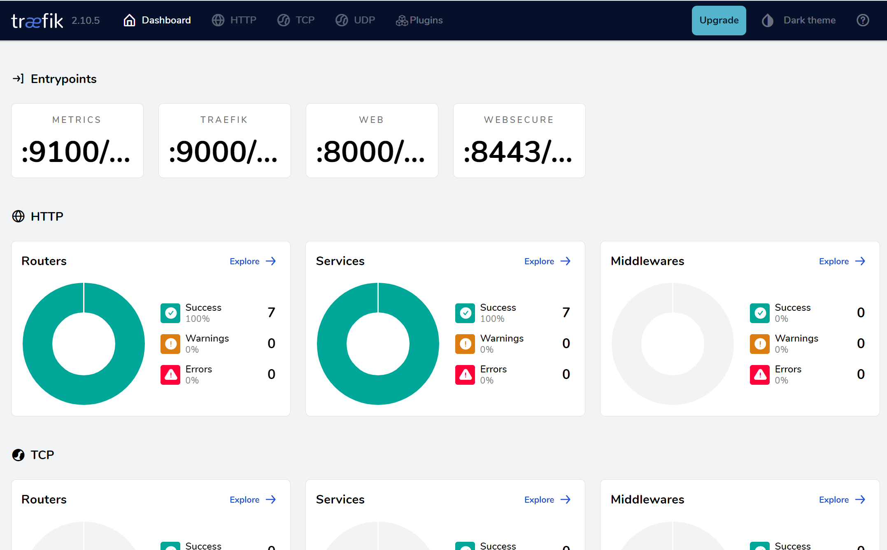

# k3s(경량 Kubernetes) 클러스터 구성하기


최근 컨테이너 오케스트레이션의 필수 도구로 자리 잡은 Kubernetes는 많은 기업들이 채택하고 있다. 그러나 Kubernetes를 사용하기 위해서는 상당한 리소스와 시간을 투자해야 한다. 하지만, 이를 구성하고 운영하는 것은 어려운 과정이다. 이에 대한 대안으로 등장한 k3s는 경량화된 Kubernetes로, 간편한 설치와 운영, 그리고 작은 리소스 사용으로 초보자부터 전문가까지 널리 활용되고 있다.


# 1. k3s 개요

k3s는 Rancher Labs에서 개발한 경량 Kubernetes 클러스터이다. 기존의 Kubernetes와 비교하여 설치 및 운영이 훨씬 간편하며, 적은 리소스만으로 사용이 가능하다. k3s는 단일 바이너리로 구성되어 있으며, 작은 장비나 IoT 기기와 같이 리소스가 제한된 환경에서도 잘 동작한다.


## 1) k3s의 특징

k3s는 경량화된 Kubernetes로, 단일 바이너리로 구성되어 있어 설치와 운영이 간편하다. 또한 작은 장비나 리소스 제한이 있는 환경에서도 빠르고 효율적으로 동작한다.  k3s는 Kubernetes의 핵심 기능을 모두 제공하면서도 불필요한 기능을 최소화하여 가볍게 유지된다. 이로 인해 필요한 기능만 사용하면서도 성능을 유지할 수 있다.  k3s는 Kubernetes의 보안 및 안정성을 유지하면서도 사용자 편의성을 최대화한다. 적은 구성 요소로 인해 취약점이 적고, 보안 업데이트가 간편하다.


## 2) k3s와 함께 제공되는 Solution

K3s는 다음과 같은 필수 종속성을 패키지로 제공한다.

### kubectl

kubectl은 Kubernetes 클러스터를 관리하기 위한 CLI 이다. k3s는 kubectl을 기본적으로 제공하여 사용자가 클러스터를 제어하고 관리할 수 있도록 한다. 리소스 생성, 조회, 수정, 삭제 등 Kubernetes 클러스터 관리 작업을 수행할 때 사용된다.

### Traefik

k3s는 기본적으로 로드 밸런서 서비스를 제공하기 위해 Traefik 을 함께 제공한다.  Traefik은 리버스 프록시 및 로드 밸런서로 사용되며 내부 네트워킹, 외부 접근 등의 기능을 지원한다.

### CoreDNS

DNS 서비스를 위해 CoreDNS를 함께 제공한다.  클러스터 내 DNS 쿼리를 처리하며 서비스 디스커버리 기능을 지원한다.

### Metrics-server

metrics-server는 Kubernetes 클러스터의 리소스 사용량 및 성능 데이터를 수집하고 노출하는 역할을 한다. 이를 통해 리소스 사용량을 모니터링하고 스케일링을 수행할 수 있다.  리소스 사용량 모니터링, 수평 스케일링 결정 등에 사용된다.


## 3) K3s 아키텍처

K3s 아키텍처를 살펴보자.


서버 노드는 `k3s server` 명령을 실행하는 호스트로 정의되며, 컨트롤 플레인 및 데이터스토어 구성 요소는 K3s에서 관리한다. 에이전트 노드는 데이터스토어 또는 컨트롤 플레인 구성 요소 없이 `k3s agent` 명령을 실행하는 호스트로 정의된다. 서버와 에이전트 모두 kubelet, Container runtime(Containerd) 및 CNI가 실행된다. 


#  2. k3s 설치

k3s는 설치는 명령어 한줄만 실행하는 방식이므로 매우 간단하다.   Stand Alone 모드가 아닌 확장된 클러스터 형태로 구성하더라도 Master / Worker Node 별로 설치후 연결하는 구조로 복잡하지 않다.  k3s 를 설치해 보자.


## 1) Stand Alone Mode

Stand Alone Mode 는 한개의 Node 로 구성된 k3s 이다. 간단한 기능검증 용도나 최소한의 AP 를 수행하기 위해서는 선택 될 수 있는 아키텍처 이다. 다만, 한개의 Node 이므로 해당 Node 가 Down 되면 서비스 중인 AP 는 복구할 수 없으니 이를 고려하자.

설치를 진행해 보자.

```sh
## root 권한으로 수행한다.
$ sudo -s

# k3s 설치
$ curl -sfL https://get.k3s.io | sh -s - --write-kubeconfig-mode 644
```


설치가 잘 되었는지 kubectl version 명령어로 확인해보자.

```sh
$ k3s kubectl version
Client Version: v1.28.6+k3s2
Kustomize Version: v5.0.4-0.20230601165947-6ce0bf390ce3
Server Version: v1.28.6+k3s2
```

Client 와 Server 의 Version 이 출력된다면 설치가 잘 된 것이다.


아래와 같이 k3s 데몬으로 설치여부를 확인 할 수 있다.

```sh

$ ps -ef|grep k3s
root         590     405  0 13:05 pts/0    00:00:00 sudo k3s server
root         591     590 76 13:05 pts/0    00:00:26 k3s server
root         626     591  5 13:05 pts/0    00:00:01 containerd -c /var/lib/rancher/k3s/agent/etc/containerd/config.toml -a /run/k3s/containerd/containerd.sock --state /run/k3s/containerd --root /var/lib/rancher/k3s/agent/containerd
...

```


## 2) Cluster Mode

단일 Node 로는 사용에 한계가 있을 수 있다.  실제로 몇몇 솔루션을 설치하다보면 Node 자체 CPU, Memory 등의 리소스의 한계가 있다.  리소스의 한계뿐만 아니라 안정성 측면에서도 권고되지 않는다.  실제로 Cluster 구성의 방향성을 잡을때는 항상 "Node 는 언제든지 down 될 수 있다"는 것을 전제로 설계해야 한다.

k3s 에서는 확장을 위해서 worker node 를 쉽게 추가할 수 있다.

Main Node 에서 사용하는 serverIP와 node token 을 추출하여 사용한다.

```sh

# Main token 확인
# Main Node 에서...
$ cat /var/lib/rancher/k3s/server/node-token


# worker node 에서...
## root 권한으로 수행한다.
$ sudo -s

# 변수 선언
$ export MASTER_TOKEN="K102..."
  export MASTER_IP="172.31.xx.xx"

# k3s 설치
$ curl -sfL https://get.k3s.io | K3S_URL=https://${MASTER_IP}:6443 K3S_TOKEN=${MASTER_TOKEN} sh -

```


일반 User가 직접 kubctl 명령 실행을 위해서는 kube config 정보(~/.kube/config) 가 필요하다. k3s 를 설치하면 /etc/rancher/k3s/k3s.yaml 에 정보가 존재하므로 이를 복사한다. 또한 모든 사용자가 읽을 수 있도록 권한을 부여 한다.  kubectl 명령을 수행하기를 원하는 특정 사용자로 아래 작업을 진행한다.

```sh
## 일반 user 권한으로 실행

$ mkdir -p ~/.kube

$ cp /etc/rancher/k3s/k3s.yaml ~/.kube/config

$ ll ~/.kube/config
-rw-r--r-- 1 song song 2957 May 14 03:44 /home/song/.kube/config

# 보안을 위해 자신만 RW 권한 부여( 644 --> 600)
$ chmod 600 ~/.kube/config


$ ls -ltr ~/.kube/config
-rw------- 1 song song 2957 May 14 03:44 /home/song/.kube/config


## 확인
$ kubectl version
Client Version: v1.28.6+k3s2
Kustomize Version: v5.0.4-0.20230601165947-6ce0bf390ce3
Server Version: v1.28.6+k3s2


$ kubectl get ns
NAME              STATUS   AGE
kube-system       Active   4m2s
kube-public       Active   4m2s
kube-node-lease   Active   4m2s
default           Active   4m2s


$ kubectl get nodes
NAME        STATUS   ROLES                  AGE     VERSION
bastion02   Ready    control-plane,master   4m10s   v1.28.6+k3s2
```

이제 root 권한자가 아닌 다른 사용자도 kubectl 명령을 사용할 수 있다.


## 3) traefik admin ui 설정

traefik 에서는 훌륭한 admin UI 를 제공한다.  브라우저에서 이를 확인하기 위해서는 expose 작업이 필요하다.  traefik service 내에서 admin ui port설정해 보자.

```yaml
$ kubectl -n kube-system edit svc traefik
---
apiVersion: v1
kind: Service
metadata:
  labels:
    app.kubernetes.io/instance: traefik-kube-system
    app.kubernetes.io/managed-by: Helm
    app.kubernetes.io/name: traefik
    helm.sh/chart: traefik-25.0.2_up25.0.0
  name: traefik
  namespace: kube-system
spec:
  allocateLoadBalancerNodePorts: true
  ...
  ports:
  - name: web
    nodePort: 30690
    port: 80
    protocol: TCP
    targetPort: web
  - name: websecure
    nodePort: 32318
    port: 443
    protocol: TCP
    targetPort: websecure
  - name: traefik                    # <-- admin ui 를 위해서 9000 port 추가
    nodePort: 30900
    port: 9000
    protocol: TCP
    targetPort: traefik
...
---

```


아래 service 명으로 접근해서 확인할 수 있다.  kubernetes service name 이므로 curl 명령어를 수행할 수 있는 POD 에서 수행해야 한다.

```sh

$ curl traefik.kube-system.svc:9000/dashboard/#/

```


외부 브라우저에서 확인하기 위해서는 아래와 같이 ingress 를 설치해야 한다.

```sh
$ cd ~/temp/traefik

$ cat > 15.traefik-admin-ui-ingress.yaml
---
apiVersion: networking.k8s.io/v1
kind: Ingress
metadata:
  name: traefik-admin-ui-ingress
  namespace: kube-system
spec:
  ingressClassName: traefik
  rules:
  - host: traefic.kube-system.xx.xx.xx.xx.nip.io
    http:
      paths:
      - backend:
          service:
            name: traefik
            port:
              number: 9000
        path: /
        pathType: Prefix
---

# 설치
$ kubectl -n kube-system apply -f 15.traefik-admin-ui-ingress.yaml


```


traefik 에서 제공하는 UI 에서 HTTP/TCP 기반의 Router, Service 들의 현황을 모니터 할 수 있다.




# 3. K9S 설치


kubernetes Cluster를 효율적으로 관리하기 위한 kubernetes cli tool 중에 k9s 라는 tool 이 있다. 

kubectl 명령을 수행할 수 있는 환경이라면 k9s 도 실행할 수 있다.  k9s를 설치해 보자.

```sh
# root 권한으로

$ sudo -s

$ mkdir -p ~/temp/k9s
  cd  ~/temp/k9s

#$ wget https://github.com/derailed/k9s/releases/download/v0.27.4/k9s_Linux_amd64.tar.gz

$ wget https://github.com/derailed/k9s/releases/download/v0.31.9/k9s_Linux_amd64.tar.gz
  tar -xzvf k9s_Linux_amd64.tar.gz

$ ll
-rw-r--r-- 1  501 staff    10174 Mar 22  2021 LICENSE
-rw-r--r-- 1  501 staff    35702 May  7 16:54 README.md
-rwxr-xr-x 1  501 staff 60559360 May  7 17:01 k9s*
-rw-r--r-- 1 root root  18660178 May  7 17:03 k9s_Linux_amd64.tar.gz

$ cp ./k9s /usr/local/bin/

$ ll /usr/local/bin/
-rwxr-xr-x  1 root root 60559360 May 15 13:05 k9s*


# 일반 사용자로 전환
$ exit 

# 실행
$ k9s
```


k9s 를 실행하게 되면 아래와 같은 화면으로 실행되며 Namespace, POD, deployment, service 등 kubernetes 내의 resource 들을 효율적으로 관리할 수 있다.


# 4. Sample App 설치


Sample App 을 설치하기 위해 # namespace 를 먼저 생성해 보자.

```sh

$ kubectl create namespace song

```


service 와 deployment 를 생성해 보자.

```sh
$ mkdir -p ~/temp/userlist
  cd ~/temp/userlist

$ cat <<EOF > 11.userlist-deployment.yaml
apiVersion: apps/v1
kind: Deployment
metadata:
  name: userlist
  labels:
    app: userlist
spec:
  replicas: 1
  selector:
    matchLabels:
      app: userlist
  template:
    metadata:
      labels:
        app: userlist
    spec:
      containers:
      - name: userlist
        image: ssongman/userlist:v1
        ports:
        - containerPort: 8181
EOF


$ cat <<EOF > 12.userlist-svc.yaml
apiVersion: v1
kind: Service
metadata:
  name: userlist-svc
spec:
  selector:
    app: userlist
  ports:
  - name: http
    protocol: TCP
    port: 80
    targetPort: 8181
  type: ClusterIP
EOF

```


해당 yaml 을 실행해보자.

```sh
$ cd ~/temp/userlist


# yaml 실행
$ kubectl -n song apply -f 11.userlist-deployment.yaml
  kubectl -n song apply -f 12.userlist-svc.yaml

# 확인
$ kubectl -n song get pod
NAME                        READY   STATUS    RESTARTS   AGE
userlist-74c9c8f969-vstx7   1/1     Running   0          9s

  
```

userlist 가 잘 실행 되었을 것이다.


curl  test 를 위해 적당한 pod 를 실행해보자.

```sh
$ kubectl create deploy curltest \
    --namespace song \
    --image=curlimages/curl -- sleep 365d

$ kubectl -n song get pod
NAME                        READY   STATUS              RESTARTS   AGE
curltest-7bf8bb4f6-6x67j    0/1     ContainerCreating   0          6s
userlist-74c9c8f969-vstx7   1/1     Running             0          25s

```


yaml 이 실행 완료 되었다면 curltest에서 userlist 호출 시도해 보자.

userlist POD의  user가 확인 될 것이다.

```sh
$ kubectl -n song exec -it deploy/curltest -- sh

$ curl -sS userlist-svc.song.svc:80/users/1
{"id":1,"name":"Jazmyne Klein","gender":"F","image":"/assets/image/cat1.jpg"}~


# while 문으로 call
$ while true;do curl -sS userlist-svc.song.svc:80/users/1;sleep 1; echo; done;
{"id":1,"name":"Jazmyne Klein","gender":"F","image":"/assets/image/cat1.jpg"}
{"id":1,"name":"Jazmyne Klein","gender":"F","image":"/assets/image/cat1.jpg"}
{"id":1,"name":"Jazmyne Klein","gender":"F","image":"/assets/image/cat1.jpg"}


```


# 5. 결론

k3s는 경량 Kubernetes로써 간편한 설치와 운영, 그리고 다양한 환경에서의 활용성으로 많은 관심을 받고 있다. 초보자부터 전문가까지 다양한 사용자들이 쉽게 접근할 수 있으며, 작은 규모부터 대규모까지 다양한 환경에서 유연하게 활용할 수 있다. 이를 통해 컨테이너 오케스트레이션에 대한 역량을 향상시키고, 더욱 쉽고 안정적으로 애플리케이션을 관리할 수 있게 된다.


